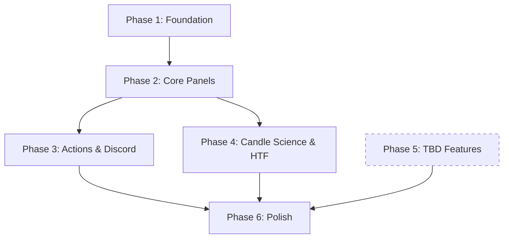

# Mission Control Dashboard - Implementation Plan

**Version:** 1.0.0
**Last Updated:** 2026-02-03

---

## Executive Summary

This plan outlines the phased implementation of the Mission Control Dashboard, prioritizing a working MVP with the Update/Publish workflow, then iteratively adding features.

---

## Phase Overview

| Phase | Focus | Duration | Deliverable |
| :--- | :--- | :--- | :--- |
| **Phase 1** | Foundation & Infrastructure | 2-3 days | Config system, API routes, basic grid |
| **Phase 2** | Core Panels (Data-Ready) | 3-4 days | EMA Zones, Premium/Discount, Distro, Regime Streaks |
| **Phase 3** | Action Buttons & Discord | 1-2 days | Update button, Snapshot mode, Discord webhook |
| **Phase 4** | Candle Science & HTF Trinity | 2-3 days | Daily Candle Science, HTF context |
| **Phase 5** | War Game & TBD Features | TBD | Pending user definitions |
| **Phase 6** | Polish & Optimization | 1-2 days | Performance, testing, visual refinements |

**Total Estimated: 10-14 days** (excluding Phase 5 TBD items)

---

## Phase 1: Foundation & Infrastructure

### 1.1 Configuration System
- [x] Create `config/tickers.ts` with NQ1, ES1, CL1, GC1, RTY1, YM1
- [x] Create `config/sessions.ts` with ASIA, LONDON, NY1, NY2
- [x] Create `config/timeframes.ts` with configurable TF arrays
- [x] Create `config/panels.ts` with panel registry

### 1.2 API Routes
- [x] Create `/api/mission/[ticker]/summary/route.ts` (aggregated response)
- [x] Create base service pattern in `lib/mission-control/service.ts`
- [x] Set up SWR hooks in `hooks/use-mission-control.ts`

### 1.3 UI Foundation
- [x] Create `app/dashboard/mission-control/[ticker]/page.tsx`
- [x] Create `MissionControlGrid.tsx` with Bento Grid layout
- [x] Create `MissionControlHeader.tsx` with ticker selector, date, buttons
- [x] Set up dark theme tokens in Tailwind config
- [x] Create `BasePanel.tsx` component pattern

### 1.4 Verification
- [ ] Route `/dashboard/mission-control/NQ1` renders grid skeleton
- [ ] API returns mock data successfully
- [ ] Ticker switching works

---

## Phase 2: Core Panels (Data-Ready)

### 2.1 EMA Zone Panel
- [x] Create `lib/mission-control/calculators/ema-zones.ts`
  - Calculate Daily 5 EMA from JSON chunks
  - Calculate zone levels at 0.5%, 1%, 1.5%, 2%, 2.5%, 3%
  - Calculate hit rates
- [x] Create `/api/mission/[ticker]/ema-zones/route.ts`
- [x] Create `EMAZonePanel.tsx` with price position, zone table, statuses

### 2.2 Premium/Discount Panel
- [x] Create `lib/mission-control/calculators/premium-discount.ts`
  - Calculate ranges for 1W, 1D, 4H, 1H, 15m
  - Calculate current price position (% of range)
- [x] Create `/api/mission/[ticker]/premium-discount/route.ts`
- [x] Create `PremiumDiscountPanel.tsx` with tabular view and color-coded zones

### 2.3 Distro (Fuel) Panel
- [x] Create `lib/mission-control/calculators/distro.ts`
  - Load data for last 20 sessions (default)
  - Calculate median range per session per DOW
- [x] Create `/api/mission/[ticker]/distro/route.ts`
- [x] Create `DistroPanel.tsx` with per-session rows and fuel % indicators

### 2.4 Regime Streak Panel
- [/] Create `lib/mission-control/calculators/regime-streak.ts` (In Progress)
- [ ] Create `RegimeStreakPanel.tsx`

### 2.5 Verification
- [ ] All panels render with real data
- [ ] Data matches existing JSON/Parquet files
- [ ] Responsive grid layout works

---

## Phase 3: Action Buttons & Discord

### 3.1 Update Button
- [ ] Create `/api/mission/refresh/route.ts`
- [x] Wire "🔄 Update" button in header (UI done)

### 3.2 Snapshot Mode
- [x] Create `BasePanel.tsx` wrapper for collapse/expand
- [x] Add `?mode=snapshot` logic to layout
- [ ] Create `lib/mission-control/snapshot.ts` (Backend TBD)

### 3.3 Discord Integration
- [ ] Create `lib/mission-control/discord.ts`
  - Use existing `discord_notifier` skill webhook logic
  - POST image to configured channel
  - Optional: Attach Markdown summary
- [ ] Create `/api/mission/snapshot/route.ts`
  - Capture snapshot
  - Post to Discord
  - Return confirmation
- [ ] Wire "📤 Publish" button to trigger snapshot + post

### 3.4 Verification
- [ ] Update button refreshes data and panels reload
- [ ] Snapshot generates clean 1920x1080 PNG
- [ ] Discord receives image successfully

---

## Phase 4: Candle Science & HTF Trinity

### 4.1 Candle Science Panel (Daily Only)
- [ ] Integrate existing `calculator.ts` logic
- [ ] Create `/api/mission/[ticker]/candle-science/route.ts`
- [ ] Create `CandleSciencePanel.tsx` with:
  - Bullish/Bearish probability
  - C3 projection based on C1/C2
  - Mode detection (live vs historical)
  - Expandable modal with full table

### 4.2 HTF Trinity Panel
- [ ] Create `/api/mission/[ticker]/htf-context/route.ts`
  - Weekly profile analysis (integrate existing script)
  - Monthly context
  - EMA zone status
- [ ] Create `HTFTrinityPanel.tsx` with:
  - Weekly/Monthly structure summary
  - Confidence indicator (TBD logic)
  - Expandable modals for each HTF

### 4.3 MOD/LOD Radar
- [ ] Create `/api/mission/[ticker]/mod-lod/route.ts`
  - Load from `{ticker}_daily_hod_lod_unadjusted.json`
  - Calculate mode/median times
- [ ] Create `ModLodPanel.tsx` with:
  - HOD/LOD time indicators
  - Simple histogram visualization

### 4.4 Economic Calendar
- [ ] Create `/api/mission/[ticker]/events/route.ts`
  - Query Prisma `EconomicEvent` for today's events
- [ ] Create `EconomicCalendarPanel.tsx` with:
  - List of events with times
  - Impact level badges

### 4.5 Verification
- [ ] All Phase 4 panels render correctly
- [ ] Candle Science matches existing tool output
- [ ] Economic events load from database

---

## Phase 5: War Game & TBD Features

> [!NOTE]
> These features are blocked on user definitions. Implementation will proceed once specs are provided.

### 5.1 War Game Matrix (TBD)
- [ ] **Blocked**: Awaiting scenario activation criteria
- [ ] **Blocked**: Awaiting conviction score logic
- [ ] Create `WarGamePanel.tsx` (placeholder ready)
- [ ] Create The Battle modal

### 5.2 ICT Daily Bias (TBD)
- [ ] **Blocked**: Awaiting bias calculation logic
- [ ] **Blocked**: Awaiting confirmation/invalidation rules

### 5.3 Narrative Feed (TBD)
- [ ] **Blocked**: Awaiting AI vs template decision
- [ ] **Blocked**: Awaiting trigger rules

---

## Phase 6: Polish & Optimization

### 6.1 Performance
- [ ] Implement data caching per `DESIGN.md` strategy
- [ ] Optimize bundle size (dynamic imports, tree shaking)
- [ ] Add loading skeletons for all panels
- [ ] Measure and achieve <2s initial load

### 6.2 Testing
- [ ] Unit tests for all calculator functions
- [ ] API integration tests with MSW
- [ ] E2E test for full dashboard flow
- [ ] Visual regression tests for snapshot mode

### 6.3 Visual Polish
- [ ] Consistent spacing and alignment audit
- [ ] Micro-animations for status changes
- [ ] Refined color palette for accessibility
- [ ] Mobile-responsive fallback (info message)

### 6.4 Documentation
- [ ] Update README with setup instructions
- [ ] API documentation
- [ ] Component storybook (optional)

---

## Dependency Map

---

## Risk Mitigation

| Risk | Mitigation |
| :--- | :--- |
| TBD features delay completion | Phases 1-4 are self-contained and deliverable |
| Data format inconsistencies | Use strict TypeScript types and runtime validation |
| Schwab API rate limits | Implement caching and debounced refresh |
| Snapshot rendering issues | Develop in parallel with manual testing |

---

## Success Criteria

### MVP (Phases 1-3)
- [ ] Dashboard loads for any configured ticker
- [ ] Core panels display accurate data
- [ ] Update button refreshes live data
- [ ] Publish button posts snapshot to Discord

### Complete (Phases 1-6)
- [ ] All panels implemented and functional
- [ ] Sub-2s load time
- [ ] Zero critical bugs
- [ ] User approval on UI/UX quality

---

## Next Steps

1. **Review this plan** and confirm priorities.
2. **Provide TBD definitions** for Phase 5 when ready.
3. **Approve to begin Phase 1 implementation**.
