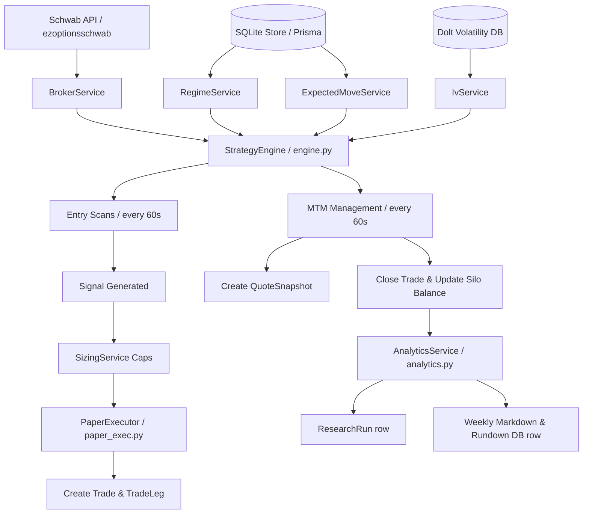

# Options Strategy Engine — Operations Manual

This guide details the operational procedures, architecture, and validation methods for the Options Strategy Engine. The engine is a fully automated paper-trading suite that runs continuously during market hours.

---

## 1. Architectural Blueprint

The Options Strategy Engine connects multiple platform services to execute and manage options trades across 41 variant combinations inside dedicated capital silos:



---

## 1.1 Position Rolling Design Decision (D13)

Rolling positions (e.g., at 21 DTE in WHEEL and LONG_DTE_CREDIT) is designed and implemented using an **asynchronous close-and-rescan model**:
1. **Trigger:** The strategy's `manage()` method evaluates DTE and returns `ManageAction(close=True, reason="ROLL")`.
2. **Close:** The `PaperExecutor` executes the close, updates the trade status to `CLOSED`, and updates the account cash balance.
3. **Rescan:** On the subsequent tick, since the silo account has no active trade, the strategy's `scan()` method automatically runs, evaluates entry criteria, and opens a new trade at the next optimal strike and DTE.

This decoupled model ensures maximum simplicity, avoids complex state transitions, and mirrors real-world broker execution where rolling is a compound transaction of closing and re-opening legs.

---

## 2. Command Reference

### 2.1 Bootstrapping/Seeding the Silos
Run this script to initialize or reset all 41 strategy combinations, silo accounts, starting capital ($25,000 each), and current stock holdings:
```powershell
$env:PYTHONPATH = "c:\Users\vinay\tvDownloadOHLC"
python scripts/libs_py/strategy_engine/seed_data.py
```

### 2.2 Launching the Scheduler
To start the continuous scheduler (which runs scan and management ticks every 60s from 9:30 AM to 4:00 PM EST, and EOD rollups at 4:05 PM EST):
```powershell
$env:PYTHONPATH = "c:\Users\vinay\tvDownloadOHLC"
python scripts/libs_py/strategy_engine/runner.py
```

---

## 3. Directory Structures

The core system code and output reports are organized inside the workspace:

*   **Coordinator Engine:** [engine.py](file:///c:/Users/vinay/tvDownloadOHLC/scripts/libs_py/strategy_engine/engine.py)
*   **Continuous Scheduler:** [runner.py](file:///c:/Users/vinay/tvDownloadOHLC/scripts/libs_py/strategy_engine/runner.py)
*   **Performance & Rollups:** [analytics.py](file:///c:/Users/vinay/tvDownloadOHLC/scripts/libs_py/strategy_engine/analytics.py)
*   **Visual Assets (Equity Curves):** `scripts/libs_py/strategy_engine/assets/`
*   **Weekly Reports:** `scripts/libs_py/strategy_engine/rundowns/`

---

## 4. Verification Checkpoint

We have fully verified the engine setup by performing dry-runs on the workspace:
1.  **Regenerated Python Prisma Client:** Integrated the new database tables (`TradeLeg`, `QuoteSnapshot`, `SignalNearMiss`, `Holding`, `EarningsCalendar`) successfully.
2.  **Seeded All Variant Silos:** Bootstrapped 41 strategy-variant-ticker combinations, starting account balances, and staged equity holdings.
3.  **Runner Execution Check:** Validated that `runner.py` starts up, registers all active strategies, and triggers the tick schedule perfectly.
