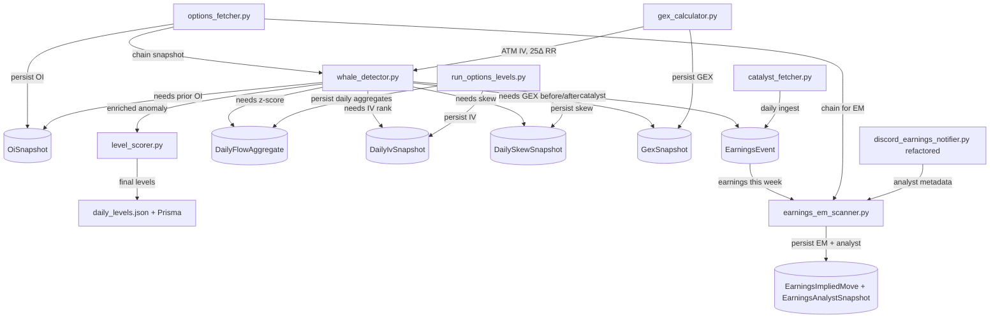

# PRD — Options Whale Flow Analysis Enhancements

**Status:** Draft
**Author:** Vinay
**Created:** 2026-07-22
**Target Module:** `scripts/streaming/options/` (whale_detector, level_scorer, gex_calculator, options_fetcher)
**Related Docs:** [OPTIONS_INVENTORY.md](../../OPTIONS_INVENTORY.md), [ADR.md](../../architecture/ADR.md)

---

## 1. Problem Statement

The current options whale detection pipeline (`whale_detector.py`) identifies large unusual options flow via notional thresholds, vol/OI ratios, and a "Golden Sweep" classifier. It then passes these through a three-filter level triage (mechanical walls, structural anchors, inflection points) in `level_scorer.py`.

However, every flagged flow event is treated as an isolated signal. The pipeline cannot answer the questions that actually determine whether a flow event is meaningful:

1. **Is this flow opening new positions or closing existing ones?** A $1.9M call sweep that adds 18k OI is a directional bet. The same sweep that closes 18k OI is profit-taking. The signal inverts.
2. **Is this flow unusual for this specific ticker?** "$1.9M" is noise on GOOGL (ADV ~$5B) but a major tell on a mid-cap. The current dynamic threshold uses ADV-tier buckets — a coarse heuristic, not a per-ticker baseline.
3. **Is this flow into a known catalyst?** A pre-earnings call sweep has a well-documented negative expected return for the buyer (IV crush). The same flow outside earnings is a different signal entirely. The pipeline has no equity earnings calendar.
4. **Is IV elevated or depressed relative to this ticker's own history?** Buying calls into IV rank 85 is accepting IV crush. Buying calls into IV rank 15 is a volatility + direction play. Completely different risk profiles.
5. **Did the flow change the dealer regime?** A flow that flips net GEX from negative to positive, or moves the call wall by >X strikes, is a structural event — not just a large print.

The pipeline detects flow well. It does not contextualize it.

---

## 2. Goals & Non-Goals

### Goals
- Classify every detected whale as **opening vs. closing** flow (new positioning vs. unwind).
- Provide a **per-ticker historical baseline** so flow magnitude is judged relative to that ticker's own recent activity, not a generic ADV bucket.
- Overlay **equity catalysts** (earnings, ex-div) on every flow event.
- Tag each whale with **IV rank / percentile** context.
- Detect whether a flow event **shifted the dealer GEX regime** (zero-gamma flip, wall move).
- Aggregate **skew shape** (25-delta risk reversal) alongside flow to confirm or contradict the directional signal.

### Non-Goals
- **Tick-level timing precision** — "1 min before close" is Twitter bait, not a real edge. We will not chase intraday timestamping.
- **Real-time streaming flow tape** — out of scope; the pipeline runs at interval cadence.
- **Order-book / Level-2 sweep detection** — we use chain snapshots, not depth-of-book.
- **Trade execution / alerts** — this PRD is about analysis quality, not order routing.

---

## 3. Features

### 3.1 OI Trajectory (Opening vs. Closing Flow) — *Priority 1, Highest Payoff*

**Problem:** Volume alone cannot distinguish opening from closing. 50k volume on 200 OI is likely new positioning; 50k volume on 100k OI could be unwinding.

**Solution:** Persist OI snapshots per strike/type/DTE per run. Diff against the prior day's snapshot to compute `oi_delta` for each contract. If `oi_delta > 0` and volume is significant, the flow is opening. If `oi_delta < 0`, it's closing.

**Inputs:**
- Current chain snapshot (already fetched by `options_fetcher.py`)
- Prior day's persisted OI snapshot (new storage)

**Outputs (added to whale anomaly dict):**
```python
{
    "oi_delta": 18234,            # net OI change vs. prior snapshot
    "flow_type": "OPENING",       # OPENING | CLOSING | MIXED | UNKNOWN
    "oi_confidence": 0.92,        # confidence in the classification
}
```

**Storage:** New Prisma model `OiSnapshot` — one row per (ticker, strike, type, dte, snapshot_date). Snapshot taken once per run.

**Edge cases:**
- First run for a ticker (no prior snapshot) → `flow_type = "UNKNOWN"`, `oi_confidence = 0.0`
- OI changes but no volume → stale data or adjustment → `flow_type = "UNKNOWN"`
- Volume >> |oi_delta| → intraday round-trip → `flow_type = "MIXED"`

**Files affected:**
- `scripts/streaming/options/whale_detector.py` — add `oi_delta` to anomaly aggregation
- `scripts/streaming/options/options_fetcher.py` — persist OI snapshot on each fetch
- `web/prisma/schema.prisma` — new `OiSnapshot` model
- `scripts/streaming/options/run_options_levels.py` — wire snapshot persistence into run loop

---

### 3.2 Earnings / Event Catalyst Overlay — *Priority 2*

**Problem:** Every flow event is treated the same regardless of whether the ticker has earnings tomorrow.

**Solution:** ~~Ingest an equity earnings calendar~~ **REUSE existing `EarningsCalendar` Prisma model + `EarningsService`** (yfinance-backed, already populated by `runner.py` cron). For each detected whale, look up the nearest catalyst within ±5 trading days and tag it.

**Inputs:**
- Equity earnings calendar (new fetcher, daily cache)
- Detected whale events (ticker)

**Outputs (added to whale anomaly dict):**
```python
{
    "catalyst": {
        "type": "EARNINGS",        # EARNINGS | EX_DIV | NONE
        "timing": "TOMORROW",      # TODAY | TOMORROW | t-2 | t+2 | NONE
        "date": "2026-07-23",
    }
}
```

**Storage:** ~~New Prisma model `EarningsEvent`~~ **Reuse existing `EarningsCalendar` model** (already has ticker, earningsDate, beforeMarket, confirmed, source, company, marketCap). No new model needed.

**Files affected:**
- `scripts/streaming/options/whale_detector.py` — add catalyst lookup via `EarningsService`
- ~~`scripts/streaming/options/catalyst_fetcher.py` — new file~~ **Not needed** — reuse `scripts/libs_py/strategy_engine/services/earnings_service.py`
- ~~`web/prisma/schema.prisma` — new `EarningsEvent` model~~ **Not needed** — reuse existing `EarningsCalendar`

---

### 3.3 Historical Flow Z-Score (Per-Ticker Baseline) — *Priority 3*

**Problem:** "$1.9M" is meaningless without knowing whether that's typical for the ticker. The current dynamic threshold uses 4-tier ADV buckets — too coarse.

**Solution:** Persist daily aggregate flow notional per ticker. Compute a rolling 20-trading-day z-score per ticker. Each whale is tagged with how many standard deviations above its own baseline the flow is.

**Inputs:**
- Daily aggregate notional per ticker (computed from whale detection output, already available)
- 20-day rolling window

**Outputs (added to whale anomaly dict):**
```python
{
    "notional_zscore": 2.8,       # std devs above 20-day mean for this ticker
    "notional_20d_mean": 450000,
    "notional_20d_std": 520000,
}
```

**Storage:** New Prisma model `DailyFlowAggregate` — one row per (ticker, date, total_notional, whale_count). Computed at end of each run.

**Cold-start:** Returns `notional_zscore = null` until 20 days of history accumulate. Falls back to the existing dynamic threshold in the interim.

**Files affected:**
- `scripts/streaming/options/whale_detector.py` — add z-score computation
- `scripts/streaming/options/run_options_levels.py` — persist daily aggregate
- `web/prisma/schema.prisma` — new `DailyFlowAggregate` model

---

### 3.4 IV Rank / Percentile — *Priority 4*

**Problem:** The pipeline computes IV via BSM/Black-76 but doesn't track whether IV is elevated or depressed relative to the ticker's own history.

**Solution:** Persist daily ATM IV per ticker. Compute IV rank (where current IV sits in the past 252-day range) and IV percentile (percent of days in the past year with lower IV).

**Inputs:**
- Daily ATM IV (already computed in `gex_calculator.py`, currently discarded)
- 252-day rolling window

**Outputs (added to whale anomaly dict):**
```python
{
    "iv_rank": 85,                # 0-100, where 100 = highest IV in past year
    "iv_percentile": 0.82,        # fraction of days with lower IV
    "iv_current": 0.45,
    "iv_252d_high": 0.62,
    "iv_252d_low": 0.18,
}
```

**Storage:** New Prisma model `DailyIvSnapshot` — one row per (ticker, date, atm_iv).

**Cold-start:** Returns `iv_rank = null` until 252 days of history accumulate. Shorter windows (30/60/90-day) available as interim.

**Files affected:**
- `scripts/streaming/options/gex_calculator.py` — expose ATM IV for persistence
- `scripts/streaming/options/whale_detector.py` — add IV rank lookup
- `web/prisma/schema.prisma` — new `DailyIvSnapshot` model

---

### 3.5 Skew / Risk Reversal Delta — *Priority 5*

**Problem:** The pipeline computes Greeks per-contract but doesn't aggregate the skew shape. A call sweep that also steepens skew is confirmed by the market; a call sweep where skew is flat may be a hedge or fade.

**Solution:** Compute 25-delta call minus 25-delta put IV (risk reversal) per ticker per run. Track the 1-day change. Tag each whale with skew direction.

**Inputs:**
- Current chain (already available)
- Prior day's risk reversal (new persistence)

**Outputs (added to whale anomaly dict):**
```python
{
    "skew_25d_rr": 3.2,            # 25Δ call IV - 25Δ put IV (vol points)
    "skew_delta_1d": +1.5,         # 1-day change in risk reversal
    "skew_confirms_flow": True,    # True if skew steepened on call flow
}
```

**Storage:** New Prisma model `DailySkewSnapshot` — one row per (ticker, date, rr_25d, rr_10d, rr_5d).

**Files affected:**
- `scripts/streaming/options/gex_calculator.py` — add 25-delta IV interpolation
- `scripts/streaming/options/whale_detector.py` — add skew context
- `web/prisma/schema.prisma` — new `DailySkewSnapshot` model

---

### 3.6 GEX Regime-Change Flagging — *Priority 6*

**Problem:** The pipeline computes net GEX and zero-gamma flips but doesn't flag when a flow event *caused* a regime change.

**Solution:** Capture a before/after GEX snapshot around each detected whale. Flag if the flow crossed zero-gamma or moved the call/put wall by >2 strikes.

**Inputs:**
- Current GEX calculation (already in `gex_calculator.py`)
- Prior snapshot's GEX profile (new persistence)

**Outputs (added to whale anomaly dict):**
```python
{
    "regime_change": True,
    "regime_change_type": "ZERO_GAMMA_FLIP",  # ZERO_GAMMA_FLIP | WALL_MOVE | NONE
    "gex_before": -1.2e9,
    "gex_after": +0.4e9,
    "call_wall_before": 185,
    "call_wall_after": 187,
}
```

**Storage:** Extend the existing `GexSnapshot` Prisma model (or add a `prior_gex` field to the run output).

**Files affected:**
- `scripts/streaming/options/gex_calculator.py` — expose before/after comparison
- `scripts/streaming/options/whale_detector.py` — add regime-change flag
- `web/prisma/schema.prisma` — extend `GexSnapshot` model

---

### 3.7 Earnings Implied-Move Scanner — *Priority 7*

**Problem:** The tweet shows a ranked table of tickers reporting earnings this week with their implied moves (±%):
```
INTC ±14.9%   ALK ±15.2%   STM ±13.5%   NOW ±12.5%
NOK ±12.2%   STLD ±12.1%   DPZ ±11.1%   TXN ±10.7%
...
GOOGL ±6.6%  DHI ±6.5%    LMT ±5.5%    HAL ±5.3%
AXP ±4.6%
```
This is the market's pricing of expected earnings volatility, derived from the ATM straddle (or the TOS expected-move model). The repo already computes expected moves for futures/indices via `calculate_tos_expected_move()` but does not produce an earnings-week scanner that ranks equities by implied move.

**Solution:** Build a scanner that, for each ticker with earnings in the current week (from the existing `EarningsCalendar` table), fetches the option chain, extracts ATM IV for the expiry covering earnings, computes the expected move as a percentage of spot, and ranks the universe. Output as a sorted table + JSON for downstream consumption (Discord, dashboard, Pine export).

**What already exists (reuse):**
- `EarningsCalendar` Prisma model — populated by `EarningsService.fetch_upcoming_all()` via yfinance
- `EarningsService.get_next_earnings()` / `is_earnings_within()` — already queryable
- `calculate_tos_expected_move()` in `gex_calculator.py` — TOS-calibrated EM model (slope=0.6368, intercept scaling, weekend decay)
- `options_fetcher.py` — Schwab chain fetching for equities
- `ACTIVE_TICKERS` config — universe definition

**What's new:**
- A scanner module that joins `EarningsCalendar` (this week) → chain fetch → ATM IV → EM% → ranked output
- Persistence of the daily earnings-EM snapshot for historical comparison ("is this IV elevated relative to this ticker's prior earnings?")

**Inputs:**
- `EarningsCalendar` table filtered to current trading week
- Schwab option chain per ticker (ATM straddle IV)
- Spot price per ticker

**Outputs:**
```python
{
    "scan_date": "2026-07-22",
    "earnings_week": "2026-07-21 to 2026-07-25",
    "ranked": [
        {
            "ticker": "ALK",
            "earnings_date": "2026-07-24",
            "earnings_timing": "AMC",        # BMO | AMC | UNCONFIRMED
            "spot": 72.45,
            "atm_iv": 0.152,
            "expected_move_pct": 15.2,
            "expected_move_dollars": 11.01,  # spot * pct
            "expiry": "2026-07-25",
            "dte": 3,
        },
        {
            "ticker": "INTC",
            "earnings_date": "2026-07-24",
            ...
        },
    ]
}
```

**Console output format (matching the tweet):**
```
EARNINGS IMPLIED MOVES — Week of 2026-07-21

$ALK  ±15.2%  (AMC Jul 24)
$INTC ±14.9%  (AMC Jul 24)
$STM  ±13.5%  (BMO Jul 25)
...
$AXP  ±4.6%   (BMO Jul 22)
```

**Storage:** New Prisma model `EarningsImpliedMove`:
```prisma
model EarningsImpliedMove {
  id              String   @id @default(cuid())
  ticker          String
  earningsDate    DateTime
  scanDate        DateTime
  spot            Float
  atmIv           Float
  expectedMovePct Float
  expectedMoveUsd Float
  expiry          String
  dte             Int
  createdAt       DateTime @default(now())

  @@unique([ticker, earningsDate, scanDate])
  @@index([scanDate])
}
```

**Historical comparison (Phase 2):** Once N earnings cycles are persisted, the scanner can also show:
- `prior_earnings_move_pct` — what the implied move was last earnings
- `actual_prior_move_pct` — what the stock actually moved
- `iv_vs_prior_delta` — is the market pricing more or less vol this time?

**Weekly aggregate comparison (Phase 2):** The scanner should also produce a week-over-week comparison so the user can see if the current earnings week is pricing higher or lower volatility than recent weeks. This addresses the observation: "I did not notice that this week's expected moves were larger compared to last week."

Outputs:
```python
{
    "current_week": {
        "week_of": "2026-07-21",
        "ticker_count": 22,
        "mean_em_pct": 8.7,
        "median_em_pct": 7.8,
        "max_em_pct": 15.2,
    },
    "prior_week": {
        "week_of": "2026-07-14",
        "ticker_count": 18,
        "mean_em_pct": 6.2,
        "median_em_pct": 5.9,
        "max_em_pct": 11.4,
    },
    "wow_delta": {
        "mean_delta": +2.5,        # percentage points
        "median_delta": +1.9,
        "direction": "ELEVATED",   # ELEVATED | SUPPRESSED | NEUTRAL (|delta| < 1.0pp)
    }
}
```

This weekly aggregate is computed from the persisted `EarningsImpliedMove` rows. With ≥4 weeks of history, the scanner can also show a 4-week rolling mean and flag when the current week is >1σ above/below the rolling baseline.

**Files affected:**
- `scripts/streaming/options/earnings_em_scanner.py` — new file (scanner + weekly aggregate + WoW comparison)
- `scripts/streaming/options/run_options_levels.py` — optional weekly scan hook
- `web/prisma/schema.prisma` — new `EarningsImpliedMove` model
- `scripts/streaming/options/discord_notifier.py` — optional earnings-EM digest post (includes WoW delta header)

**Effort:** ~0.5 day scanner + ~0.5 day historical/WoW comparison = ~1 day total

---

### 3.8 Analyst Expectations & Fundamental Context Overlay — *Priority 8*

**Problem:** The implied move tells you what the options market is pricing. But without analyst expectations (EPS/revenue consensus, target price, recommendation) there's no way to judge whether the implied move is *justified* by fundamental expectations or purely a vol premium. A ±15% implied move with a wide EPS estimate range is different from ±15% with a tight consensus.

**What already exists (reuse heavily):**
The repo already has `scripts/market_data/discord_earnings_notifier.py` which pulls from yfinance:
- Analyst recommendation (`recommendationKey`) — BUY / HOLD / SELL
- Analyst target mean price + premium vs. spot (`targetMeanPrice` / `currentPrice`)
- EPS consensus estimate (`Earnings Average` from `ticker.calendar`)
- Revenue consensus estimate (`Revenue Average`)
- Short float (`shortPercentOfFloat`)
- Historical reactions (last 8 earnings, 1-day close-to-close %)
- Vol edge ratio (priced move / avg realized reaction) with tier labels (RICH / FAIR / CHEAP)
- Stale analyst data warnings (rating vs. target premium mismatch)

This feature integrates that existing metadata into the EM scanner output and persists it for historical comparison.

**Solution:** For each ticker in the earnings-week scanner, fetch the analyst/fundamental metadata (via the existing `_fetch_ticker_metadata()` function or a refactored shared utility) and join it with the EM calculation. Persist the snapshot so you can track:
- How analyst expectations shifted leading into earnings
- Whether the implied move aligns with or exceeds the EPS surprise range
- Whether high-conviction analyst ratings (strong buy + high target premium) correlate with post-earnings moves

**Inputs:**
- Existing `_fetch_ticker_metadata()` from `discord_earnings_notifier.py` (yfinance)
- EM scanner output (feature 3.7)

**Outputs (added to each scanner entry):**
```python
{
    "ticker": "GOOGL",
    "earnings_date": "2026-07-23",
    "expected_move_pct": 6.6,
    # --- Analyst context ---
    "analyst": {
        "recommendation": "BUY",
        "target_mean": 215.0,
        "target_premium": 0.12,        # (target / spot) - 1
        "eps_estimate": 1.44,
        "revenue_estimate": 9.5e10,
        "eps_surprise_range": null,    # needs prior earnings persistence
    },
    # --- Vol edge ---
    "vol_edge": {
        "avg_realized_8q": 4.2,         # avg abs 1-day move last 8 earnings
        "edge_ratio": 1.57,             # priced_move / avg_realized
        "tier": "FAIR",                 # RICH (>1.8) | FAIR (0.9-1.8) | CHEAP (<0.9)
    },
    # --- Short interest ---
    "short_float": 0.008,
}
```

**Enriched scanner table format:**
```
EARNINGS IMPLIED MOVES — Week of 2026-07-21

$ALK   ±15.2%  AMC Jul 24  | EPS est $2.55  | Rec: HOLD  | Edge: 1.8x RICH
$INTC  ±14.9%  AMC Jul 24  | EPS est $0.35  | Rec: SELL  | Edge: 2.1x RICH  | Short: 3.2%
$STM   ±13.5%  BMO Jul 25  | EPS est $0.42  | Rec: BUY   | Edge: 1.2x FAIR
$GOOGL ±6.6%   AMC Jul 23  | EPS est $1.44  | Rec: BUY   | Edge: 1.6x FAIR  | Tgt: +12%
$TSLA  ±7.0%   AMC Jul 23  | EPS est $0.62  | Rec: HOLD  | Edge: 0.8x CHEAP | Short: 3.4%
```

**Historical comparison (Phase 2):** Persist the analyst snapshot per earnings event. After N cycles, the scanner can show:
- `eps_surprise_pct` — actual EPS vs. consensus estimate (from persisted prior estimates)
- `target_premium_trend` — is the analyst target converging or diverging from spot?
- `recommendation_changes` — did any tickers get upgraded/downgraded into earnings?
- `vol_edge_vs_actual` — did RICH-tier tickers actually realize lower moves? (validates the edge ratio)

**Storage:** New Prisma model `EarningsAnalystSnapshot`:
```prisma
model EarningsAnalystSnapshot {
  id              String   @id @default(cuid())
  ticker          String
  earningsDate    DateTime
  scanDate        DateTime
  recommendation  String?
  targetMean      Float?
  targetPremium   Float?
  epsEstimate     Float?
  revenueEstimate Float?
  shortFloat      Float?
  avgRealized8q   Float?
  volEdgeRatio    Float?
  volEdgeTier     String?
  createdAt       DateTime @default(now())

  @@unique([ticker, earningsDate, scanDate])
  @@index([scanDate])
}
```

**Files affected:**
- `scripts/streaming/options/earnings_em_scanner.py` — integrate analyst metadata into scanner output
- `scripts/market_data/discord_earnings_notifier.py` — refactor `_fetch_ticker_metadata()` into a shared utility (importable by the scanner)
- `web/prisma/schema.prisma` — new `EarningsAnalystSnapshot` model
- `scripts/streaming/options/discord_notifier.py` — enriched earnings-EM digest post

**Effort:** ~0.5 day (metadata fetching already exists in `discord_earnings_notifier.py`; this is mostly refactoring + integration + persistence)

**Solution:** Capture a before/after GEX snapshot around each detected whale. Flag if the flow crossed zero-gamma or moved the call/put wall by >2 strikes.

**Inputs:**
- Current GEX calculation (already in `gex_calculator.py`)
- Prior snapshot's GEX profile (new persistence)

**Outputs (added to whale anomaly dict):**
```python
{
    "regime_change": True,
    "regime_change_type": "ZERO_GAMMA_FLIP",  # ZERO_GAMMA_FLIP | WALL_MOVE | NONE
    "gex_before": -1.2e9,
    "gex_after": +0.4e9,
    "call_wall_before": 185,
    "call_wall_after": 187,
}
```

**Storage:** Extend the existing `GexSnapshot` Prisma model (or add a `prior_gex` field to the run output).

**Files affected:**
- `scripts/streaming/options/gex_calculator.py` — expose before/after comparison
- `scripts/streaming/options/whale_detector.py` — add regime-change flag
- `web/prisma/schema.prisma` — extend `GexSnapshot` model

---

## 4. Architecture

### 4.1 New Prisma Models

```prisma
model OiSnapshot {
  id           Int      @id @default(autoincrement())
  ticker       String
  strike       Float
  optionType   String   // CALL | PUT
  dte          Int
  openInterest Int
  snapshotDate DateTime @default(now())
  createdAt    DateTime @default(now())

  @@unique([ticker, strike, optionType, dte, snapshotDate])
  @@index([ticker, snapshotDate])
}

model EarningsEvent {
  // REUSE existing EarningsCalendar model — see web/prisma/schema.prisma
  // Fields: ticker, earningsDate, beforeMarket, confirmed, source, company, marketCap
}

model EarningsImpliedMove {
  id              String   @id @default(cuid())
  ticker          String
  earningsDate    DateTime
  scanDate        DateTime
  spot            Float
  atmIv           Float
  expectedMovePct Float
  expectedMoveUsd Float
  expiry          String
  dte             Int
  createdAt       DateTime @default(now())

  @@unique([ticker, earningsDate, scanDate])
  @@index([scanDate])
}

model EarningsAnalystSnapshot {
  id              String   @id @default(cuid())
  ticker          String
  earningsDate    DateTime
  scanDate        DateTime
  recommendation  String?
  targetMean      Float?
  targetPremium   Float?
  epsEstimate     Float?
  revenueEstimate Float?
  shortFloat      Float?
  avgRealized8q   Float?
  volEdgeRatio    Float?
  volEdgeTier     String?
  createdAt       DateTime @default(now())

  @@unique([ticker, earningsDate, scanDate])
  @@index([scanDate])
}

model DailyFlowAggregate {
  id            Int      @id @default(autoincrement())
  ticker        String
  date          DateTime
  totalNotional Float
  whaleCount    Int
  createdAt     DateTime @default(now())

  @@unique([ticker, date])
}

model DailyIvSnapshot {
  id        Int      @id @default(autoincrement())
  ticker    String
  date      DateTime
  atmIv     Float
  createdAt DateTime @default(now())

  @@unique([ticker, date])
}

model DailySkewSnapshot {
  id        Int      @id @default(autoincrement())
  ticker    String
  date      DateTime
  rr25d     Float
  rr10d     Float
  rr5d      Float
  createdAt DateTime @default(now())

  @@unique([ticker, date])
}
```

### 4.2 Data Flow



### 4.3 Backward Compatibility

All new fields are additive to the whale anomaly dict and `ScoredLevels` output. Existing consumers (Discord notifier, Pine export, file writer) will ignore unknown fields. No breaking changes to the current pipeline output schema.

---

## 5. Implementation Phases

### Phase 1 — OI Trajectory (Priority 1)
- Add `OiSnapshot` Prisma model, run `prisma db push`
- Persist OI on each `options_fetcher.py` run
- Add `oi_delta`, `flow_type`, `oi_confidence` to whale anomalies
- Cold-start handling (UNKNOWN classification on first run)
- **Effort:** ~1 day
- **Unblocks:** Better classification across all downstream features

### Phase 2 — Earnings Overlay (Priority 2)
- Add `EarningsEvent` Prisma model
- Create `catalyst_fetcher.py` (Finnhub free tier or yahooquery)
- Daily ingestion job (run before market open)
- Add `catalyst` tag to whale anomalies
- **Effort:** ~0.5 day

### Phase 3 — Historical Flow Z-Score (Priority 3)
- Add `DailyFlowAggregate` Prisma model
- Persist daily aggregate at end of `run_options_levels.py`
- Add `notional_zscore` to whale anomalies
- Fallback to dynamic threshold during cold-start
- **Effort:** ~0.5 day
- **Note:** Requires 20 days of data before useful

### Phase 4 — IV Rank (Priority 4)
- Add `DailyIvSnapshot` Prisma model
- Expose ATM IV from `gex_calculator.py` for persistence
- Add `iv_rank`, `iv_percentile` to whale anomalies
- **Effort:** ~0.5 day
- **Note:** Requires 252 days of data for full rank; 30/60/90-day interim available

### Phase 5 — Skew Delta (Priority 5)
- Add `DailySkewSnapshot` Prisma model
- Add 25-delta IV interpolation to `gex_calculator.py`
- Add `skew_25d_rr`, `skew_delta_1d`, `skew_confirms_flow` to whale anomalies
- **Effort:** ~0.5 day

### Phase 6 — GEX Regime Change (Priority 6)
- Extend `GexSnapshot` model with prior-snapshot comparison
- Add `regime_change`, `regime_change_type` to whale anomalies
- **Effort:** ~0.5 day

### Phase 7 — Earnings Implied-Move Scanner (Priority 7)
- Reuse existing `EarningsCalendar` table + `EarningsService` (yfinance, already populated)
- Reuse `calculate_tos_expected_move()` for TOS-calibrated EM%
- New `earnings_em_scanner.py` — joins calendar → chain fetch → ATM IV → EM% → ranked output
- New `EarningsImpliedMove` Prisma model for historical comparison
- Optional Discord digest post (earnings-week table)
- **Effort:** ~1 day (scanner + WoW comparison)

### Phase 8 — Analyst Expectations Overlay (Priority 8)
- Refactor `_fetch_ticker_metadata()` from `discord_earnings_notifier.py` into a shared utility
- Integrate analyst recommendation, target price, EPS/revenue estimates, short float, vol edge ratio into scanner output
- New `EarningsAnalystSnapshot` Prisma model for historical tracking
- Enriched Discord digest (EPS est, rec, edge tier, short float columns)
- **Effort:** ~0.5 day (metadata fetching already exists; mostly refactoring + integration)

---

## 6. Success Metrics

| Metric | How to measure | Target |
|---|---|---|
| Flow classification accuracy | Manual audit of 50 flagged whales — does `flow_type` match reality? | ≥85% correct |
| False-positive reduction | Whales flagged with `notional_zscore < 1.0` should be deprioritized | Reviewer judges 30-day sample |
| Catalyst context coverage | % of flagged whales with `catalyst != NONE` correctly tagged | 100% (when calendar has the event) |
| IV rank availability | % of runs that return non-null `iv_rank` | 100% after 30-day warmup |
| Regime-change detection | Manual audit — did GEX actually flip when `regime_change = True`? | ≥90% correct |
| Earnings EM scanner coverage | % of current-week earnings tickers that return a valid EM% | ≥95% (chain liquidity dependent) |
| Earnings EM accuracy | Compare scanner EM% vs. actual earnings-day move for 50 events | Mean absolute error ≤ 2x EM% |
| WoW EM comparison | Scanner produces weekly aggregate + WoW delta after 2 weeks of history | 100% (automated from persisted data) |
| Analyst context coverage | % of scanner tickers with non-null EPS estimate + recommendation | ≥90% (yfinance coverage dependent) |
| Vol edge validation | After 20 earnings events, do RICH-tier tickers realize smaller moves than CHEAP-tier? | Directional confirmation (mean realized < priced for RICH) |

---

## 7. Open Questions

1. **Earnings calendar source** — ~~Finnhub free tier vs. yahooquery vs. Schwab API~~ **RESOLVED**: `EarningsCalendar` Prisma model + `EarningsService` (yfinance) already exist and are populated. Feature #2 (catalyst overlay) and #7 (EM scanner) should reuse this, not build a new calendar fetcher.
2. **OI snapshot timing** — Once per run (current interval cadence) vs. once per day (close-of-session OI is the "official" number). Schwab's intraday OI may lag. Need to verify if Schwab returns real-time OI updates or only prior-day settled OI.
3. **Z-score window** — 20 trading days vs. 30 vs. 60. Shorter = more reactive, longer = more stable. Default to 20, make configurable.
4. **IV rank warmup** — Ship with 30/60/90-day interim ranks, or suppress until 252-day history exists? Recommend interim.
5. **Skew interpolation** — 25-delta requires interpolating IV at the strike where delta ≈ 0.25. Confirm the existing `gex_calculator.py` delta math is accurate enough for this, or if we need a dedicated IV-surface fitter.

---

## 8. Risks

| Risk | Mitigation |
|---|---|
| Schwab OI is prior-day settled, not real-time | Document as a limitation; `flow_type` becomes "as of prior close" — still useful for overnight/pre-open analysis |
| Earnings calendar source rate-limits or breaks | Cache daily; fail gracefully to `catalyst = NONE` |
| Cold-start period (no history) for z-scores and IV rank | All features fall back to `null` / existing dynamic threshold; no pipeline breakage |
| Prisma schema growth (7 new models) | All additive; no migrations to existing data |
| Earnings EM scanner Schwab rate limits | Batch chain fetches with delay; cache daily |
| yfinance analyst data staleness | `discord_earnings_notifier.py` already has stale-data warnings; carry forward |
| Added latency per run (more DB reads for context lookups) | All lookups are indexed by (ticker, date); benchmark and add caching if needed |