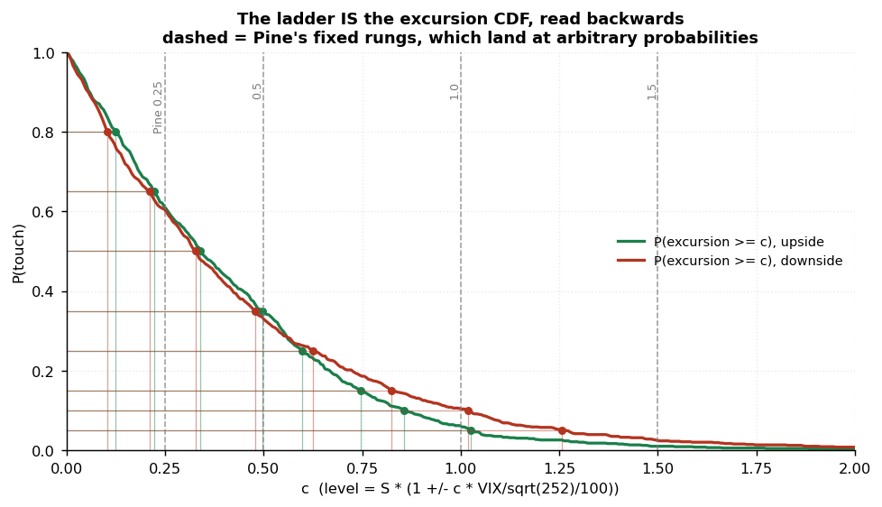
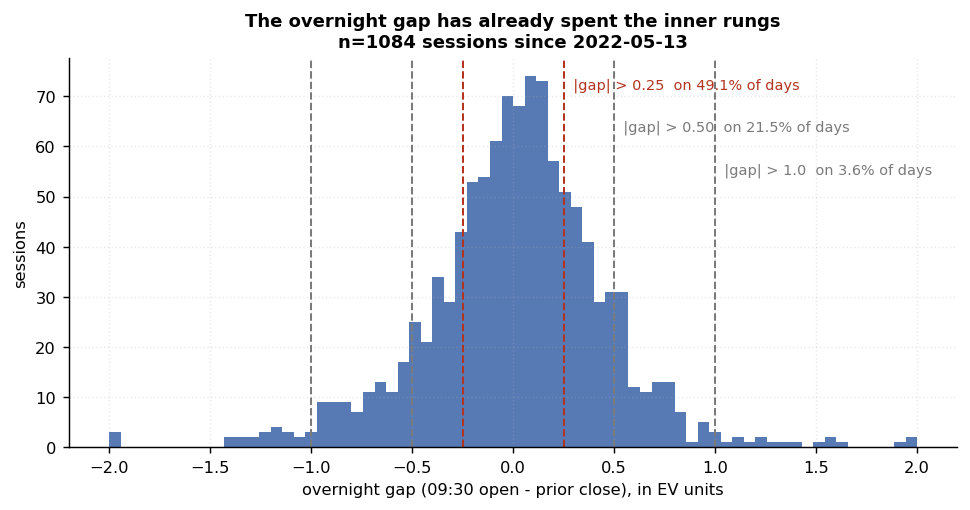
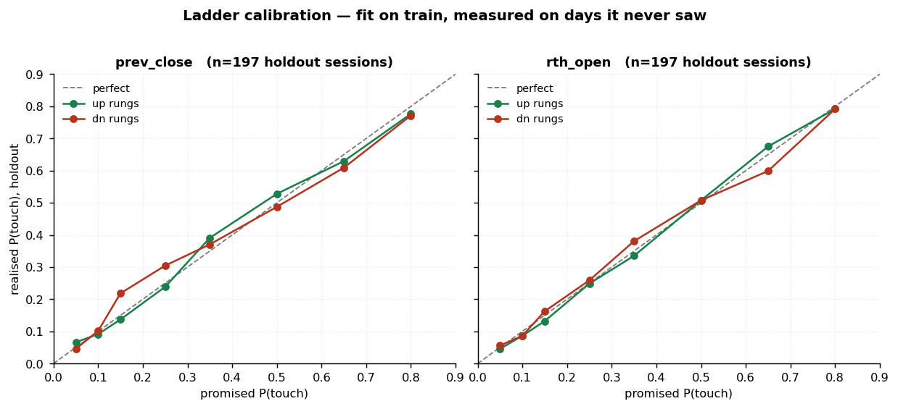
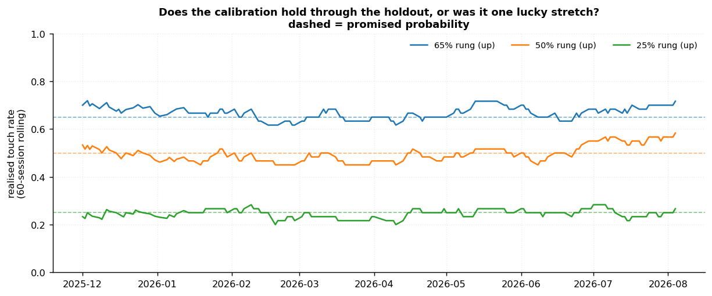
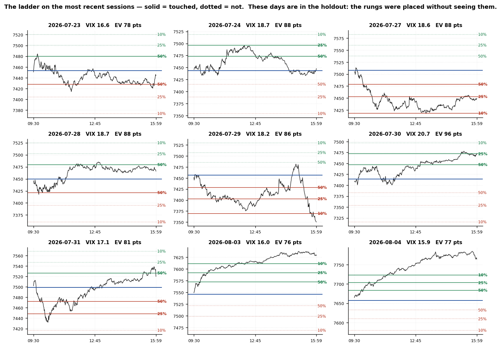
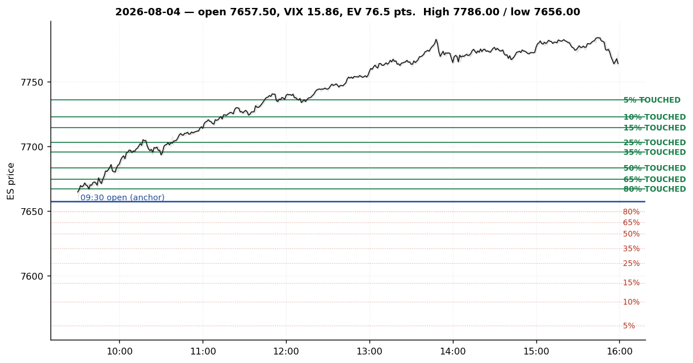
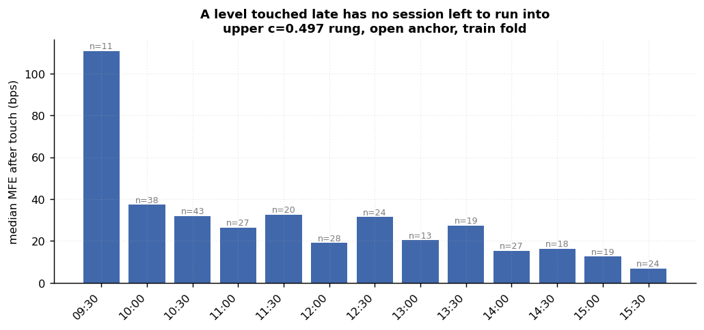
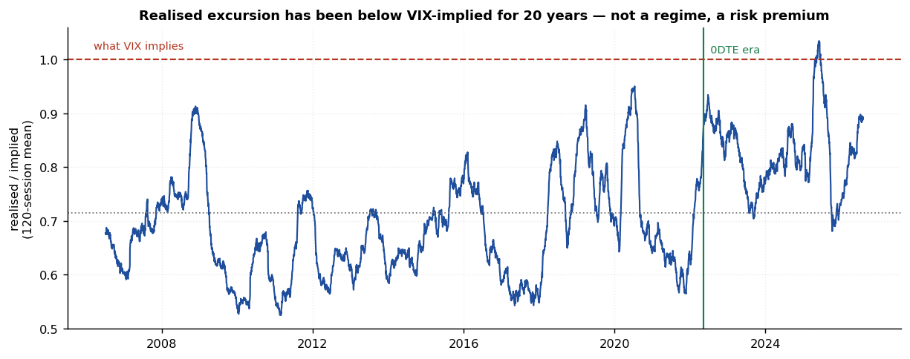
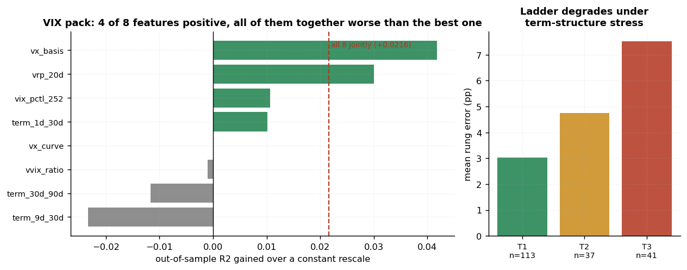

# Expected Volatility Zones — Research Report

> `ES1` x `VIX`, 0DTE regime from **2022-05-13**. Train 887 sessions, chronological holdout 197 from **2025-10-21**, data through 2026-08-04. Nothing in this document is fit on the holdout.

Every number is computed when this file is rendered, by `scripts/expected_volatility/report.py`, from the same session frame the figures are drawn from. No figure can disagree with the table beside it.

---
## 0. The short version

The indicator draws bands around a price using VIX. Three findings, in descending order of how much evidence stands behind them.

**1. The bands are too wide.** Measuring the average session's furthest travel from its anchor, `mean(max(up, dn)) / EV`: **0.68x** the VIX-implied move from the 09:30 open, **0.82x** from the prior close. That is not a regime — it is the variance risk premium, it has been there for twenty years (§4.1) and it shows up on every index tested (§2.5).

> Two cautions on that number. The prior-close figure is *higher* only because excursions measured from yesterday's close include the overnight gap — it is not the better-calibrated anchor, it is the one measuring a bigger thing. And this is the mean furthest excursion, which is a larger quantity than a fitted volatility ratio; on the same data a half-normal sigma fit gives ~0.67. Both say the same thing and neither is interchangeable with the other, so **compare like with like when quoting these.**

**2. The origin is wrong for intraday use.** The bands are drawn from the prior close. The overnight gap alone clears the 0.25 rung on **49.1%** of sessions, so half the time the inner bands are spent before the bell. Anchoring at the 09:30 open cuts calibration error from 2.46% to 1.45%.

**3. They are not entry signals.** Fading the levels loses at every rung. The opposite — continuation — looked strong and turned out to be the overnight gap in disguise; it does not survive re-anchoring (§3.2). What the levels give you is a **calibrated probability**, which is a sizing and expectation tool, not a trigger.

---
## 1. How the levels are built

### 1.1 The twelve Pine levels are one number

The indicator exposes 12 levels and a 252/365 toggle. They are all `S * (1 +/- c * VIX/sqrt(252)/100)` for some constant `c`. The toggle is a multiplication by `sqrt(252/365) = 0.8309`; the mid-line is `0.9155`. So there are not twelve decisions to make, or two. There is **one number**, and the only question is what it should be.

### 1.2 Set that number by probability, not by tradition

Pine picks `c` from a table of round numbers. Nothing makes 0.25 special. The alternative is to decide what probability you want a line to carry and then put the line where that probability actually is — invert the empirical distribution of how far sessions travel:



Two things fall out for free. The ladder **self-corrects** any systematic mis-scaling of its input, because it is fit to what happened rather than to what VIX claimed. And it handles **skew**: up and down quantiles are taken separately, so a mirrored construction is no longer forced on a market that is not mirrored.

### 1.3 Anchor at the open, not the prior close



| overnight gap, in EV units | p5 | p25 | p50 | p75 | p95 | mean abs |
|---|---|---|---|---|---|---|
| 1084 sessions | -0.76 | -0.22 | +0.04 | +0.28 | +0.70 | 0.334 |

| gap already exceeds | share of sessions |
|---|---|
| `c = 0.25` | 49.1% |
| `c = 0.4155` | 29.3% |
| `c = 0.5` | 21.5% |
| `c = 1.0` | 3.6% |

---
## 2. Validation — how you can check this

### 2.1 The claim is falsifiable, which is the point

A rung labelled 50% says: *price will reach here on half of sessions*. That is not an opinion. Fit the rungs on old data, draw them on days the fit never saw, count. If the counts miss, the ladder is wrong.

### 2.2 Promised versus realised, on unseen days



| rung | side | `c` | promised | realised (holdout) | hits | error |
|---|---|---|---|---|---|---|
| 80% | up | 0.124 | 80.0% | 79.2% | 156/197 | -0.8% |
| 80% | dn | 0.103 | 80.0% | 79.2% | 156/197 | -0.8% |
| 65% | up | 0.222 | 65.0% | 67.5% | 133/197 | +2.5% |
| 65% | dn | 0.211 | 65.0% | 59.9% | 118/197 | -5.1% |
| 50% | up | 0.340 | 50.0% | 50.8% | 100/197 | +0.8% |
| 50% | dn | 0.327 | 50.0% | 50.8% | 100/197 | +0.8% |
| 35% | up | 0.497 | 35.0% | 33.5% | 66/197 | -1.5% |
| 35% | dn | 0.479 | 35.0% | 38.1% | 75/197 | +3.1% |
| 25% | up | 0.598 | 25.0% | 24.9% | 49/197 | -0.1% |
| 25% | dn | 0.626 | 25.0% | 25.9% | 51/197 | +0.9% |
| 15% | up | 0.746 | 15.0% | 13.2% | 26/197 | -1.8% |
| 15% | dn | 0.825 | 15.0% | 16.2% | 32/197 | +1.2% |
| 10% | up | 0.857 | 10.0% | 8.6% | 17/197 | -1.4% |
| 10% | dn | 1.019 | 10.0% | 8.6% | 17/197 | -1.4% |
| 5% | up | 1.027 | 5.0% | 4.6% | 9/197 | -0.4% |
| 5% | dn | 1.256 | 5.0% | 5.6% | 11/197 | +0.6% |

Mean absolute error across all 16 rungs: **1.45%** on the open anchor, 2.46% on the prior close. For scale, sampling noise alone on 197 sessions is about 3.5 pp at a 50% rung, so **the ladder is calibrated to within its own measurement error.**

### 2.3 Overnight ladder: not calibrated yet

The separately fitted overnight ladder was evaluated on the same 197-session holdout. Its mean absolute error is 3.52% — about twice the RTH ladder's — and the per-rung errors lean the same way: **16/16 positive**, i.e. the rungs were touched *more* often than promised.

**It is not 16 independent mistakes, and it is not "the same every day".** The 16 rungs are 16 readoffs of **one** excursion distribution, so same-sign errors are one drift seen 16 times — the two-sided sign test `p = 3.1e-05` treats them as independent and overstates the evidence. Individual days still scatter both ways; the statement is about the pooled holdout.

**What the drift is.** The holdout window simply moved more than the train window did: mean `max(up,dn)/EV` went from 0.481 in train to 0.509 in holdout — a +6% scale shift the train-fitted rungs cannot know about. For scale, the RTH ladder on the identical holdout drifts -1% with 7/16 rungs positive — essentially none — so this is a property of the overnight window in this stretch, not of the VIX-implied scale itself.

It is not uniform across the week, either:

| weekday (holdout) | n | mean signed error | rungs positive |
|---|---|---|---|
| Mon | 40 | +8.3% | 13/16 |
| Tue | 41 | -0.4% | 8/16 |
| Wed | 40 | +0.3% | 6/16 |
| Thu | 38 | +4.8% | 13/16 |
| Fri | 38 | +4.8% | 15/16 |

Mon and Thu/Fri carry the drift; Tue/Wed are flat. Note this *contrasts* with §4.9's Monday RTH finding, which has the opposite sign — Monday's day-session realises LESS than the pooled fit expects (rungs too wide), while Monday's overnight in this holdout ran HOT (rungs too narrow). Different sessions, different directions: Monday behaves as one thing in the day and another at night.

**The fix that does not work.** The obvious move — apply §4.9's weekday multipliers, which already ship for ON — was measured rather than assumed. They were fit on the same train fold as this ladder, so they cannot know about a post-train drift by construction; applied to this holdout, pooled signed error goes +3.5% -> +3.2% (survives) and Monday +8.3% -> +9.1% (widens). **Weekday conditioning is the wrong tool for a drift** — the levels are drawn at the wrong scale, not the wrong day.

**The fix that does.** A drift means the calibration is *stale*, not mis-specified: refit the rungs on an expanding window and revalidate — exactly the standing maintenance §7.1 prescribes. The refit moves with the regime; conditioning on more catalysts cannot.

Do not treat the overnight Pine ladder as probability-calibrated until it is refit on current data and revalidated.

### 2.3b The session stack: splitting the overnight answers it

§2.3's overnight drift is not a property of "the overnight" as a whole — the ON window is two regimes glued together, and they calibrate differently. `sessions_stack.py` fits and validates each half separately, same fold split, same verdict rules (predeclared):

| session | window | fit | holdout MAE | errors positive | drift | verdict |
|---|---|---|---|---|---|---|
| **London** | 03:00-09:30 | full train (887) | **1.95%** | 5/16 | 0.931x | **CALIBRATED** |
| Asia | 18:00-03:00 | full train (887) | 9.95% | 16/16 | 1.334x | NOMINAL |
| Asia | 18:00-03:00 | rolling from 2024-12-01 (228) | 5.12% | 14/16 | 1.109x | NOMINAL |
| *RTH (reference)* | 09:30-15:59 | full train (887) | *1.45%* | *7/16* | *0.988x* | *CALIBRATED* |
| *ON pooled (reference)* | 18:00-09:30 | full train (887) | *3.52%* | *16/16* | *1.060x* | *REFIT* |

**London calibrates at RTH grade** — holdout MAE 1.95% against RTH's 1.45%, errors scattered both ways, essentially no drift. **Asia does not**: one-sided at every fit window tried, including a §7.1-style rolling refit (5.12% MAE but still 14/16 one-sided). The §2.3 drift therefore decomposes as: the *London half* of the overnight carries VIX's calibration; the *Asia half* does not. This is the expected structure — VIX prices US cash-session variance, and the Asia session trades regional information VIX does not see.

**Shipping consequence.** The Pine session stack renders three verdicts and never lets a session pretend to a calibration it does not have: **NY (RTH) `CALIBRATED`, London `CALIBRATED`, Asia `NOMINAL`** — a distance map whose touch probabilities must be read as indicative, with constants regenerated on the rolling refit each §7.1 cycle. The pooled ON ladder of §2.3 should be retired in favour of the split: it averages a calibrated session with an uncalibrated one and inherits both problems.

### 2.4 Was it one lucky stretch?

A single holdout average can hide a ladder that was badly wrong for two months and badly wrong the other way for two more. Rolling the touch rate through the holdout:



### 2.5 The last nine sessions, drawn

These are holdout days. The rungs were placed without seeing them.



And one session in full detail:



This last one is worth reading carefully, because it is the **tail case** and not the typical one: a trend day that touched every upside rung including the 5% level and no downside rung at all. A 5% rung is supposed to be reached about one day in twenty, and days like this are what that means. A ladder that was never fully run through would be too wide.

### 2.6 It replicates across instruments

| instrument | vol index | n sessions | realised / implied | P(close within 1 EV) | dn/up skew |
|---|---|---|---|---|---|
| ES1 | VIX | 5,183 | 0.714 | 89.1% | 1.44 |
| NQ1 | VXN | 5,158 | 0.613 | 91.4% | 1.47 |
| YM1 | VXD | 4,626 | 0.815 | 85.6% | 1.17 |
| RTY1 | RVX | 2,242 | 0.934 | 82.1% | 1.09 |
| GC1 | GVZ | 4,479 | 0.726 | 88.0% | 1.03 |

> `CL1 x OVX` is excluded rather than omitted: the continuous CL series has roll gaps and bad prints, and this pipeline applies equity-index session conventions to a contract that settles at 14:30 ET. Any number it produced would be a convention artifact.

### 2.7 What would falsify this

- Realised touch rates drifting away from the diagonal on new data — the direct test, and the one the rolling chart is for.
- The realised/implied ratio moving to 1.0 and staying there, which would mean the variance risk premium had gone.
- A different instrument showing a ratio above 1.0 with clean data.

---
## 3. What the levels do not do

### 3.1 Fading them loses

Across every rung with N>=30 on the holdout, fading the touch returns **-0.0666 EV** per trade with a 41.1% win rate. This is the clearest negative result in the study and it holds on both folds and both sides.

### 3.2 The continuation edge was the overnight gap

Its mirror looked excellent, and an earlier draft of this report recommended it. Same ladder, same bracket, same days, only the origin moved:

| fold | anchor | rungs N>=30 | mean E per trade | positive | mean win |
|---|---|---|---|---|---|
| train | prev_close | 15 | +0.0534 | 15/15 | 58.0% |
| train | rth_open | 16 | +0.0093 | 12/16 | 51.7% |
| holdout | prev_close | 10 | +0.0666 | 9/10 | 58.9% |
| holdout | rth_open | 11 | -0.0016 | 6/11 | 49.7% |

The mechanism, in one column — minutes from 09:30 to the first touch, prior-close anchor:

| rung | `c` | median first touch | win rate | E per trade |
|---|---|---|---|---|
| 80% | 0.055 | 0 min | 69.3% | +0.154 |
| 65% | 0.246 | 0 min | 66.9% | +0.117 |
| 50% | 0.390 | 8 min | 60.6% | +0.058 |
| 35% | 0.578 | 30 min | 55.8% | +0.040 |

The two rungs carrying the whole result are touched at **minute zero**. The trade was never a level touch — it was *buy the open on a gap day and hold*, with the level acting only as a filter on which days qualified.

This is the failure mode worth internalising: the holdout was honest and the ladder was never fit on it, and it still passed. **A holdout cannot detect a confound in the definition of the event**, because the confound is present identically in both folds. Only the control caught it.

### 3.3 The clock tells you size, not direction



A level touched at 15:45 has forty minutes to work. This decay is mechanical and it survives re-anchoring. The *win rate* by time of day does not — on the open anchor it is flat noise around 50%.

### 3.4 A bracket around these levels is a fair game

The ladder reports *marginal* touch rates. No trading decision asks for one. A bracket asks which of two levels is reached **first**, and the marginal rates cannot answer that, because on most sessions both are touched. So the race was measured directly (`bracket.py`), over all 64 target/stop rung pairs, each side.

| session | geometry edge | drift | unresolved (widest) |
|---|---|---|---|
| RTH | **+0.00 pp** | -0.44 pp | 90.6% |
| Overnight | **-0.04 pp** | +0.36 pp | 90.5% |

*Geometry edge* is `P(target first | the race was decided)` minus the breakeven `b/(a+b)`, averaged over the mirrored long/short pair so that the sample's directional drift cancels to first order. It is zero to two decimal places. **Your win rate is exactly what your bracket geometry says it is**, and the only remaining levers are refusing brackets whose arithmetic never worked, and costs.

Two traps were live in the first version of this measurement, and both are worth stating because they are easy to repeat.

**`win - breakeven` is not a test of the market.** For a driftless random walk run to *infinity*, `P(+a before -b) = b/(a+b)` exactly. A session is finite: on a wide bracket most sessions end having touched neither leg — up to **90.6%** of them — and that probability is subtracted from both sides. The naive metric therefore read about **-19 pp on every bracket** and grew more negative the wider the bracket got. It was measuring the horizon, not the market.

**Long and short are not two independent readings.** ES rose a great deal over this window, so a long bracket inherits that drift and a short one pays it. Reading the long column alone would have called the drift an edge.

### 3.5 Runner conversion — the one thing that is conditional

The §3.2 null cannot distinguish *no effect* from *two effects that cancel*, because it averages over time-of-touch: a rung reached at 10:00 leaves six hours of session, the same rung at 15:30 leaves twenty minutes. Splitting by session quarter (`timing.py`):

| quarter of session | RTH | overnight |
|---|---|---|
| Q1 first quarter | 80.8% | 83.5% |
| Q2 | 73.2% | 81.1% |
| Q3 | 64.4% | 72.2% |
| Q4 final quarter | 41.9% | 57.8% |

*Runner conversion* is `P(the next rung out is also reached | this one was)`. The level is identical in every row; what differs is how much session remains to travel through it. This is the one conditional statement in the report that is both large and clean.

The overnight column carries §2.3's caveat with it: the ON rungs it converts between are drifted (too narrow by ~6% in the holdout), so both the touches and the conversions in that column run slightly hot relative to what a refit ON ladder would show. Read the RTH column as the calibrated one; the ON column as directionally right, pending the ON refit.

The obvious companion measure — the move from the rung to the session close — is tabulated by `timing.py` but is **not** reported as an edge, for two reasons found by running it. Rungs are **nested**, so one session contributes up to eight rows to the same pooled mean and the naive pooled `t` reached 3.93 on 887 sessions. And continuation-to-close is *mechanically* bounded near zero for late touches, because a rung first reached at 15:50 leaves no time to come back — the measure is weakest exactly where it looks strongest.

### 3.6 VIX and VVIX cannot call chop before the open

Chop was predeclared as a completed-session property: directional efficiency `|close-open|/(high-low) <= 0.25` **and** an RTH range <= 1 EV, prevalence 27% on the holdout. Three logistic models saw only pre-09:30 inputs and were scored out of sample:

| model | inputs | n train / holdout | holdout AUC | Brier |
|---|---|---|---|---|
| `vix` | VIX close, VIX percentile, abs gap | 887 / 197 | **0.520** | 0.201 |
| `vix_vvix` | + VVIX/VIX ratio | 862 / 191 | **0.501** | 0.195 |
| `full_pack` | VIX pctl, VVIX/VIX, term slope, VX basis, VRP, gap | 408 / 71 | **0.427** | 0.198 |

An AUC of 0.5 is a coin; the full pack lands *below* it, on a 71-session holdout where VX-futures availability thins the sample. The strongest single coefficient (`term_30d_90d`) does not survive as ranking skill — the predicted-risk quintiles are flat against realised chop. **There is no pre-open `CHOP LIKELY` badge to ship: the pre-open VIX state does not separate chop days from trend days at any usable accuracy.** Chop is knowable in hindsight, or as an intraday state — §5.4's arrival curves are the honest version of that question.

---
## 4. The inputs

### 4.1 Twenty years of the same bias



The line is below 1.0 essentially throughout. VIX is a **price**, not a forecast: it carries the premium people pay for crash insurance, the same way fire insurance costs more than your odds of a fire. Any construction that treats it as a forecast inherits that premium as width.

### 4.2 Vol input: HAR-RV forecasts better, and it does not matter

HAR-RV (Corsi 2009) on log realised RTH variance, 5-minute sampling, coefficients from the train fold only: `daily +0.430`, `weekly +0.307`, `monthly +0.146`, summing to 0.884. Decaying and mean-reverting — textbook, which is a check on the estimator rather than a finding.

| anchor | vol input | mean rung error | CV of excursion/EV | QLIKE |
|---|---|---|---|---|
| rth_open | `vix_prev_close` | 1.45% | 0.556 | 1.9397 |
| rth_open | `har_rv` | 1.67% | 0.550 | 1.4309 |
| rth_open | `vix_open` | 1.70% | 0.558 | 1.9618 |
| rth_open | `blend` | 1.79% | 0.527 | 1.3844 |
| prev_close | `vix_open` | 2.39% | 0.569 | 1.6709 |
| prev_close | `vix_prev_close` | 2.46% | 0.571 | 1.6454 |
| prev_close | `blend` | 2.55% | 0.540 | 1.8150 |
| prev_close | `har_rv` | 2.55% | 0.556 | 1.9294 |

**Every open-anchored row beats every prior-close row, with no overlap.** Within an anchor the four vol inputs span a third of a percentage point and their ranking flips between anchors — noise. HAR does forecast better (QLIKE 1.94 -> 1.43, -26%) and the VIX/HAR blend better still (weights `+0.62` / `+0.60`, near-equal, so the two carry different information).

It does not help the ladder, and the reason is structural: **inverting the CDF already absorbs a mis-scaled input.** A vol source running 30% hot gets corrected by the fit. What cannot be absorbed is an origin in the wrong place, because that changes what is being measured. Fix the anchor; the vol input is close to a free choice. Prefer the blend where the EV *magnitude* is used for sizing rather than just the rank.

### 4.3 The VIX ecosystem pack — mostly decoration, with one exception

The plan carries 28 questions about VIX1D, VIX9D, VIX3M, VVIX, the VX futures basis and the variance risk premium. All twelve columns are joined as-of T-1. The question worth asking is not *does the pack predict volatility* — VIX already does — but **does it predict the residual**, `log(realised excursion / EV)`? If it does, the ladder can be widened per session. If not, the pack is decoration.



| feature | meaning | coef | holdout R2 gained |
|---|---|---|---|
| `vx_basis` | VX1 - VIX (futures basis) | -0.0998 | +0.0418 |
| `vrp_20d` | VIX - trailing 20d realised (variance risk premium) | +0.0205 | +0.0300 |
| `vix_pctl_252` | VIX percentile, 252d | +0.0033 | +0.0107 |
| `term_1d_30d` | VIX1D - VIX (front-loaded event risk) | +0.0384 | +0.0102 |
| `vx_curve` | VX2 - VX1 (curve slope) | -0.0358 | +0.0000 |
| `vvix_ratio` | VVIX / VIX (vol-of-vol, scaled) | -0.0627 | -0.0010 |
| `term_30d_90d` | VIX - VIX3M (>0 = inverted, stress) | +0.0999 | -0.0117 |
| `term_9d_30d` | VIX9D - VIX | +0.0677 | -0.0233 |

**4 of 8 features gain anything out of sample, and only two gain much**: `vx_basis` (+0.0418) and `vrp_20d` (+0.0300). Using all eight together gains +0.0216 — **less than the best single feature alone** (+0.0418). That gap is what overfitting looks like when you score it honestly: eight free parameters on 887 rows will always fit in sample, and the holdout says most of it was noise.

The sign is the sensible one: the coefficient on `vx_basis` is negative, so when VX futures sit above spot (contango, calm) realised movement undershoots the implied band by more. When the basis inverts, realised runs hot.

And the ladder is measurably less reliable under term-structure stress:

| VIX-VIX3M tercile | n (holdout) | mean rung error | mean excursion/EV |
|---|---|---|---|
| 1 (< -2.36) | 113 | 3.03% | 0.668 |
| 2 (-2.36 to -1.56) | 37 | 4.76% | 0.741 |
| 3 (>= -1.56) | 41 | 7.53% | 0.713 |

Calibration error roughly doubles from the calm tercile to the stressed one. **Treat rung probabilities as softer when the curve is inverted.**

### 4.4 Is the miscalibration stable, or an artifact of one regime?

Everything above is measured on the 0DTE window. The bias is older than that — 5,183 sessions, 2006-01-06 to 2026-08-04, split into four-year blocks:

| period | n | P(close within 1 EV) | P(up >= 1 EV) | P(dn >= 1 EV) | realised / implied |
|---|---|---|---|---|---|
| 2006-2009 | 995 | 89.0% | 6.5% | 9.9% | 0.638 |
| 2010-2013 | 1,004 | 91.7% | 5.4% | 8.0% | 0.559 |
| 2014-2017 | 1,002 | 91.9% | 5.8% | 9.6% | 0.598 |
| 2018-2021 | 1,007 | 90.0% | 8.4% | 12.8% | 0.750 |
| 2022-2026 | 1,175 | 83.7% | 13.3% | 16.8% | 0.750 |

Never near 1.0, in any block, across two crashes and a pandemic. **This is not a regime you can wait out.**

### 4.5 The 252-versus-365 argument, settled

The indicator offers a toggle between dividing by `sqrt(252)` (trading days) and `sqrt(365)` (calendar days), as though those were the two candidate answers. Fit the single parameter instead and ask what divisor the data implies:

| quantity | value |
|---|---|
| optimal `k` in `abs(return) ~ k * S * VIX/100` | 0.03346 |
| implied 1-day sigma coefficient | 0.04194 |
| **implied divisor** `sqrt(N)`, N = | **569** |
| `1/sqrt(252)` — Pine's `a` | 0.06299 |
| `1/sqrt(365)` — Pine's `b` | 0.05234 |
| realised / implied sigma | 0.666 |

The data wants `sqrt(569)`. **Both toggle positions are too small**, and 365 — the one that looks more conservative because it makes the bands narrower — is the further of the two from the answer. The toggle is not a choice between two theories; it is a 17% adjustment to a number that is ~33% wrong either way.

### 4.6 Where variance actually realises

The plan proposes scaling levels by `sqrt(session_minutes / 1380)`, which assumes variance accrues evenly in clock time. Measured from 1-minute squared returns across the full trading day:

| session | minutes | % of clock | % of variance | per-minute index | `sqrt(share)` | `sqrt(min/1380)` |
|---|---|---|---|---|---|---|
| Asia (18:00-03:00) | 540 | 39.1% | 18.4% | 0.47 | 0.429 | 0.626 |
| London (03:00-09:30) | 390 | 28.3% | 21.4% | 0.76 | 0.463 | 0.532 |
| NY_AM (09:30-12:00) | 150 | 10.9% | 26.2% | 2.41 | 0.512 | 0.330 |
| NY_PM (12:00-16:00) | 240 | 17.4% | 31.2% | 1.80 | 0.559 | 0.417 |
| Settlement (16:00-17:00) | 60 | 4.3% | 2.7% | 0.61 | 0.163 | 0.209 |

NY_AM is 10.9% of the clock and carries 26.2% of the variance — **2.41x** the average minute. Asia is 0.47x. So the clock-time scaling is wrong for every session, and the last two columns show by how much. RTH carries **57.5%** of variance in 28% of the clock, so its scale factor is `sqrt(0.575)` = **0.758**, not `sqrt(390/1380)` = 0.532.

This retires a horse race rather than settling it: the session scale is a **measurement**, not a modelling choice between 390, 1380 and 1440.

### 4.7 Skew — the mirrored ladder is mis-specified

| `c` | P(up touch) | P(dn touch) | ratio dn/up | z |
|---|---|---|---|---|
| 0.5000 | 34.07% | 32.55% | 0.96 | -1.6 |
| 0.8309 | 14.26% | 16.05% | 1.13 | +2.5 |
| 1.0000 | 8.06% | 11.60% | 1.44 | +6.0 |
| 1.5000 | 1.14% | 3.70% | 3.25 | +8.5 |

Near-symmetric at the inner rungs and sharply asymmetric in the tails — the signature of index put skew. A construction that mirrors `R` and `S` around the anchor cannot express this; taking the two quantiles separately (§1.2) does, for free.

### 4.8 A metric that lied, and why it is in this report

An early version of the reaction test asked: *after touching a rung, does price retrace at least 50% of the anchor-to-level distance?* It produced a clean monotone decay and it was **entirely an artifact** — 50% of a small distance is a small move, so the threshold tightens as the rung moves out. The same touches, scored against a fixed 10 bps instead:

| rung `c` | n touches | retrace >= 50% of distance | retrace >= 10 bps |
|---|---|---|---|
| 0.25 | 696 | 64.2% | 68.8% |
| 0.50 | 444 | 43.7% | 68.0% |
| 1.00 | 148 | 18.9% | 70.3% |
| 1.50 | 31 | 12.9% | 71.0% |

The first column falls away; the second does not. **Any threshold expressed as a fraction of the quantity being tested will manufacture a trend.** It is kept here because DATA_PLAN §6.1 was about to define the reaction metric exactly that way, and because it is the same error class as the anchor confound in §3.2: not a wrong number, a wrong question.

---
### 4.9 The ladder is day-of-week dependent

A pooled ladder assumes every weekday draws from one excursion distribution. It does not. Kruskal-Wallis across the five weekdays gives **H = 32.128, p = 1.8e-06** for RTH and **H = 20.57, p = 0.00039** overnight, on 1084 sessions.

`scale` is that weekday's typical excursion relative to the pooled ladder: 0.83 means the drawn levels are 17% too wide.

| day | RTH scale | t | RTH rungs high | ON scale | t | ON rungs high |
|---|---|---|---|---|---|---|
| Mon | 0.833 | -4.47 | 4/16 | 0.987 | -0.37 | 9/16 |
| Tue | 0.980 | -0.59 | 3/16 | 0.948 | -1.44 | 8/16 |
| Wed | 1.054 | +1.61 | 12/16 | 0.923 | -2.23 | 3/16 |
| Thu | 1.079 | +1.99 | 10/16 | 1.058 | +1.65 | 13/16 |
| Fri | 1.077 | +2.04 | 12/16 | 1.095 | +2.62 | 16/16 |

**Monday RTH is the finding**: scale 0.833, t = -4.47, which survives a Bonferroni correction across every comparison in this section. It is also *asymmetric* — the miss is **-8.60 pp on the down side with 0 of 8 rungs high**, against -0.44 pp and 4 of 8 on the up side. The mechanism is not folklore: VIX is quoted in calendar time and Friday's close carries the weekend, so it prices two extra days of crash risk that Monday's realised downside usually does not deliver. The fear is in the input; it is not in the outcome.

The prediction going in had the opposite sign, and for the wrong session. A Sunday 18:00 open follows ~49 hours of unpriceable news, so the overnight session was expected to run wide; it scores 0.987, flat. The weekend premium lands in Monday's *day* session.

This also retires a standing claim in earlier drafts and in the Pine header, that the overnight UP side runs narrow on 8 of 8 rungs and wants a fixed 1.15-1.30 multiplier. Over 1084 sessions rather than 75, the pooled overnight up bias is **+0.80 pp**, and it is the average of **Thursday +5.68 pp** and **Tuesday -6.08 pp**. It was a weekday effect being read as a constant, and a constant multiplier would have worsened Tuesday by as much as it helped Thursday.

#### Correcting for it

One width multiplier per weekday **per side** — a shared per-day scalar destroys Monday's asymmetry, which is the actual signal, and degrades monotonically against the holdout. Each is the geometric mean excursion ratio on the train fold, then **shrunk halfway to 1.0**. Unshrunk they make the RTH holdout *worse* (5.16% to 5.23%): ten parameters against ~40 holdout sessions per weekday is more fit than the data supports. 0.5 is deliberately not the argmax on either series — RTH peaks at 0.25 and ON at 1.0 — it is the one value that improves both, chosen that way so the shrinkage is not itself fitted to the holdout.

| day | RTH up | RTH down | ON up | ON down |
|---|---|---|---|---|
| Mon | 0.983 | 0.866 | 0.989 | 0.950 |
| Tue | 0.947 | 1.034 | 0.902 | 1.087 |
| Wed | 1.062 | 1.052 | 0.978 | 0.948 |
| Thu | 0.952 | 1.088 | 1.111 | 0.963 |
| Fri | 1.072 | 0.990 | 1.044 | 1.069 |

Holdout mean absolute calibration error, all five weekdays and both sides: **5.16% to 4.96%** (RTH) and **6.68% to 6.20%** (overnight). Both improve, which is the only reason they ship.

## 5. Using it

### 5.1 The ladder

Anchor `S` = the 09:30 ET opening print. `EV = S * VIX / sqrt(252) / 100`. Level = `S +/- c * EV`. Fit on 887 train sessions:

| rung | P(touch) | `c` above open | `c` below open |
|---|---|---|---|
| L1 (noise) | 80% | 0.124 | 0.103 |
| L2 | 65% | 0.222 | 0.211 |
| L3 (median) | 50% | 0.340 | 0.327 |
| L4 | 35% | 0.497 | 0.479 |
| L5 | 25% | 0.598 | 0.626 |
| L6 | 15% | 0.746 | 0.825 |
| L7 | 10% | 0.857 | 1.019 |
| L8 (tail) | 5% | 1.027 | 1.256 |

The skew inverts across the ladder — the up side is slightly wider at the inner rungs, the down side much wider in the tail. Small moves lean up, large moves lean down, which is the right shape for index skew and is measured rather than assumed.

### 5.2 Worked example

09:30 open `S = 6000`, VIX `15.0`:

- `EV = 6000 * 15 / sqrt(252) / 100 = 56.7 points`

| rung | P(touch) | upper | lower |
|---|---|---|---|
| 80% | 80% | 6007.02 | 5994.16 |
| 65% | 65% | 6012.56 | 5988.05 |
| 50% | 50% | 6019.26 | 5981.48 |
| 35% | 35% | 6028.21 | 5972.86 |
| 25% | 25% | 6033.92 | 5964.52 |
| 15% | 15% | 6042.28 | 5953.25 |
| 10% | 10% | 6048.59 | 5942.22 |
| 5% | 5% | 6058.21 | 5928.76 |

### 5.3 What to do with it, and what not to

**Do** use the rung probability as your expectation for the session — how much room is plausibly left, whether a target is ambitious or lazy, how far a stop has to sit to be outside noise.

**Do not** treat a touch as a signal. Not as a fade (negative at every rung) and not as a breakout (that result was the gap). **Do not** anchor at the prior close for intraday work. **Do not** carry a pre-2022 calibration; the 0DTE ladder is wider. **Do not** use a fixed-bps stop at these levels — measured adverse excursion at the p75 runs tens of basis points, so the repo's default 15 bps stop sits inside the noise and gets hit first on 40-68% of trades.

### 5.4 When is a level typically reached?

§2 gives each rung a P(touch) by the close. A trader standing at 11:00 with a rung untouched is asking a different question, and `arrival.py` measures it on the same 1-minute paths as a **5-minute first-touch histogram**: the share of hit sessions whose first touch lands in each 5-minute bucket, plus its median and modal bucket. Full sessions only — 40 half-days are excluded because a 13:00 close can only depress late-session arrival. Rungs are train-fitted. **These are historical frequencies — a description of past sessions, not a forecast of today's.**


| rung | side | hits | median | mode | first 15% | middle 70% | final 15% |
|---|---|---|---|---|---|---|---|
| 35% | above open | 303 | 12:17 | 10:45-10:50 | 16% | 71% | 13% |
| 35% | below open | 292 | 11:19 | 10:00-10:05 | 27% | 65% | 7% |
| 25% | above open | 218 | 12:59 | 15:55-16:00 | 11% | 73% | 16% |
| 25% | below open | 210 | 12:15 | 09:55-10:00 | 19% | 73% | 8% |
| 15% | above open | 130 | 14:00 | 15:50-15:55 | 7% | 67% | 26% |
| 15% | below open | 133 | 13:02 | 10:15-10:20 | 14% | 67% | 20% |
| 10% | above open | 84 | 14:10 | 15:55-16:00 | 5% | 63% | 32% |
| 10% | below open | 88 | 13:31 | 10:35-10:40 | 2% | 77% | 20% |
| 5% | above open | 40 | 13:47 | 15:10-15:15 | 8% | 60% | 32% |
| 5% | below open | 43 | 14:30 | 15:55-16:00 | 0% | 67% | 33% |

Read this as a histogram, not a schedule. The shape — not any single number — is the finding, and it is **bimodal in a specific way**:

- **Downside rungs lean first-hour.** The 35%/25%/15%/10% below-open rungs all have their modal bucket between 09:55 and 10:40 — the open-drive lower. By noon an untouched below-open rung is past its most likely window, though the left@ series in the artifact (8-16% for 35%/25% at 13:30) says it is not dead. The 5% below-open rung is the exception — at n=43 its mode sits at the close, where the rare deep-down day prints late.
- **Upside tail rungs are a close phenomenon.** The 15%/10%/5% above-open rungs have modal buckets at 15:10-15:55, with 26-32% of their touches in the final 15% of the day — trend days that keep grinding finish at the highs. (The deepest tail rung of all, 5% below open, matches them at 33%, the single largest final share — extreme days in either direction print late or not at all.)
- **The inner rungs are broad.** The 35%/25% rungs spread across the whole day; their medians (11:19-12:59) sit hours from their modes because the distribution has no single peak.

**Why no overnight arrival curves.** §2.3 shows the ON ladder is drifted — rungs too close by ~6% — and levels that sit too close are reached too early, so an ON arrival histogram computed on them would bake that width error into its timing. The RTH arrival study is reproducible because the RTH ladder passes its holdout; the ON equivalent is deferred until the ON refit §2.3 prescribes has been done and revalidated.

**Day of week.** §4.9 found Monday's RTH ladder runs ~17% narrow, so arrival was split by weekday too (train fold; cells with fewer than 30 hits suppressed — tail rungs go blank on most days, which is the honest state):


| rung | side | Mon | Tue | Wed | Thu | Fri |
|---|---|---|---|---|---|---|
| 35% | above open | 12:06 | 12:14 | 13:56 | 12:30 | 11:37 |
| 35% | below open | 11:40 | 11:08 | 12:31 | 11:08 | 10:52 |
| 25% | above open | 13:16 | 12:38 | 13:59 | 13:31 | 12:37 |
| 25% | below open | — | 12:04 | 13:20 | 11:38 | 11:42 |
| 15% | above open | — | — | — | — | 13:44 |
| 15% | below open | — | — | 13:59 | 13:08 | 12:36 |
| 10% | above open | — | — | — | — | — |
| 10% | below open | — | — | — | — | — |
| 5% | above open | — | — | — | — | — |
| 5% | below open | — | — | — | — | — |

Wednesday is the late day at every rung with enough hits — medians 12:31-13:59 against Friday's 10:52-12:37 at the 35%/25% rungs — and at those same well-populated rungs the down-side arrives earliest on Tue/Thu/Fri and latest on Mon/Wed. The Monday exception echoes §4.9: the pooled ladder is drawn where Monday's excursion rarely reaches, so what does print prints late.

**Stability.** The milestone cumulatives replicate: **68/80** cells within the predeclared ±5 pp, every failing cell an inner rung (80/65/50%) at an early milestone with the holdout arriving *earlier* — the same direction as the §2.2 calibration drift, and **no priority rung (35%-5%) failed at any milestone**. The modal 5-minute bucket is noisier, as a narrow bin on 25-70 holdout hits must be: 3/11 exact, 7 within one adjacent bucket. **Read the modes as a window, not a time.**

Rungs are nested, so no statistic here is pooled across rungs — each cell stays one observation per session.

### 5.5 Where does a move die? Zones, reversal, terminal cluster

§5.4 answers when a level is *reached*. The trader watching an extended move asks where it *ends*. `reversal.py` measures three end-of-move distributions on the same 1-minute paths, per rung and side, full sessions only (40 half-days excluded). Zones are percentiles of the excursion **among sessions that touched the rung** — a zone boundary means *among historical touches, the move ran this far past the level this share of the time*. Historical frequencies, not forecasts.

| rung | side | hits | die in zone | back to anchor | ext p50 | ext p75 | ext p90 |
|---|---|---|---|---|---|---|---|
| 35% | above open | 66 | 26% | 17% | 0.19 | 0.36 | 0.59 |
| 35% | below open | 75 | 32% | 29% | 0.27 | 0.48 | 0.89 |
| 25% | above open | 49 | 47% | 10% | 0.16 | 0.30 | 0.52 |
| 25% | below open | 51 | 37% | 16% | 0.26 | 0.52 | 0.99 |
| 15% | below open | 32 | 47% | 9% | 0.24 | 0.52 | 0.96 |

Read the columns separately, because they answer different questions:

- **die in zone** is the probability the excursion *terminates* between this rung and the next one out — a session that touched the 25% rung but never the 15%. This is the ladder's own *extension-zone* structure: moves die at rungs at a measurable rate that rises with depth (train 29% at the 35% rung, 39-40% at the 25%, 49% at the 10%).
- **back to anchor** is the probability the move retraced to the 09:30 open *before the close*, measured among touches. It is context for where moves end, **not an edge**: §3.1 measured that fading the touch loses at every rung.
- **ext p50/p75/p90** are how far past the level the excursion ran, among touches — the TYPICAL / DEEP / STRETCHED banding a zone ladder renders. The down side extends further than the up at every percentile, mirroring §4.7's tail skew.

**The terminal cluster.** Across all sessions (not just touches), the day's furthest excursion lands most often in the 0.45-0.50 EV band (73 of 855 train sessions) — between the 50% and 35% rungs. The holdout mode sits higher at 0.60-0.65 EV (20 of 189), consistent with the §2.2 hot inner rungs: when the day runs wider than the fit expects, the terminal zone moves out with it. **The most likely place for a move to die is the 35-50% rung band, and a trader's 'has this extended?' judgment reads against exactly that.**

---
## 6. Limits

- **Costs are not modelled anywhere in this document.** At ES 6000 a one-tick round turn is ~0.42 bps. That was a footnote when there was a measured edge; with the open-anchored edge at roughly zero it is not.
- **Standard errors are optimistic.** Volatility clusters, so sessions are not independent and every interval here is narrower than it should be. A block bootstrap is open work.
- **The holdout is 197 sessions.** Rung-level cells run much smaller than that; read the tail rungs as indicative.
- **A same-distance placebo has not been run.** Re-anchoring removed the gap confound, but nothing here yet proves an EV-scaled level beats an arbitrary level at matched distance. That is the cleanest remaining test of whether the geometry matters at all.
- **Confluence conditioning is untested** — quarters, fibs, VWAP, overnight high/low. This is the most likely source of the information the bare level lacks, and the highest-value next study.

---
## 7. Reproducing this

```
.\.venv\Scripts\python.exe -m scripts.expected_volatility.conditioning --anchor rth_open
.\.venv\Scripts\python.exe -m scripts.expected_volatility.compare_variants --ticker ES1
.\.venv\Scripts\python.exe -m scripts.expected_volatility.build_playbook --ticker ES1
.\.venv\Scripts\python.exe -m scripts.expected_volatility.build_playbook --ticker ES1 --anchor rth_open
.\.venv\Scripts\python.exe -m scripts.expected_volatility.arrival --ticker ES1
.\.venv\Scripts\python.exe -m scripts.expected_volatility.reversal --ticker ES1
.\.venv\Scripts\python.exe -m scripts.expected_volatility.sessions_stack --ticker ES1
.\.venv\Scripts\python.exe -m scripts.expected_volatility.charts
.\.venv\Scripts\python.exe -m scripts.expected_volatility.report
```

### 7.1 Standing maintenance — when anything needs to change

The ladder is designed so that **nothing is redone unless something entirely new is introduced**. Two different situations have two different procedures; confusing them is how a wrong fix gets shipped (§2.3's multipliers are the worked example):

| situation | what it is | procedure | frequency |
|---|---|---|---|
| **New data arrives** (normal operation) | the holdout grows | re-run the pipeline in order (`paths` -> studies -> `report`); the gate blocks the report if any artifact is stale | every data refresh |
| **Calibration drift** (§2.3 ON: holdout runs hot at one sign) | the regime moved after the fit | **expanding-window refit** — fold the holdout into the training window, re-derive rungs and multipliers, revalidate on the newest data; never a constant multiplier | when the §2.2/§2.3 tables breach their own SE |
| **Weekday / catalyst conditioning** | a *persistent, in-sample measurable* effect (§4.9: Kruskal-Wallis, Bonferroni-surviving) | per-day per-side multipliers fit on train only, shrunk 0.5 to 1.0, shipped only if the holdout improves | once; then re-estimated at each refit |
| **An entirely new input** (VVIX chop badge, confluence, a new session type) | new information | the full study -> holdout -> gate cycle; §3.6 (chop) is the template for a candidate that FAILED it | per candidate |

The decision rule, in one line: **a drift means the fit is stale -> refit; a stable in-sample structure means the fit is incomplete -> condition; a new data source means nothing is known -> full study.**

What does NOT trigger a change: new days alone (the gate handles staleness), a single weekday's miss (§4.9 multipliers already carry the measured weekday structure, and §2.3 shows piling on more conditioning does not fix a drift), or a re-run of the same study with no new inputs — the numbers are computed at render time, so regenerating the report is always safe.

| module | role |
|---|---|
| `features.py` | the session frame — anchors, vol inputs, VIX pack. One definition, every consumer |
| `conditioning.py` | does the VIX pack predict the residual? |
| `compare_variants.py` | anchor x vol-input horse race, HAR-RV, blend |
| `build_playbook.py` | trade-level statistics, both anchors |
| `measure_baselines.py` | the long-window studies: variance share by session, the 252-vs-365 fit, block stability, the scale-free reaction metric |
| `arrival.py` | when is a rung typically reached — arrival curves, holdout stability (§5.4) |
| `reversal.py` | where does a move die — extension zones, back-to-anchor, terminal cluster (§5.5) |
| `sessions_stack.py` | Asia/London split of the overnight; the shipping verdicts (§2.3b) |
| `chop_regime.py` | can VIX/VVIX call chop before the open? No (§3.6) |
| `bracket.py` | the first-passage race: does bracket geometry beat breakeven? (§3.4) |
| `timing.py` | does WHEN a touch happened matter? runner conversion (§3.5) |
| `seasonality.py` | weekday dependence and the per-day multipliers (§4.9) |
| `overnight.py` | the ON ladder fit/validation and the §2.3 drift diagnosis |
| `charts.py` | every figure in this document |
| `report.py` | this document, plus the staleness gate |
