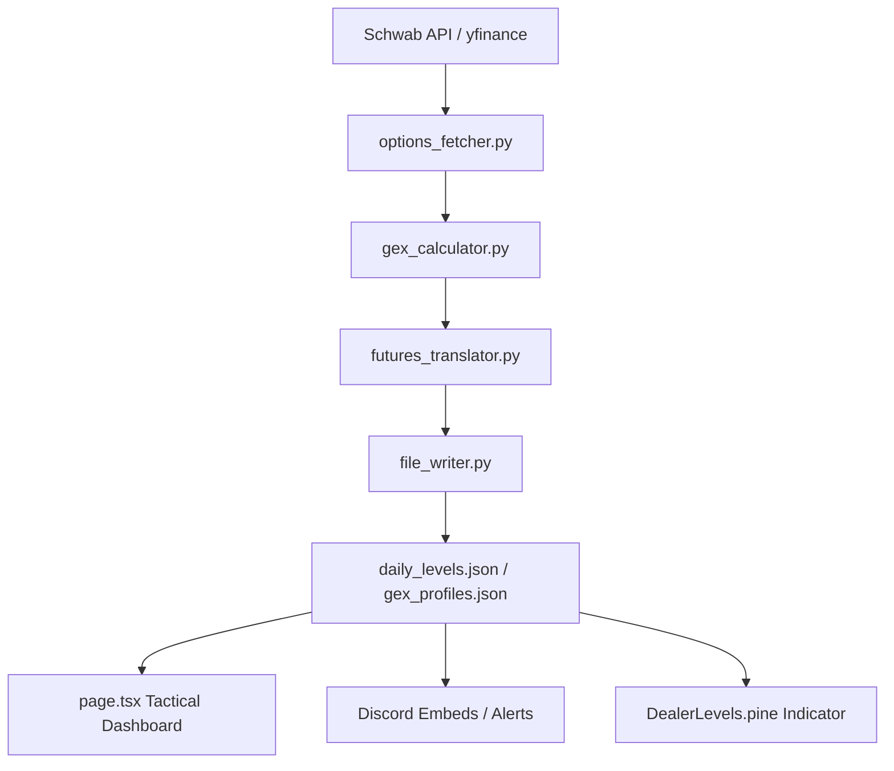

# Dealer Levels — Technical Design

**Feature**: Automated Dealer Positioning Levels via Options GEX  
**Version**: 3.0 (Volatility & Skew Integration)
**Last Updated**: 2026-03-22

---

## 1) Architecture Overview

The system operates as a unified data-to-UI pipeline:



---

## 2) Key Data Components

### 2.1 Backend Engine (`run_options_levels.py`)
Responsible for orchestrating:
- **Prioritized Scanning**: Tiered polling (60s for SPX/QQQ, 10m for secondary).
- **Strike Aggregation**: Multi-expiry flattening to calculate dealer exposure over specific DTE windows.
- **Centroids**: Calculation of Volume-Weighted (VWAP) centroids of strikes for the "True Center" of dealer position.
- **Volatility & Skew**: 
    - **ATM IV**: Tracks the At-The-Money implied volatility.
    - **25D Skew**: Compares 25-delta Puts vs Calls to calculate the **Volatility Skew Premium**.
- **Vanna/Charm Proxies**: Sensitivity analysis of dealer gamma relative to implied volatility and time decay.

### 2.2 Translation & Normalization (`futures_translator.py`)
Handles the translation of cash-index levels (SPX) into futures-space (/ES) using:
- **Additive Spread**: For instruments at the same scale (SPX -> ES).
- **Multiplicative Ratio**: For instruments at different scales (QQQ -> NQ).

---

## 3) Dashboard UI Design (`page.tsx`)

The **Options Tactical Command** is a Next.js application designed as a real-time monitor for active traders.

### 3.2 Display Philosophy
- **Immersive Visuals**: High-contrast, neon-on-dark HUD with glassmorphism overlays.
- **Volatility Skew Chart**: Real-time line chart tracking the "Fear Premium" pulse throughout the session.
- **Cumulative IV Shift**: Unified calculation in `page.tsx` that compares current IV against the first recorded IV of the day, displayed in both the Stats Hero and Daily Shift cards.
- **Pulsing Alerts**: Visual pulsing and audio chimes trigger on **Regime Shifts** (e.g., Battle Zone -> Trending Bullish).
- **Precision Zoom**: Multi-mode charts (GEX, Volume, OI) with automatic strike-window zooming based on current spot range.

---

## 4) Data Schemas

### 4.1 `gex_profiles.json` (Strikes)
Includes strike-level metrics used for the profile charts:
```json
{
  "strike": 6680.0,
  "call_gex": 12.5,
  "put_gex": -5.2,
  "net_gex": 7.3,
  "call_vol": 4500,
  "put_vol": 1200,
  "call_oi": 15000,
  "put_oi": 8000
}
```

### 4.2 `daily_levels.json` (State)
Includes the full market structure and individual level coordinates.

---

## 5) Error Isolation & Resilience
- **API Guardrails**: Throttling and retry logic in `options_fetcher.py`.
- **Data Integrity Cache**: `pipeline_state.json` provides a snapshot for recovery if a cycle fails.
- **ETF Fallback**: SPX/NDX automatically fallback to SPY/QQQ if index chains are missing or sparse.
