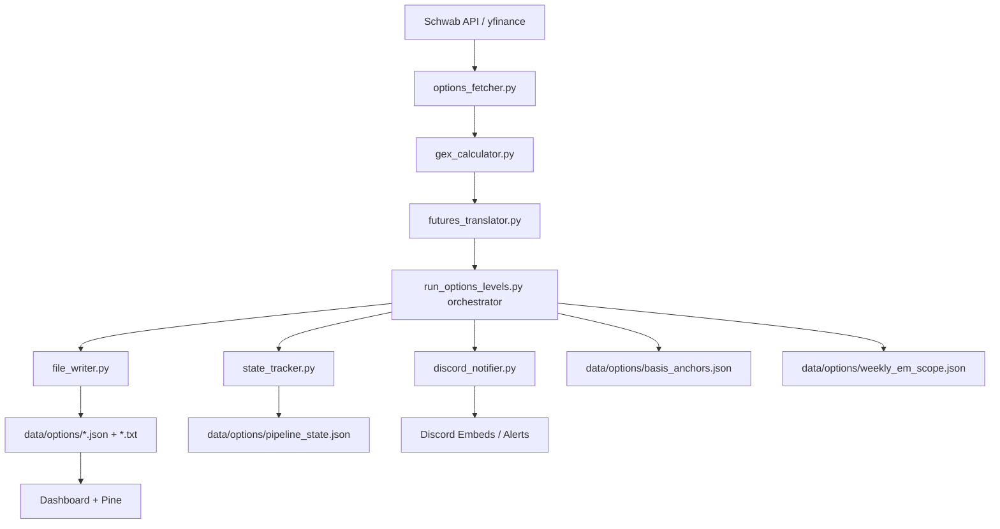

# Dealer Levels — Technical Design

**Feature**: Automated Dealer Positioning Levels via Options GEX
**Version**: 3.2 (EM85 Propagation + Weekly Scope Persistence)
**Last Updated**: 2026-05-09

---

## 1) Architecture Overview

The system operates as a unified data-to-UI pipeline:



---

## 2) Key Data Components

### 2.1 Backend Engine (`run_options_levels.py`)
Responsible for orchestrating:
- **Prioritized Scanning**: Tiered polling (60s for SPX/QQQ, 10m for secondary).
- **Strike Aggregation**: Multi-expiry flattening to calculate dealer exposure over specific DTE windows.
- **Resilience Paths**: per-ticker exception isolation, ETF fallback for sparse/invalid index chains.
- **Expected-Move Family**: standard EM + EM85 (`straddle_85_upper/lower`) per expiry.
- **Weekly Scope Capture**: Friday EOD capture and Mon-Fri carry-forward of weekly scope bounds.
- **State Persistence**:
  - basis anchors
  - weekly scope cache
  - regime state snapshots for change detection

### 2.2 Translation & Normalization (`futures_translator.py`)
Handles the translation of cash-index levels (SPX) into futures-space (/ES) using:
- **Additive Spread**: For instruments at the same scale (SPX -> ES).
- **Multiplicative Ratio**: For instruments at different scales (QQQ -> NQ).
- **Expected Move Propagation**: carries EM and EM85 bounds through translation.

### 2.3 Rescaling Path (`gex_calculator.py`)
- ETF-derived fallback levels are rescaled back to target cash index space.
- EM and EM85 values are preserved through rescale to avoid downstream signal loss.

### 2.4 Formatting + Delivery
- `formatting.py` generates copy-ready rows and metadata tokens for Pine. It resolves `active_zg` by prioritizing the delta-adjusted Zero Gamma (`zero_gamma_delta_adj`) over the standard metric.
- `copy_ready_line` formats the active Zero Gamma level as `Zero Gamma (Δ-Adj)` to automatically route the delta-adjusted value to the charts.
- `discord_notifier.py` builds compact embeds, enforces payload budgets, and falls back to text payloads when embed rejection occurs.

---

## 3) Consumer Surfaces

- Web tactical dashboard (`/options-live`)
- Discord updates and regime alerts
- TradingView Pine overlays via paste-based text inputs:
  - **`ExecutionHUD.pine`**: Draws trigger/target bands (scaled to 1.5% of Expected Move) with a solid midline inside each band, transparent ghost lines, and an interactive 4-column HUD.
  - **`MacroDealerLevels.pine`**: Displays a detailed multi-row dashboard and original level layout, updated to parse `Zero Gamma (Δ-Adj)` levels.

---

## 4) Data Schemas

### 4.1 `data/options/gex_profiles.json` (Strikes)
Includes strike-level metrics used for the profile charts:
```json
{
  "strike": 6680.0,
  "call_gex": 12.5,
  "put_gex": -5.2,
  "net_gex": 7.3,
  "call_vol": 4500,
  "put_vol": 1200,
  "call_oi": 15000,
  "put_oi": 8000
}
```

### 4.2 `data/options/daily_levels.json` and `data/options/intraday_levels.json` (State)
Includes market structure, translated levels, expected-move arrays, metadata fields, and scored overlays.

### 4.3 `data/options/weekly_em_scope.json` (Weekly Carry Cache)
Stores ticker-scoped weekly EM/EM85 capture records from Friday EOD for reuse on subsequent sessions until rollover.

### 4.4 `data/options/pipeline_state.json` (Change Detection)
Stores prior run state to detect regime/bias/structure changes and trigger alerts.

---

## 5) Error Isolation & Resilience
- **API Guardrails**: Throttling and retry logic in `options_fetcher.py`.
- **Data Integrity Cache**: `pipeline_state.json` snapshots prior state for resilient diffing.
- **ETF Fallback**: SPX/NDX automatically fallback to SPY/QQQ if index chains are missing or sparse.
- **Discord Hardening**: oversized embed paths are compacted and retried as text payloads.

---

## 6) Daily 16:14 ET TOS Expected Move & Historical IV Pipeline

For full architectural details, see [TOS_EXPECTED_MOVE_PIPELINE_DESIGN.md](file:///c:/Users/vinay/tvDownloadOHLC/docs/architecture/TOS_EXPECTED_MOVE_PIPELINE_DESIGN.md).

- **Execution Time:** Scheduled daily at **16:14 ET** (Mon–Fri) in `run_options_levels.py` (`daily_multi_expiry_tos_em`).
- **Prioritization:**
  1. Priority 1 (Futures): `ES`, `NQ` (with settlement verification).
  2. Priority 2 (Indices & ETFs): `SPX`, `SPY`, `QQQ`, `IWM`, `DIA`, `NDX`, `SMH`, `SPCX`.
  3. Priority 3 (Stocks): 39 monitored mega-caps, semis, infra, cyber, crypto, and pharma names.
- **Database Target (`web/prisma/dev.db`):**
  - `ExpectedMove`: Populates `manualEm` for weekly Friday expiries, preserving daily calculation dates as active support/resistance lines.
  - `HistoricalVolatility`: Populates daily closing `iv` and `closePrice` for historical IV ranking and percentile analytics.

