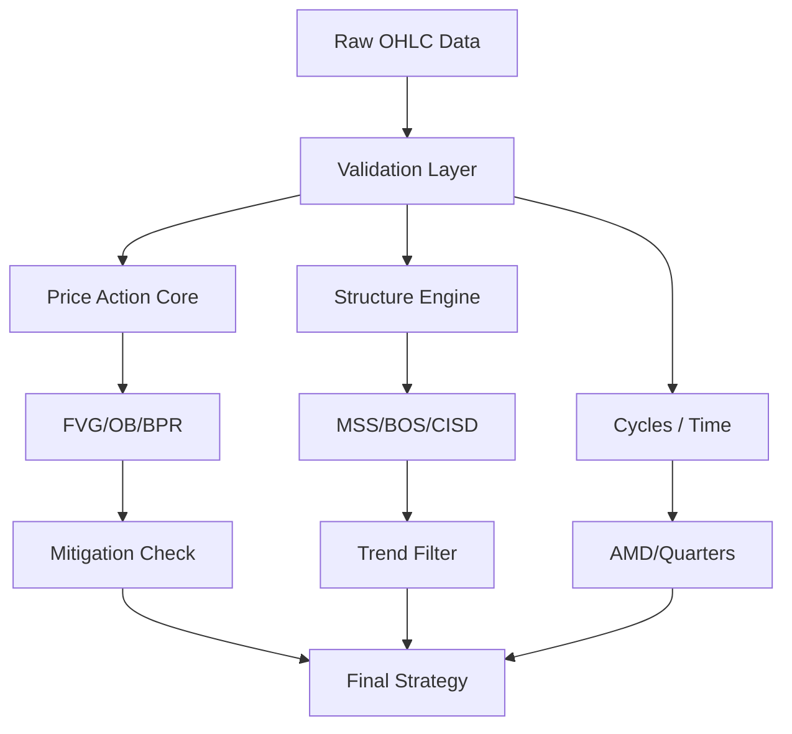

# ICT Unified Engine (V1.3.0) — Architecture & API Reference

## 1. Overview
The `ict_engine` is a high-performance, vectorized Python library designed to detect ICT (Inner Circle Trader) and SMC (Smart Money Concepts) patterns. It is built as a **"Clean Architecture"** middleware that bridges raw market data (Parquet/OHLC) with algorithmic strategies.

**v1.3.0 changes:**
- `detect_fvg()` rewritten as canonical FVG implementation (merged from `nqstats.ib.detect_fvgs_v5`)
- `detect_volume_imbalance()` enhanced with `resample_rule` param + `vi_finalized_time` column
- `detect_ipda_ranges()` added — IPDA 20/40/60 rolling dealing ranges
- `get_silver_bullet_data()` added — Silver Bullet window detection
- `SILVER_BULLETS` constant dict added
- `detect_gap_fills()` added — tracks when NWOG/NDOG/RTH gaps get filled
- `get_gap_consequent_encroachment()` fixed (removed erroneous `@validate_ohlc` decorator)
- `nqstats.ib.detect_fvgs_v5` and `detect_fvgs_vectorized` are now thin wrappers delegating to `ict_engine.pa.detect_fvg`

## 2. Architecture & Data Flow
The engine follows a strict **Pipe-and-Filter** pattern:
`Raw OHLC` -> `Validation` -> `Core Detection` -> `Mitigation Tracking` -> `Strategy Signal`

## 3. API Reference

### 3.1 Validation Layer
- **`validate_ohlc(input_type="ohlc")`**
  - **Type**: Decorator
  - **Input**: `pd.DataFrame`
  - **Output**: Normalized lowercase OHLC DataFrame.

### 3.2 Price Action Core (`pa.py`)
- **`detect_fvg(ohlc, join_consecutive=False, require_candle_direction=False, resample_rule=None)`**
  - **Output**: `pd.DataFrame` columns: `fvg_type` (1/-1/0), `fvg_top`, `fvg_bottom`, `fvg_low`, `fvg_high`, `fvg_finalized_time`.
  - **Description**: Canonical 3-bar Fair Value Gap detection. Supports optional resampling, consecutive gap merging, and candle direction filtering. `nqstats.ib.detect_fvgs_v5` delegates to this.
- **`detect_inversion_fvg(ohlc, fvg_df)`**
  - **Output**: `pd.DataFrame` columns: `ifvg` (1/-1), `top`, `bottom`.
- **`detect_bpr(fvg_bull, fvg_bear)`**
  - **Output**: `pd.DataFrame` columns: `bpr` (1/0), `top`, `bottom`.
- **`detect_orderblock(ohlc, swings)`**
  - **Output**: `pd.DataFrame` columns: `ob` (1/-1), `top`, `bottom`.
- **`detect_breaker(ohlc, swings)`**
  - **Output**: `pd.DataFrame` columns: `breaker` (1/-1), `top`, `bottom`.
- **`detect_liquidity(ohlc, swings, threshold=0.0001)`**
  - **Output**: `pd.DataFrame` columns: `liquidity` (1/-1), `level`, `type`.
  - **Description**: Identifies external liquidity pools. 
    - `BSL`: Swing High.
    - `SSL`: Swing Low.
    - `EQH`: Equal Highs (cluster of 2+).
    - `EQL`: Equal Lows (cluster of 2+).
- **`detect_volume_imbalance(ohlc, resample_rule=None)`**
  - **Output**: `pd.DataFrame` columns: `vi_type` (1/-1/0), `vi_top`, `vi_bottom`, `vi_finalized_time`.
  - **Description**: Detects gaps between the *bodies* of consecutive candles (Close[i-1] vs Open[i]).
- **`detect_liquidity_void(ohlc)`**
  - **Output**: `pd.DataFrame` columns: `void` (1/0), `top`, `bottom`.
- **`detect_first_fvg_per_hour(ohlc, fvg_df)`**
  - **Output**: `pd.DataFrame` columns: `first_fvg` (1/-1), `top`, `bottom`.
  - **Description**: Identifies the "First Presented FVG" of every hour (starts at H:00).
- **`detect_first_fvg_after_time(ohlc, fvg_df, time_str="09:30")`**
  - **Output**: `pd.DataFrame` columns: `first_fvg` (1/-1), `top`, `bottom`.
  - **Description**: Identifies the single "First Presented FVG" after a specific target time (e.g., NY Open).
- **`detect_opening_gaps(ohlc)`**
  - **Output**: `pd.DataFrame` columns: `nwog`, `ndog`, `gap_top`, `gap_bottom`.
- **`detect_rth_gaps(ohlc, ticker="ES1")`**
  - **Output**: `pd.DataFrame` columns: `rth_gap`, `gap_top`, `gap_bottom`.
- **`detect_gap_fills(ohlc, gaps_df)`**
  - **Output**: `pd.DataFrame` columns: `filled` (1/0), `fill_time`, `fill_price`.
  - **Description**: Tracks when opening gaps get filled by subsequent price movement.
- **`get_gap_consequent_encroachment(gaps_df)`**
  - **Output**: `pd.Series` — 50% midpoint of detected gaps.

### 3.3 Structure Engine (`structure.py`)
- **`detect_swings(ohlc, swing_length=5)`**
  - **Output**: `pd.DataFrame` columns: `shl` (1/-1), `level`.
- **`detect_structure_breaks(ohlc, swings)`**
  - **Output**: `pd.DataFrame` columns: `break_high`, `break_low`.
- **`detect_cisd(ohlc, swings)`**
  - **Output**: `pd.DataFrame` columns: `cisd` (1/-1), `extreme_ref`.

### 3.4 Cycles & Time (`cycles.py`)
- **`detect_ttrade_fractal(ohlc)`**
  - **Output**: `pd.DataFrame` columns: `ttrade_reversal` (1/-1), `ttrade_confirmation` (1/-1).
  - **Description**: Mechanical candle-by-candle reversal model (C1-C4).
- **`detect_po3(ohlc, session_mask)`**
  - **Output**: `pd.DataFrame` columns: `phase`, `opening_price`.
- **`quarterly_cycles(ohlc)`**
  - **Output**: `pd.DataFrame` columns: `quarter` (1-4), `cycle_open`.
- **`get_session_data(ohlc, session_name)`**
  - **Output**: `pd.DataFrame` columns: `active`, `session_high`, `session_low`.
- **`get_macro_data(ohlc, macro_name)`**
  - **Output**: `pd.DataFrame` columns: `active`, `macro_high`, `macro_low`.
- **`get_silver_bullet_data(ohlc, bullet_name)`**
  - **Output**: `pd.DataFrame` columns: `active`, `sb_high`, `sb_low`.
  - **Description**: Vectorized Silver Bullet window detection. Windows: `london_sb` (03:00-04:00), `ny_am_sb` (10:00-11:00), `ny_pm_sb` (14:00-15:00).
- **`detect_htf_levels(ohlc)`**
  - **Output**: `pd.DataFrame` columns: `pdh`, `pdl`, `pdm`, `pwh`, `pwl`, `pwm`, `pmh`, `pml`, `pmm`.
- **`detect_ipda_ranges(ohlc)`**
  - **Output**: `pd.DataFrame` columns: `ipda20_high`, `ipda20_low`, `ipda20_eq`, `ipda20_pct`, `ipda40_*`, `ipda60_*`.
  - **Description**: IPDA 20/40/60 rolling dealing ranges. Each shifts daily (excludes current bar). Position pct = (close - low) / (high - low) * 100.
- **`detect_dealing_range(ohlc, swings)`**
  - **Output**: `pd.DataFrame` columns: `equilibrium`, `is_discount`, `is_premium`.

### 3.5 Projections & Correlation
- **`sd_projections(ohlc, anchor_high, anchor_low)`**
  - **Output**: `pd.DataFrame` columns: `sd_2`, `sd_2.5`, `sd_4`.
- **`detect_smt(symbol_a, symbol_b, swings_a, swings_b)`**
  - **Output**: `pd.DataFrame` columns: `smt` (1/-1).

### 3.6 Bias & Filters (`bias.py`)
- **`detect_bias_mmxm_simple(ohlc_1h)`**
  - **Output**: `pd.DataFrame` columns: `mmxm_ema_200`, `bias_mmxm`.
  - **Description**: 1H 200 EMA directional filter.
- **`detect_bias_ttrades_mechanical(ohlc_daily, ohlc_intraday)`**
  - **Output**: `pd.DataFrame` columns: `bias_ttrades`, `potential_reversal`.
  - **Description**: PDH/PDL Close/Wick mechanical bias.
- **`apply_midnight_open_filter(ohlc, bias)`**
  - **Output**: `pd.Series` (bool).
  - **Description**: Flags if price is in the optimal execution zone (Discount for Longs / Premium for Shorts).

## 5. Liquidity & Algorithmic Targets

The `ict_engine` implements the "Market Delivery Triad": 
1. **Liquidity Sweeps** (External)
2. **Imbalance Rebalancing** (Internal)
3. **Time-Based Sensitivity** (Killzones/Macros)

### 5.1 External Liquidity (BSL / SSL)
Found using `detect_liquidity` and `detect_htf_levels`. These represent where stop-loss orders are concentrated:
- **Major Swings**: The absolute high/low of a price leg.
- **Equal Highs/Lows (EQH/EQL)**: High-conviction liquidity pools.
- **HTF Levels**: PDH (Previous Day High), PWH (Previous Week High), PMH (Previous Month High) and their respective lows.

### 5.2 Internal Liquidity (Gaps)
Found using `pa.py`, `sessions.py`, and `gaps.py`:
- **Fair Value Gaps (FVG)**: 3-bar displacement gaps.
- **Volume Imbalance (VI)**: Gaps between candle bodies.
- **Opening Gaps (NWOG/NDOG/RTH)**: Gaps formed during session transitions.
- **Session Highs/Lows**: Asia, London, and NY session highs/lows.

### 5.3 Order of Delivery & Narrative
The algorithm delivered by this engine assumes:
- **Narrative**: Determine if price is in **Premium** or **Discount** using `detect_dealing_range`. 
- **Internal to External**: If price just filled an **Internal Imbalance** -> Next draw is **External Liquidity**.
- **External to Internal**: If price just swept **External Liquidity** -> Next draw is **Internal Imbalance**.

## 6. Performance Standards
- **Vectorization**: All functions MUST use NumPy/Pandas vectorization. Manual loops are forbidden for O(N) operations.
- **Decomposition**: No function shall exceed 50 lines.
- **Memory**: Use `float32` or `int32` where possible to minimize footprint on large Parquet datasets.
