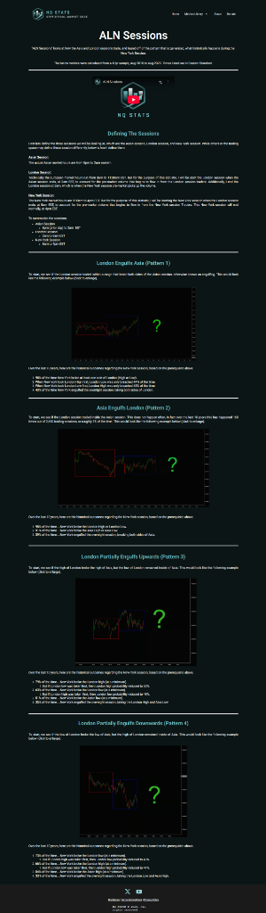

# ALN Sessions Verification Report

**Source**: [NQStats - ALN Sessions](https://nqstats.com/aln-sessions) (Credit to NQStats)
**Date Verified**: January 3, 2026
**Tickers Analyzed**: NQ, ES, YM, RTY, GC, CL (10 Years: 2014-2025)

## 1. Concept & Context (Visual)
The **ALN (Asia-London-New York)** metric classifies the market state based on how the London Session (03:00-08:00 ET) interacts with the Asia Session (18:00-02:00 ET), and predicts how the New York Session (09:30-16:00 ET) will behave.

### The 4 Patterns (Visualized Above)
*   **LEA (London Engulfs Asia)**: London breaks BOTH Asia High and Low.
    *   *Bias*: Volatile. NY is expected to break AT LEAST one London extreme.
*   **LPEU (London Partial Engulf Up)**: London breaks Asia High, holds Asia Low.
    *   *Bias*: **BULLISH Continuation**. NY is expected to break London High.
*   **LPED (London Partial Engulf Down)**: London breaks Asia Low, holds Asia High.
    *   *Bias*: **BEARISH Continuation**. NY is expected to break London Low.
*   **AEL (Asia Engulfs London)**: Rare. London stays inside Asia.
    *   *Bias*: Determining...

## 2. Verification Analysis (The Data)
We ran a 10-year verification script across 6 tickers. Here are the **Confirmed Probabilities** vs Claims.

### Key Finding: NQ is the "Alpha"
NQ (Nasdaq) respects the "London Continuation" patterns (LPEU/LPED) more reliably than any other asset (82% Win Rate).

| Scenario | Metric | Claim | **NQ Actual** | **ES Actual** | **GC Actual** | **CL Actual** |
| :--- | :--- | :--- | :--- | :--- | :--- | :--- |
| **LEA** (Engulfs Asia) | Break London Hi/Lo | 80% | **99.3%** | 99.3% | 99.3% | 97.4% |
| | Engulf Both | 64% | **45.3%** | 31.7% | 39.8% | 31.7% |
| **LPEU** (Partial Up) | **Continuation (Break High)** | 78% | **82.2%** | 78.5% | 69.4% | 76.6% |
| | Reversal (Break Low) | 63% | **65.9%** | 61.4% | 55.8% | 57.1% |
| **LPED** (Partial Down)| **Continuation (Break Low)** | 82% | **76.0%** | 73.5% | 69.9% | 73.8% |
| | Reversal (Break High) | 58% | **68.2%** | 64.7% | 54.1% | 55.4% |

## 3. Operational Strategy
Based on the data, the most profitable strategies are:

### Strategy A: The NQ Continuation (LPEU/LPED)
*   **Trigger**: At 08:00 AM ET, check if London broke only one side of Asia.
*   **Action**:
    *   If **LPEU** (Partially Up): Look for Longs. **Target: London High**. (82% Probability).
    *   If **LPED** (Partially Down): Look for Shorts. **Target: London Low**. (76% Probability).
*   **Asset**: Trade this primarily on **NQ**. Avoid on Gold (GC) where continuation is <70%.

### Strategy B: The LEA Volatility Expansion
*   **Trigger**: London Engulfs Asia (LEA).
*   **Action**: Expect expansion. Do NOT fade the first break of London High/Low in NY. The market has proven it wants to clear liquidity.

## 4. Source Code & Data
*   **Verification Script**: [verify_aln.py](file:///scripts/nqstats/aln_sessions/verify_aln.py)
*   **Raw Results (CSV)**: [aln_verification_summary.csv](file:///scripts/nqstats/results/aln_verification_summary.csv)
