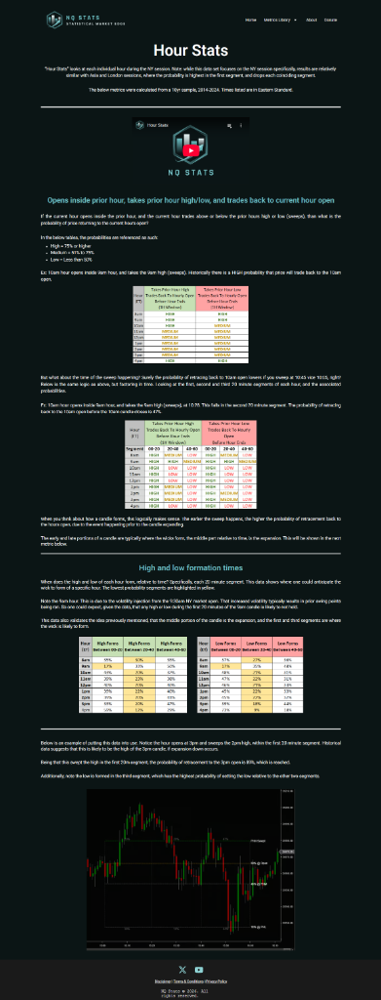

# Hour Stats Logic

**Source**: NQStats "Hour Stats" Video Transcript

**Concept**: Probability of price returning to the current hour's OPEN after sweeping the previous hour's High or Low.

## 1. The Core Stat
*   **Trigger**: Current Hour (e.g., 8:00 AM) breaks ("sweeps") the Previous Hour's (7:00 AM) High or Low.
*   **Claim**: Historically, there is a **~75% probability** that price will trade back to the Current Hour's **OPEN**.

## 2. Granularity (20-Minute Segments)
The probability changes based on *when* the sweep happens within the hour:
*   **Segment 1 (First 20 mins)**: **89%** probability of return to Open. (Highest edge).
*   **Segment 2 (Middle 20 mins)**: Probability drops (e.g., ~84%), but still high.
*   **Segment 3 (Last 20 mins)**: Lowest probability of return.

## 3. High/Low Formation Times
*   **First 20 mins**: Rarely sets the true High/Low of the hour (except for 9:00 AM due to 9:30 open).
*   **Middle/Last 20 mins**: Where the true High/Low usually forms.

## 4. Operational Filters
*   **Minimum Distance**: Look for at least **20-50 points** between the Current Open and the Sweep level (Prior High/Low) to make the target viable.
*   **9:00 AM Exception**: The 9:00 AM hour often sweeps in the middle/end due to the 9:30 Equity Open volatility.

## 5. Strategy
1.  Wait for a new hour to open (e.g., 8:00 AM).
2.  Mark the Opening Price.
3.  Wait for price to sweep the Prior Hour's High or Low (especially in the first 20 mins).
4.  **Target**: A return to the Opening Price.
