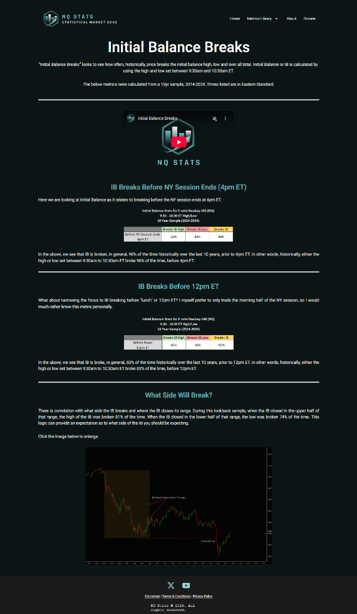

# Initial Balance (IB) Verification Report

**Source**: [NQStats - IB Breaks](https://nqstats.com/initial-balance-breaks) (Credit to NQStats)
**Date Verified**: January 3, 2026
**Tickers Analyzed**: NQ, ES, YM, RTY, GC, CL (10 Years: 2014-2025)

## 1. Concept & Context (Visual)
The **Initial Balance (IB)** is the price range established during the first hour of the Regular Trading Session (09:30 AM - 10:30 AM ET).
*   **The Theory**: The IB is merely an opening range.
*   **The Claim**: The market will almost *never* stay inside this 1-hour range for the entire day.
*   **The Bias**: The direction of the break is correlated to where the 10:30 AM hourly candle CLOSES (Upper vs Lower half).

## 2. Verification Analysis (The Data)
We verified the "Break Probability" and "Directional Bias" across 10 years.

### A. The "96% Rule" (Expansion is Guaranteed)
It is statistically near-impossible for NQ or ES to stay inside the 9:30-10:30 range all day.
*   **NQ1**: **96.2%** probability of breaking the High or Low before close.
*   **Timing**: **85.5%** of these breaks happen **before 12:00 PM**.

| Ticker | Break Before Noon | Break Before Close |
| :--- | :--- | :--- |
| **NQ1** | **85.5%** | **96.2%** |
| **ES1** | **84.6%** | **96.0%** |
| **CL1** | **89.5%** (Fast Mover) | **96.7%** |
| **YM1** | 81.3% | 94.6% |
| **GC1** | 76.9% | 91.2% |

### B. Directional Bias ( The "Half" Rule)
If the 09:30-10:30 candle closes in the **Upper Half** of its range, probabilities favor breaking the **High**.

| Ticker | Upper Close -> Break High | Lower Close -> Break Low |
| :--- | :--- | :--- |
| **NQ1** | **81.3%** | **79.5%** |
| **ES1** | **81.7%** | **81.2%** |
| **CL1** | **81.0%** | **79.3%** |

## 3. Operational Strategy
*   **The Setup**:
    1.  At 10:30 AM ET, draw the High and Low of the session so far.
    2.  Check the 10:30 Closing Price.
*   **The Bias**:
    *   **Upper Half Close**: Long Bias. Target the IB High. (>80% Win Rate).
    *   **Lower Half Close**: Short Bias. Target the IB Low.
*   **Timing**: Expect the move to happen largely before Noon (85% chance). If it hasn't broken by Noon, exercise caution (chop likely).

## 4. Source Code & Data
*   **Verification Script**: [verify_ib_breaks.py](file:///scripts/nqstats/initial_balance/verify_ib_breaks.py)
*   **Raw Results (CSV)**: [ib_breaks_verification.csv](file:///scripts/nqstats/results/ib_breaks_verification.csv)
