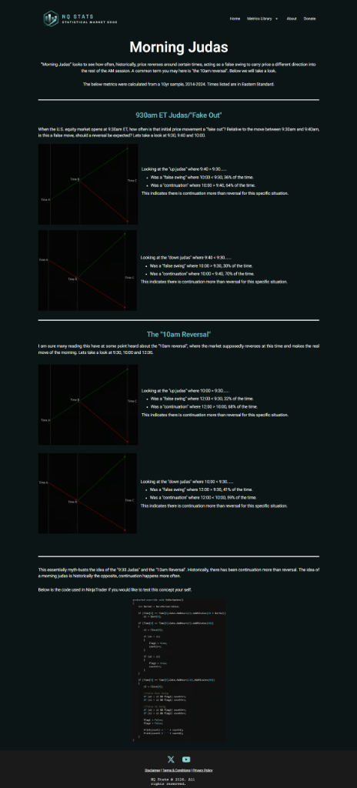

# Morning Judas Verification Report

**Source**: [NQStats - Morning Judas](https://nqstats.com/morning-judas) (Credit to NQStats)
**Date Verified**: January 3, 2026
**Tickers Analyzed**: NQ, ES, YM, RTY, GC, CL (10 Years: 2014-2025)

## 1. Concept & Context (Visual)
The "Morning Judas" is a popular concept (often called the 10am Reversal or Fake Out) suggesting that the initial move from 9:30-9:40 AM is a trap to induce traders before reversing the other way.

### The Myth
*   **The Belief**: The 9:30-9:40 move is "Fake" (Judas).
*   **The Prediction**: Price will reverse and break the 9:30 Open by 10:00 AM.

## 2. Verification Analysis (The Data)
We verified the probabilities of **Continuation** (Price stays advanced) vs **Reversal** (Price breaks the 9:30 Open) by 10:00 AM.

### Outcome: Myth Busted for Equities
For Equity Futures (NQ, ES, YM, RTY), the initial move is **Real** far more often than it is fake.
*   **Reversal Probability**: Only **~24%**. (1 in 4 times).
*   **Holding the Move**: **~76%**. (Price 10:00 > Price 9:30).

| Scenario | Metric | NQ1 | ES1 | YM1 | RTY1 | Verdict |
| :--- | :--- | :--- | :--- | :--- | :--- | :--- |
| **Up Judas** (9:30-9:40 UP) | Reversal (<9:30) | **23.9%** | 22.0% | **22.4%** | 25.3% | **Unlikely** |
| | Continuation (>9:40) | **53.6%** | 53.0% | 52.8% | 50.0% | **Probable** |
| | **Holds Gains** (>9:30) | **76.1%** | **78.0%** | **77.6%** | **74.7%** | **Strong Bias** |
| **Down Judas** (9:30-9:40 DOWN) | Reversal (>9:30) | **24.5%** | 22.4% | **23.3%** | 25.3% | **Unlikely** |
| | Continuation (<9:40) | **53.3%** | 52.3% | 51.5% | 49.2% | **Probable** |
| | **Holds Drop** (<9:30) | **75.5%** | **77.6%** | **76.7%** | **74.7%** | **Strong Bias** |

### Outcome: NO EDGE for Commodities (GC/CL)
We ran a specific optimization for Gold (GC) and Oil (CL), testing multiple start times (08:00, 08:30, 09:00, 09:30).
*   **Result**: The Continuation vs Reversal rate is effectively **50/50** (Coin Flip) at all tested times.
*   **Takeaway**: The "Opening Drive" is a structural behavior of the NYSE Equity Open (9:30 AM). It does not apply to global commodities that trade heavily during London. **Do not use Morning Judas on Gold or Oil.**

## 3. Operational Strategy (Equities Only)
*   **Myth Bust**: Do **NOT** blindly fade the 9:30-9:40 move expecting a "Judas" reversal. That trade loses 76% of the time.
*   **Trend Follow**: If the first 10 minutes expands, the odds favor the 10:00 AM candle closing in that same direction.
*   **The Trade**: Wait for a pullback after 9:40 and look to join the trend, rather than shorting the high.

## 4. Source Code & Data
*   **Verification Script**: [verify_judas.py](file:///scripts/nqstats/morning_judas/verify_judas.py)
*   **Optimization Script**: [optimize_judas_times.py](file:///scripts/nqstats/morning_judas/optimize_judas_times.py)
*   **Raw Results (CSV)**: [judas_verification.csv](file:///scripts/nqstats/results/judas_verification.csv)
