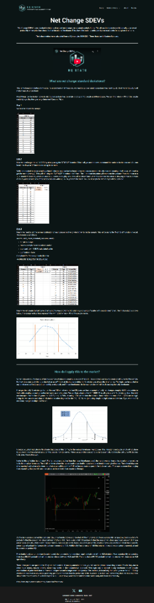

# Net Change SDEVs Verification Report

**Source**: [NQStats - Net Change SDEVs](https://nqstats.com/net-change-sdevs) (Credit to NQStats)
**Date Verified**: January 3, 2026
**Tickers Analyzed**: NQ, ES, YM, RTY, GC, CL (10 Years: 2014-2025)

## 1. Concept & Context (Visual)
The **Net Change SDEVs** metric uses a Rolling 1-Year (252 Trading Day) Standard Deviation of the "Net Change" (Daily Close - Daily Open).
*   **The Theory**: Price movement is normally distributed.
*   **The Levels**:
    *   **0.5 SD**: 68% of moves fall within +/- 1 SD (so 0.5 is a minor level).
    *   **1.0 SD**: 84% of all *Daily Closes* fall within +/- 1 SD.
    *   **2.0 SD**: 95% of all *Daily Closes* fall within +/- 2 SD.
*   **The Trade**: Using these levels as mean-reversion points intraday.

## 2. Verification Analysis (The Danger)
While the math is correct (unconditional probability), the **Conditional Probability** of a reversal *given that price touched the line* is notably weak.

### "Trend Day" Warning
The verification data reveals that **hitting the 1.0 SD line is often a Breakout Signal**, not a Reversion Signal.
*   **NQ1**: If price touches the 1.0 SD line, it only closes back inside **44.9%** of the time.
    *   This means **55.1%** of the time, it continues trending (Close Outside).

| Ticker | 0.5 SD Reversion | **1.0 SD Reversion** | 1.5 SD Reversion | 2.0 SD Reversion |
| :--- | :--- | :--- | :--- | :--- |
| **NQ1** | 39.5% | **44.9%** (Loss) | 47.6% | 40.0% |
| **ES1** | 37.7% | **45.5%** (Loss) | 47.0% | 47.6% |
| **YM1** | 39.8% | **46.0%** (Loss) | 46.7% | 51.6% |
| **RTY1** | 38.2% | **46.8%** (Loss) | 47.0% | 50.5% |
| **CL1** | 38.9% | **44.6%** (Loss) | 46.9% | 49.2% |
| **GC1** | 41.4% | **51.0%** (Coin Flip) | 51.3% | 50.3% |

## 3. Operational Strategy
*   **Warning**: Do **NOT** place blind limit orders at the SD lines (StartFading).
*   **Trend Identification**:
    *   If price approaches 1.0 SD with strong momentum (no consolidation), assume a **Trend Day**.
    *   The "Rubber Band" is snapping. Go with the flow or stand aside.
*   **Confirmation**: Only fade if:
    1.  Price hits the level.
    2.  Price consolidates for >30 mins OR forms a lower-high (reversal structure) on M15.

## 4. Source Code & Data
*   **Verification Script**: [verify_sdevs.py](file:///scripts/nqstats/net_change_sdevs/verify_sdevs.py)
*   **Raw Results (CSV)**: [sdev_verification.csv](file:///scripts/nqstats/results/sdev_verification.csv)
