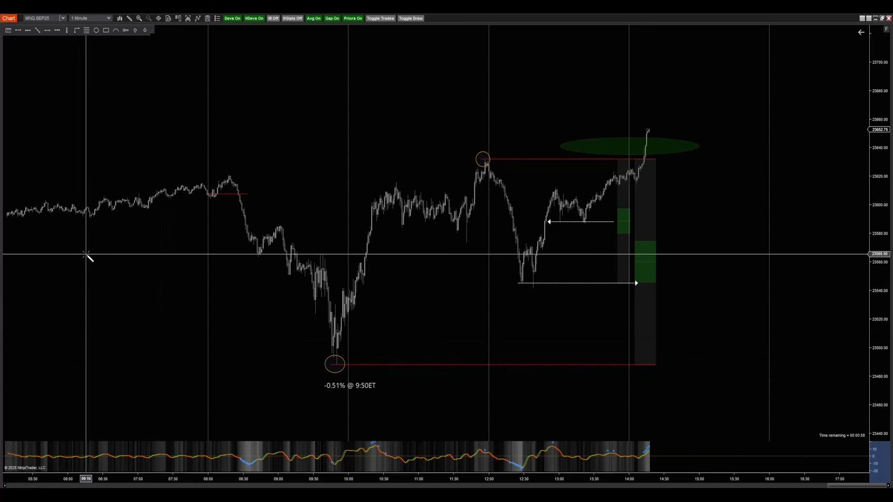

# Example Noon Curve Trade

**Video**: [INQ Stats - Noon Curve Example](https://www.youtube.com/watch?v=c6rKQ7uIUKI)
**Transcript**: [Glasp Reader](https://glasp.co/reader?url=https://www.youtube.com/watch?v=c6rKQ7uIUKI)

## Important Disclaimer

INQ Stats provides statistical edges derived from historical market performance, but it does not provide strategy, indicators, or financial/investment advice. Traders are entirely responsible for how they build around the data, manage their trades, and determine entries and exits.

## Market Context & Validating the Setup

* **8:00 AM Open:** This serves as the initial reference point for the session's price movement.
* **AL Session Pattern:** The session presented as "Pattern 4," which historically indicated an expectation to sweep the London lows, which was successfully validated.
* **Setting the AM Low:** A low was established around 10:00 AM that perfectly aligned with historical statistics.
  * **Price:** The low hit at **-0.51%** from the 8:00 AM open, landing right in the middle of the high probable price window.
  * **Time:** The low occurred within the expected **9:00 AM to 10:00 AM** window.
* **Bias Confirmation:** Quarter 2 (10:00 AM - 12:00 PM) broke above the Quarter 1 high. This structural break combined with the statistically accurate AM low creates a strong bias to target a new PM high.

## Trading the "Noon Curve" (Trend Continuation)

* The Noon Curve stat is used for **trend continuation**, unlike other stats that might be meant for mean reversion.
* **Entry Strategy:** Instead of buying the immediate top or a shallow pullback, look for a proper mechanical retracement.
* **The Pullback Zone:** The ideal buy zone is a **40% to 60% retracement** of the most recent leg up (from the AM low to the AM high).

## Trade Management & Scaling Out

* **Defensive Scaling:** Once entered on the pullback, scale out of **50%** of the position when price pushes back up halfway into the minor down-leg. This protects the trader in case the structure fails and shifts into a downtrend rather than continuing up.
* **Final Target (PM High):** Historically, the data expects the PM high to be put in between **2:00 PM and 3:00 PM** Eastern time.
* **Taking Low-Hanging Fruit:** Even if the day's average range suggests the market has room to run much higher (e.g., reaching a 1% up-move based on 60-day averages), it is often a great trade to simply take full profits at the top of the PM high rather than risking runners.

## Conclusion

This particular session offered a picture-perfect Noon Curve setup: the AM low formed at the correct time and price, Q2 broke the Q1 high, the market offered a textbook 50% retracement, and it successfully ran to a new high.