# RTH Gap Morning Decision Flowchart

This flowchart renders in any Markdown viewer that supports Mermaid (GitHub, Obsidian, VS Code, etc.)

```mermaid
flowchart TD
    subgraph PREMARKET["📋 09:25 ET - PRE-MARKET"]
        A[Measure Gap %] --> B{Gap Size?}
    end

    subgraph GAPSIZE["STEP 1: GAP SIZE FILTER"]
        B -->|"< 0.15%"| C1["🟢 NOISE<br/>Fill Rate: 85%+<br/>→ FADE"]
        B -->|"0.15% - 0.45%"| C2["🟡 CONFLICT ZONE<br/>Fill Rate: 55%<br/>→ USE FILTERS"]
        B -->|"> 0.45%"| C3["🔴 SIGNAL<br/>Fill Rate: 35%<br/>→ DEFEND"]
    end

    C1 --> D
    C2 --> D
    C3 --> DEFEND

    subgraph GLOBEX["STEP 2: GLOBEX RANGE"]
        D{Globex Range<br/>vs 20d ATR?}
        D -->|"< 50% ATR<br/>NARROW"| E1["🟢 Fill: 76%<br/>→ FADE BIAS"]
        D -->|"50-100% ATR<br/>NORMAL"| E2["🟡 Fill: 61%<br/>→ FILTER MORE"]
        D -->|"> 100% ATR<br/>WIDE"| E3["🔴 Fill: 41%<br/>→ DEFEND BIAS"]
    end

    E1 --> F
    E2 --> F
    E3 --> DEFEND

    subgraph POSITION["STEP 3: OPEN POSITION"]
        F{RTH Open Position<br/>in Globex Range?}
        F -->|"Lower Third"| G1["Bearish Pressure<br/>Fill: 59%"]
        F -->|"Middle Third"| G2["🟢 NEUTRAL<br/>Fill: 78%<br/>→ BEST FADE"]
        F -->|"Upper Third"| G3["Bullish Pressure<br/>Fill: 57%"]
    end

    G1 --> H
    G2 --> H
    G3 --> H

    subgraph VOL["STEP 4: VOLATILITY CHECK"]
        H{VVIX > 110?<br/>OR High ATR?}
        H -->|"NO<br/>Normal Vol"| I1["✓ Proceed"]
        H -->|"YES<br/>High Vol"| I2["⚠️ DEFENSE BIAS<br/>Skip Fades"]
    end

    I1 --> J
    I2 --> DEFEND

    subgraph NEWS["STEP 5: NEWS CHECK"]
        J{8:30 AM News?<br/>NFP/CPI/GDP}
        J -->|"NO"| K1["Standard Execution"]
        J -->|"YES - NFP"| K2["Wait for flush<br/>NFP fills 68%"]
        J -->|"YES - CPI"| K3["Wider fakeout<br/>More persistent"]
    end

    K1 --> L
    K2 --> L
    K3 --> DEFEND

    subgraph STREAK["STEP 6: STREAK CHECK"]
        L{Consecutive<br/>Fill Days?}
        L -->|"0-1"| M1["Normal Sizing"]
        L -->|"2-3"| M2["⚠️ 85% fill prob<br/>but exhaustion near"]
        L -->|"4+"| M3["🛑 SKIP<br/>Regime reversal due"]
    end

    M1 --> N
    M2 --> N
    M3 --> SKIP

    subgraph DOW["STEP 7: DAY OF WEEK"]
        N{Day of Week?}
        N -->|"Monday"| O1["Defense Prone<br/>Fill: 59%"]
        N -->|"Tue/Wed/Thu"| O2["🟢 BEST FADE<br/>Fill: 67-70%"]
        N -->|"Friday"| O3["Defense Prone<br/>Fill: 63%"]
    end

    O1 --> DECISION
    O2 --> DECISION
    O3 --> DECISION

    subgraph FINAL["FINAL DECISION"]
        DECISION{All Filters<br/>Passed?}
        DECISION -->|"YES - Multiple<br/>Green Signals"| FADE
        DECISION -->|"NO - Multiple<br/>Red Signals"| DEFEND
    end

    subgraph FADETRADE["✅ REVERSION TRADE"]
        FADE["🎯 FADE THE GAP"]
        FADE --> FADE_EXEC["Entry: Fade at open<br/>Stop: 1.0x gap beyond open<br/>Target: Prior RTH close<br/>Time Stop: 30 min<br/><br/>Win Rate: 88-91%"]
    end

    subgraph DEFENDTRADE["🛡️ CONTINUATION TRADE"]
        DEFEND["🎯 DEFEND THE GAP"]
        DEFEND --> DEFEND_EXEC["Entry: With gap direction<br/>Stop: Prior RTH close<br/>Target: 1.5-2x gap size<br/>No time stop<br/><br/>Win Rate: 60-70%"]
    end

    subgraph SKIPTRADE["⏸️ NO TRADE"]
        SKIP["🚫 SIT OUT"]
        SKIP --> SKIP_EXEC["Regime exhaustion<br/>Wait for reset<br/>Preserve capital"]
    end

    FADE_EXEC --> MOAT
    DEFEND_EXEC --> MOAT

    subgraph CONFIRM["09:45 ET - CONFIRMATION"]
        MOAT["15-MIN MOAT CHECK"]
        MOAT --> MOAT_Q{Prior Extreme<br/>Held?}
        MOAT_Q -->|"YES - Held"| MOAT_D["Defense Confirmed<br/>Exit fade OR join trend"]
        MOAT_Q -->|"NO - Broke"| MOAT_R["Reversion Confirmed<br/>Hold for fill"]
    end

    MOAT_R --> MANAGE
    MOAT_D --> MANAGE

    subgraph MGMT["TRADE MANAGEMENT"]
        MANAGE["Monitor Fill Progress"]
        MANAGE --> PROG{Retrace<br/>Level?}
        PROG -->|"At 50%"| HOLD50["82% full fill prob<br/>→ HOLD"]
        PROG -->|"At 75%"| HOLD75["90% full fill prob<br/>→ HOLD"]
        PROG -->|"Stalled 15m+"| REDUCE["Consider reducing<br/>or exiting"]
    end

    style FADE fill:#22c55e,color:#fff
    style DEFEND fill:#3b82f6,color:#fff
    style SKIP fill:#6b7280,color:#fff
    style G2 fill:#22c55e,color:#fff
    style O2 fill:#22c55e,color:#fff
    style E1 fill:#22c55e,color:#fff
    style C1 fill:#22c55e,color:#fff
    style C3 fill:#ef4444,color:#fff
    style E3 fill:#ef4444,color:#fff
    style I2 fill:#ef4444,color:#fff
    style M3 fill:#ef4444,color:#fff
```



---

## Simplified Decision Tree (Text Version)

```
09:25 ET START
    │
    ├─► Gap < 0.15%? ──────────────────────► FADE (85%+ fill)
    │
    ├─► Gap > 0.45%? ──────────────────────► DEFEND (65%+ defense)
    │
    └─► Gap 0.15-0.45%? ──► CHECK FILTERS:
                               │
                               ├─► Narrow Globex + Middle Third + Mid-week
                               │   + Normal Vol + No 4+ streak
                               │   ─────────────────────────────► FADE
                               │
                               ├─► Wide Globex + Extreme Position + Mon/Fri
                               │   + High Vol + OBR Open
                               │   ─────────────────────────────► DEFEND
                               │
                               └─► Mixed signals ──────────────► SIT OUT
```

---

## Quick Probability Matrix

| Condition | Fill Rate | Action |
|-----------|-----------|--------|
| Gap <0.15% + Narrow Globex + Middle Third | **~92%** | Strong Fade |
| Gap 0.15-0.25% + Narrow Globex + Wed | **~85%** | Fade |
| Gap 0.25-0.45% + Normal Globex + Tue-Thu | **~65%** | Cautious Fade |
| Gap >0.45% + Wide Globex + Mon/Fri | **~35%** | Defend |
| Gap >0.45% + OBR + High ATR | **~30%** | Strong Defend |
| After 4+ Consecutive Fills | Regime shift due | Skip |

---

## Ticker Selection Quick Guide

```
QUESTION: Which ticker should I trade?

FOR FADING (Reversion):
├─► Want tightest stops? ────────► ES (78% median fakeout)
├─► Want fastest fills? ─────────► NQ or RTY (fills in minutes)
├─► Want most time to manage? ───► YM (slowest fills)
└─► Want highest win rate? ──────► ES or YM (91.1%)

FOR DEFENDING (Continuation):
├─► Want most persistent gaps? ──► GC (78% defense rate)
├─► Want equity exposure? ───────► YM (70% defense rate)
└─► Avoid ──────────────────────► CL (too chaotic)
```
