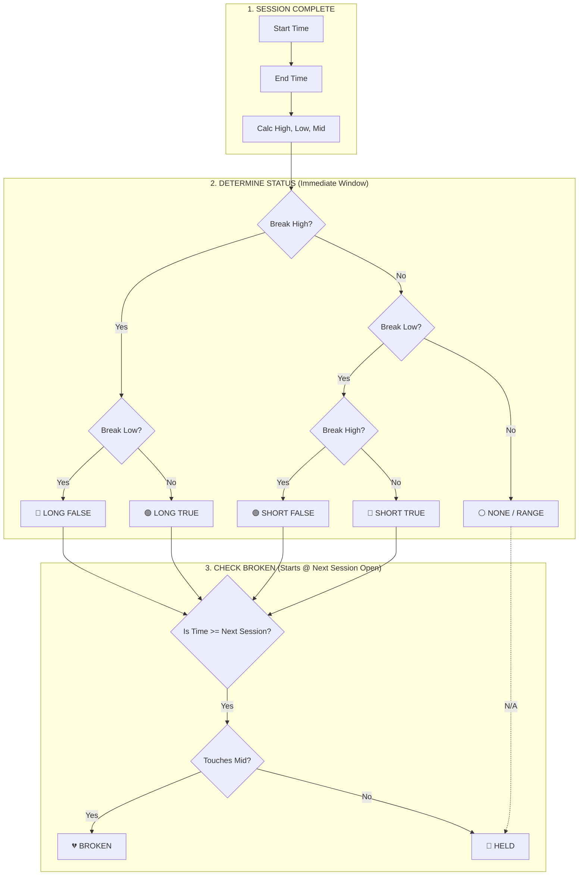

# Profiler Requirements

## Overview

The Profiler is a session-based analysis tool that classifies market behavior based on how price interacts with specific time-based "Session Boxes". It does NOT use daily classifications (R1, R2, etc.) but instead focuses on the structural outcome of key trading sessions: Asia, London, and New York.

## 🕒 Session Definitions

All times are in **New York Time (EST/EDT)**.

| Session    | Start Time | End Time | Description                                                  |
| :--------- | :--------- | :------- | :----------------------------------------------------------- |
| **Asia**   | 18:00      | 19:30    | The initial overnight range setting the tone.                |
| **London** | 02:30      | 03:30    | The European open, often testing Asia's extremes.            |
| **NY AM**  | 07:30      | 08:30    | The US pre-market header, often leading into the 09:30 open. |
| **NY P12** | 06:00      | 17:59    | Previous day's New York trading hours (Day Stats).           |

---

## 📍 Reference Levels

The Profiler tracks hit rates for several key levels. These levels are categorized by their origin:

### 1. Current Day Levels

Levels formed during the active trading day (starting 18:00 Day-1).

- **Daily Open**: 18:00 Open.
- **Midnight Open**: 00:00 Open.
- **07:30 Open**: Pre-NY open.
- **P12 Levels**: High/Low/Mid of the 18:00-06:00 window.
- **Session Mids**: Asia Mid (19:30), London Mid (03:30), NY1 Mid (08:30), NY2 Mid (12:30).

### 2. Macro Levels (Previous Day)

Levels formed during the previous trading day.

- **PDH / PDL / PDM**: Previous Day High, Low, and Mid.
- **NY P12 Levels**: Previous Day's 06:00-17:59 High/Low/Mid.

### 3. Cross-Session "Prev" Mids

To avoid lookahead bias, earlier sessions (Asia/London) analyze their relationship to the _previous_ day's session mids until the current day's mids are formed.

- **Prev Asia/London/NY1/NY2 Mids**: The session mids from the immediately preceding trading day.

---

## 🚦 Status Definitions

The "Status" of a session is determined by price action **after the session ends** (until the start of the next tracked session). It assesses breakout direction and holding power.

### 1. Long True (LT)

**Definition**: Price breaks the Session High and **never** breaks the Session Low.

- **Sentiment**: Strong Bullish.
- **Logic**: `Break High AND Hold Low`

### 2. Short True (ST)

**Definition**: Price breaks the Session Low and **never** breaks the Session High.

- **Sentiment**: Strong Bearish.
- **Logic**: `Break Low AND Hold High`

### 3. Long False (LF)

**Definition**: Price initially breaks the Session High (Fakeout), but then reverses and breaks the Session Low.

- **Sentiment**: Failed Bullish (Bearish Reversal).
- **Logic**: `Break High THEN Break Low`

### 4. Short False (SF)

**Definition**: Price initially breaks the Session Low (Fakeout), but then reverses and breaks the Session High.

- **Sentiment**: Failed Bearish (Bullish Reversal).
- **Logic**: `Break Low THEN Break High`

### 5. None / Range (Inside)

**Definition**: Price remains **completely inside** the session's High/Low range logic during the evaluation window. It breaks neither the High nor the Low.

- **Sentiment**: Neutral / Consolidation.
- **Logic**: `!Break High AND !Break Low`

---

## 💔 "Broken" Logic

The "Broken" status is a secondary condition that specificially checks if price **retraces to the mean** in the _subsequent_ session timeframe.

> [!IMPORTANT]
> **Timing Constraint**: A session cannot be "Broken" by price action within its own active evaluation window. The "Broken" check begins **strictly after** the next session starts.

- **Condition**: Price touches the **Session Midpoint** `(High + Low) / 2`.
- **Window**: From the start of the **Next Session** (e.g., London Open for Asia) until the end of the day (17:00).
- **Significance**: A "Broken" session suggests the specific session's range has failed to serve as lasting support/resistance.

---

## 🧠 Logic Flowchart

