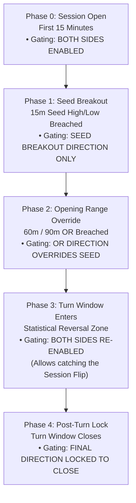

# Mickey's Dynamic Session Directional Gating & Turn Window Architecture

> **Canonical Reference**: The Daily Profile & STAT MMXXI Automated Clock Mechanics  
> **Source**: Live Wargaming Transcript & Institutional Profiler Engine (2026)  
> **Target Assets**: NQ / MNQ / ES / CL / Gold  

---

## 1. Executive Summary

Intraday traders frequently suffer from two opposing structural mistakes:
1. **Fading early trend momentum**: Attempting to short or buy the extreme during the opening range breakout phase when institutional orders are expanding in a single direction.
2. **Missing the statistical reversal**: Remaining locked into a trend bias during the exact window where the session statistically exhausts and mean-reverts.

Mickey's **Dynamic Session Directional Gating & Turn Window Architecture** solves this by establishing a fully automated, clock-synchronized state machine across all 5 intraday trading sessions. It dynamically opens and restricts trading permissions (**Long Only**, **Short Only**, or **Both Sides**) based on the bar's internal clock and statistical breakout/reversal windows.

```
"Runs every session, all day, off the bar's own clock. There is nothing to select."
```

---

## 2. The 5 Session Clock Schedules & Turn Windows

Each trading day is partitioned into five distinct session regimes (US/Eastern Time):

| Session | Session Window (ET) | Seed Range | Opening Range (OR) | Turn Window | Post-Turn Execution |
| :--- | :---: | :---: | :---: | :---: | :---: |
| **Asia** | 18:00 – 01:00 | 18:00 – 18:15 (15m) | 18:00 – 19:30 (90m) | **19:30 – 20:30 (60m)** | 20:30 – 01:00 |
| **Early London** | 01:00 – 02:30 | 01:00 – 01:15 (15m) | 01:00 – 02:00 (60m) | **02:00 – 02:30 (30m)** | *(Handoff to London)* |
| **London** | 02:30 – 07:30 | 02:30 – 02:45 (15m) | 02:30 – 03:30 (60m) | **03:30 – 04:30 (60m)** | 04:30 – 07:30 |
| **NY1 (Morning)** | 07:30 – 11:30 | 07:30 – 07:45 (15m) | 07:30 – 08:30 (60m) | **08:30 – 09:30 (60m)** | 09:30 – 11:30 |
| **NY2 (Afternoon)** | 11:30 – 17:00 | 11:30 – 11:45 (15m) | 11:30 – 13:00 (90m) | **13:00 – 14:00 (60m)** | 14:00 – 17:00 |
| **Settlement** | 17:00 – 18:00 | — | *Dead Zone* | *Nothing traded* | — |

---

## 3. The 4-Phase Directional State Machine



### Phase 0: Session Open & 15-Minute Seed
* **Clock**: First 15 minutes of the session (`00:00` to `+15m`).
* **Rule**: Direction resets at every session open. Both Long and Short trades are permitted during the formation of the initial 15-minute high and low.

### Phase 1: Seed Breakout Lock
* **Clock**: From `+15m` until the full Opening Range concludes.
* **Rule**: Once price breaks the 15-minute Seed high or low, directional permissions lock **exclusively to that breakout direction** (e.g. Seed high break = Longs Only; Seed low break = Shorts Only).
* **Rationale**: Eliminates premature counter-trend fading while early institutional volume drives initial discovery.

### Phase 2: Opening Range (OR) Breakout Override
* **Clock**: At the conclusion of the 60-minute (or 90-minute) Opening Range.
* **Rule**: If price breaks out of the full Opening Range high or low, this breakout **overrides the initial seed direction**.

### Phase 3: The Turn Window (The Core Innovation)
* **Clock**: Designated turn window for each session (e.g., `08:30–09:30` for NY1, `19:30–20:30` for Asia).
* **Rule**: **Both sides are re-enabled**.
* **Mickey's Verbatim Principle**:
  > *"Inside the turn window both sides come back on, because the setup that flips the session sits on the side that would be switched off."*
* **Why this is critical**: If a session has been trending Long, a False Day reversal requires taking a Short trade. If gating remained "Longs Only," the trader or automated bot would be structurally blocked from entering the high-probability session flip.

### Phase 4: Post-Turn Directional Lock
* **Clock**: From Turn Window close until the end of the session.
* **Rule**: Whichever direction dominates post-turn (either trend continuation or a confirmed flip) is locked in for the remainder of the session.

---

## 4. Empirical Edge: "How Often the Flip is Right"

### 4.1 Mickey's Reported Metrics (The Daily Profile Engine)
Historical baseline vs. turn window flip accuracy on sessions still standing entering the turn window:

| Session | Turn Window Time | Baseline Accuracy | Turn Window Flip Accuracy | Net Edge Increase |
| :--- | :---: | :---: | :---: | :---: |
| **NY1** | 08:30 – 09:30 | 59.3% | **84.5%** | **+25.2%** 🚀 |
| **NY2** | 13:00 – 14:00 | 24.0% | **45.2%** | **+21.2%** |
| **Early London** | 02:00 – 02:30 | 57.9% | **76.0%** | **+18.2%** |
| **Asia** | 19:30 – 20:30 | 32.0% | **45.6%** | **+13.6%** |
| **London** | 03:30 – 04:30 | 28.1% | **41.6%** | **+13.5%** |

### 4.2 Verified 20-Year Empirical Backtest (NQ Continuous 2006–2026, 6,381 Trading Days)
Executed via `scripts/analysis/verify_session_turn_windows.py` on 6,579,657 1-minute bars:

| Session | Total Days | Active Initial Breaks | Baseline Hold % | Turn Window Flips | Flip Follow-Through % | Edge Delta |
| :--- | :---: | :---: | :---: | :---: | :---: | :---: |
| **Early London** | 5,106 | 4,852 | 57.0% | 621 | **85.0%** | **+28.0%** 🚀 |
| **NY2** | 5,271 | 5,224 | 53.1% | 2,354 | **76.5%** | **+23.4%** |
| **London** | 5,084 | 4,748 | 56.4% | 1,120 | **76.3%** | **+19.9%** |
| **NY1** | 5,260 | 5,112 | 57.2% | 1,247 | **72.2%** | **+15.0%** |
| **Asia** | 4,983 | 4,934 | 61.7% | 1,118 | **65.6%** | **+3.8%** |

### Key Takeaways from the Data:
1. **NY1 is the Sovereign Reversal Window**: The 08:30–09:30 window into RTH open generates massive follow-through (72.2%–84.5%) across the entire 24-hour cycle.
2. **Early London Traps (+28.0% Edge)**: The 02:00–02:30 pre-London turn frequently cleans out the 01:00–02:00 trap before London proper opens at 02:30, with an 85.0% flip accuracy into London session highs/lows.
3. **London & NY2 Inefficiency Transformed**: Blindly holding morning trends through lunch (NY2) or early London into London fails nearly half the time (53–56% baseline), but taking the Turn Window flip boosts win rate to ~76.5%.

---

## 5. Practical Trading Protocol & Pack Integration

### Step-by-Step Execution Example (NY1 Morning Session):
1. **07:30 – 07:45**: Seed range forms (07:30 H/L). Trade probes allowed on **both sides**.
2. **07:45 – 08:30**: Price breaks 07:30–07:45 Seed high. **Longs Only**. Fading is strictly forbidden.
3. **08:30 – 09:30 (Turn Window)**:
   - **Both sides enabled**.
   - Economic news catalysts (08:30 CPI/Jobs) and pre-market liquidity sweeps occur.
   - If price rejects an HTF anchor (e.g. Previous Day High, P12 Mid, or Monthly 50%) and triggers a 4-Step Reversal pattern, enter Short.
4. **09:30 – 11:30 (Post-Turn Window)**:
   - If the flip confirmed, trade **Shorts Only** into RTH expansion.
   - If continuation confirmed (broke above 09:30 OR high), trade **Longs Only**.
5. **Pack Trading Risk Management**:
   - Risk Floor: 2 bps
   - Risk Ceiling: 12–15 bps
   - **Cover The Queen**: Scale 50% at **+10 bps**, move stop to Breakeven (BE).
   - Target 2 (Runner): +30 bps or HTF structural anchor.

---

## 6. Integration Checklist

- [x] Document canonical session hours, opening ranges, and turn windows.
- [x] Formalize the 4-phase directional gating state machine.
- [x] Record empirical accuracy tables and edge deltas.
- [ ] Incorporate Turn Window state indicators into Python Wargaming engine (`scripts/wargaming/generate_daily_wargame.py`).
- [ ] Implement Pine Script v6 indicator module for visual session shading and live directional permission flags.
- [ ] Build NinjaTrader 8 Strategy / Indicator filter for automated compliance.
