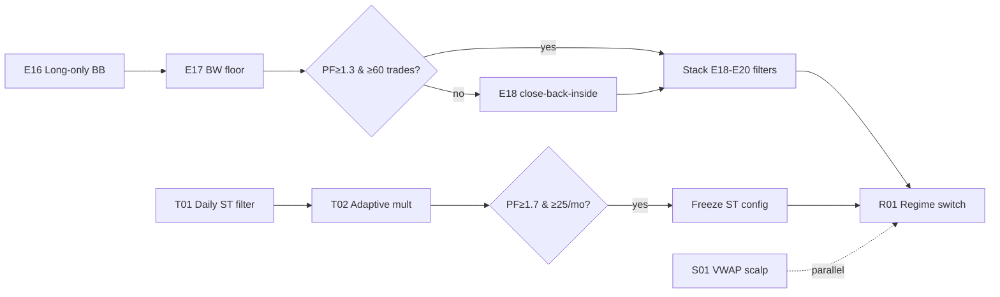

# Strategy Review & Roadmap — BB Mean Reversion, Supertrend, + New Classes

> Review date 2026-08-27. Synthesizes `BB_EXPERIMENTS.md` (E01-E15), `SUPERTREND_HALFTREND.md` (2026-08-23 results + NT8 port), and the Aug-26 scripts (`bb_failure_analysis`, `bb_frequency_diagnosis`, `bb_ict_crossref`, `supertrend_intraday_cost`, `bb_multi_session_scan`).
>
> Shared harness: `BacktestEngine` (`scripts/analysis/range_strategy_comparison.py:509`), limit 1-tick, cost 4×MES $1.20/rt. Data: `data/derived/nt_es_09_26_1m/5m_2025_2026_mergeBA.csv` or `load_fused_data('ES1')` ≥ 2025-01-01 resampled 5m.

---

## 0. Where each class stands (verified state)

| Class | Best config | 19mo result | Density | Verdict |
|---|---|---|---|---|
| **BB Mean Reversion** | E14: BB20 1.8σ + IB<0.4 + skip13-14 + **MACD hist rising** | PF 2.44, WR 70.6%, +$626 | **17 trades — fatal** | Edge is real, sample is not. Needs frequency unlock, not more filters. |
| **Supertrend** | ST(10-14, 2.0) + **1.5×ATR trail** | PF 1.50 cost-adj, WR 38.7%, +$1,889 | 40/mo ✓ prop-ready | Works. NT8 `STTrendBot` validated. Improve via whipsaw reduction, not re-tuning. |
| Scalping | none built | — | — | Candidate: VWAP-stretch reversion (open window). |
| Regime switcher | none built | — | — | Candidate: bandwidth-gated model switch (BB↔ST). |

**Latest Aug-26 grid (`supertrend_intraday_cost.py`, $0 comm/slip = NT8 parity):** period 14/10/7 × mult 2.0 all PF 2.87-3.01, ~760-930 trades — the class is robust across parameters (good sign, low overfit risk). mult 3.0 is uniformly worse. Trail 2.0 collapses PF to ~1.2-1.4 everywhere. **Do not chase period/mult further.**

---

## 1. BB Mean Reversion — what the data actually says

### 1.1 Failure anatomy (from `bb_failure_analysis.py` + E-log)

| Failure mode | Evidence | Confidence |
|---|---|---|
| SHORT side is structurally wrong | E-log: SHORT 65% loss vs LONG 61%; Aug-26 crossref: SHORT PF 0.88 (−$1,219) vs LONG 1.17 (+$1,879) over 1,112 trades | **High — act on it** |
| Liquidity sweeps = trap | Sweep-aligned PF 0.92 (−$1,227) vs no-sweep 1.25 (+$1,991). Fading INTO the sweep level loses | **High** |
| HTF confluence helps longs | HTF-aligned PF 1.72, WR 44.9% (n=69) | Medium (small n) |
| FVG alignment = noise | 1.00 vs 1.11 vs 1.07 — dead | Confirmed dead |
| ADX<25 gate is broken | `bb_frequency_diagnosis`: 83 of 137 raw touches sit at ADX 20-22 — just below the 25 line. The gate excludes the *most common* chop, not the worst | **High** |
| RSI 33/67 too strict | Relaxing to 38/62 nearly doubles touches (98→130). RSI 67-80 has 45 touches being skipped | Medium |
| Bandwidth is the real killer | BW 0.007-0.011 → 83% loss (E-log diag) | **High** |
| 15:00-16:00 hour carries trades | 114 of 137 touches at hour 15 | Medium (window-specific) |

### 1.2 The frequency problem is misdiagnosed

E11-E14 stacked filters (IB + lunch-skip + MACD) to reach PF 2.44 — but each filter multiplies away trades. The Aug-26 touch scan shows the base rate is ~137 raw band touches/19mo in the *current* window, and the gates (ADX 25, RSI 33/67, IB<0.4) each cut ~30-70% of an already thin population.

**Correct move: widen the population, then filter on the two things with proven discriminative power (direction = long-only; bandwidth = floor).** Not more regime gates.

### 1.3 Next queue (one-by-one, same harness) — E16-E21

| ID | Variant | Hypothesis | Params | Priority |
|---|---|---|---|---|
| **E16** | **Long-only** | Shorts lose $1.2k net over 1,112 trades. Long-only on E02 base (95 trades) should flip PF 0.55 → >1.0 with zero new logic | BB20 1.8-2.0, RSI 33, no ADX, all sessions | **P0 — run first** |
| **E17** | **Bandwidth floor** | BW 0.007-0.011 = 83% loss. Require BW > 0.011 (or > 0.010) at entry. Replaces the ADX gate (which the scan shows is miscalibrated) | same + `bw > 0.011` | **P0** |
| **E18** | **RSI 38/62 + close-back-inside** | Relax entry (98→130 touches) but require the *candle after the touch* to close back inside the band (kills intrabar false triggers; documented BB improvement) | same, entry on confirmation bar | **P1** |
| **E19** | **RSI-50 exit** | Exit when RSI crosses 50 instead of mid-band — faster exits cut give-back on trend days | E16+E17 base | **P1** |
| **E20** | **Sweep veto** | Skip entries where price just swept a session high/low (sweep-aligned PF 0.92). Reuses existing ICT sweep detection | E16+E17 base | **P2** |
| **E21** | **15:00-16:00 window focus** | 114/137 touches in hour 15 — test a pure "power hour BB reversion" micro-config vs all-day | bb20 1.8, long-only | **P2** |

**Expected outcome:** E16+E17 together should land ~60-90 trades/19mo at PF ≥ 1.3. That + E14's MACD filter (if it survives the larger sample) is the prop-viable shape.

### 1.4 What NOT to do (already falsified)

- ~~W%R instead of RSI~~ (E13, PF 0.52) · ~~Stoch 28 / CCI~~ (E15) · ~~FVG alignment filter~~ (Aug-26, dead) · ~~Daily-trend filter on BB~~ (E-log: PF 0.35) · ~~Quarters grid~~ · ~~VWAP slope + CVD~~ (no effect) · ~~1m / 3m timeframes~~ (E05/E06, cost noise) · ~~Squeeze precondition as *entry* trigger~~ (E03: lifts PF but 8 trades — squeeze = breakout regime, not reversion regime; use it as a *veto* in E17, not a trigger).

---

## 2. Supertrend — improve the whipsaw, keep the trail

Current edge: PF 1.50, WR ~39%, trail 1.5×ATR is the load-bearing component. The weakness is chop-day flip sequences (small repeated losses).

### 2.2 Next queue — T01-T05

| ID | Variant | Hypothesis | Expected effect |
|---|---|---|---|
| **T01** | **Daily Supertrend(10,2) direction filter** | Only take 5m flips in the direction of the daily ST state. Trend-following classes benefit from HTF alignment (opposite of BB, where it hurt) | Cuts counter-trend flip sequences; expect PF +0.2-0.4, trades −30% |
| **T02** | **Adaptive mult via ATR regime** | mult = 2.0 base; expand to 2.5 when ATR(14) > 1.2× its 50-bar mean, contract to 1.7 when < 0.8×. Targets chop directly (the documented ST weakness) | Fewer whipsaw flips in compression |
| **T03** | **ADX floor on flip entries** | Require ADX(14) > 18 at flip. The BB diagnosis showed ADX 20-22 = most common chop zone; 18 is a deliberately loose floor | Cheap filter, test with/without T01 |
| **T04** | **HalfTrend exit variant** | Same entries, exit on HalfTrend line cross instead of ST flip + trail. HT anchors to extremes (sits flat in consolidation) vs ST which drifts toward price in chop | Structural fix for the drift-erodes-trail problem |
| **T05** | **Chandelier trail** | Trail from highest-high − 2.5×ATR(22) instead of ST band + 1.5×ATR. Gives more room at swing points | Test only if T01-T03 don't already lift PF |

**Keep:** 5m chart only (the NT8 forming-bar repaint lesson), crude trail ATR, 1.5× trail, no range gate, no fixed targets.

**Watch:** trade count. T01-T03 all cut trades. Prop floor is ~40/mo on ES — if the stack drops below ~25/mo, drop the weakest filter (test in order, keep the PF/$ trade-off honest).

---

## 3. New class A — VWAP-stretch scalping (fills the 9:30-11:00 window)

Neither current strategy trades the open window well (BB is gated off pre-11:30; ST has no session gate). The documented pattern that survives costs on ES/NQ 1-5m:

**Setup (S01 baseline):** RTH only, 9:35-11:00 · entry when price stretches ≥ 1.2×ATR(14) from session VWAP AND a reversal candle closes back toward VWAP · target = VWAP (the magnet), stop = 1.0×ATR beyond entry extreme · hard time-exit 11:15 · max 2 trades/day.

- Cost math: ES ATR(14) on 5m ≈ 3-5 pts; 1.2×stretch ≈ 4-6 pts to entry, VWAP target ≈ half that. On $5/pt 1×MES with $1.20/rt + 1-tick, a 2-3 pt gross target nets ~+$7-12 — thin but positive if WR ≥ 55%. **The A/B that matters: 1m vs 5m signal TF.**
- Why it might work where BB failed: VWAP is session-anchored (mean is *defined* per day, no rolling-window drift), and the open window has the highest reversion tendency of the day (validated: 15:00 hour carries BB touches; 9:30-11:00 carries ORB edge per external evidence).

**S02 variant:** require first-touch-of-day (first VWAP stretch of the session only) — kills repeat-fade bleed.
**S03 variant:** NQ-only (NQ reverts harder intraday than ES per NQSTATS memory).

## 4. New class B — regime-switched meta-strategy (the "one model" answer)

The BB and ST failure modes are *complementary*: BB loses in trends (shorts in the ES uptrend), ST loses in chop (flip whipsaws), and both lose in compression (BW 0.007-0.011 for BB, flip-noise for ST).

**R01 — Bandwidth-regime switch (build only after E16-E21 + T01-T03 settle):**

```
state = BB bandwidth percentile (20-day rolling, 5m bars)
  p < 30 (compression) → STAND ASIDE (squeeze precedes breakout, not reversion)
  p 30-70 (normal)     → BB mean reversion (E16/E17 config, long-only)
  p > 70 (expansion)   → Supertrend flips (T01/T02 config)
```

One variable, three regimes, reuses both validated engines. The bandwidth percentile is already computed for E17, so this is a routing layer, not new math. Risk: regime-lag (the switch confirms after the regime starts) — accept ~½ day of lag, measure with a "switch-day" trade tag in the harness.

---

## 5. Sequencing & prop-firm fit



| Target | Metric | Current | Goal |
|---|---|---|---|
| BB class | PF / trades per 19mo | 2.44 / 17 | ≥ 1.3 / ≥ 60 |
| ST class | PF / trades per mo | 1.50 / 40 | ≥ 1.7 / ≥ 25 (filter-tolerant) |
| Meta | combined /mo ES | — | ≥ 50 trades, DD < $800 on 1×MES |

**Prop-firm guardrails (ADR-020/021 apply):** all variants must respect 15:50 ET liquidation, and any Monte Carlo viability runs go through `PropFirmSimulator` only.

## 6. Harness notes

- Reuse `build_day_context` + `BacktestEngine` (`range_strategy_comparison.py`) — limit 1-tick, $1.20/rt cost is already in.
- For E16-E21: `BBRsiMeanReversionStrategy` needs a `long_only` flag and a `bw_floor` param (add to `detect_signal` metadata gate, ~10 lines).
- For T01: daily ST state comes from `supertrend_daily.py`'s daily computation — join on trade_date.
- For T02: mult series is vectorizable (`np.where(atr_ratio > 1.2, 2.5, np.where(atr_ratio < 0.8, 1.7, 2.0))`) — no loop needed.
- Update this file + `BB_EXPERIMENTS.md` rows after each run; NT8 port decisions go in `SUPERTREND_HALFTREND.md` §NT8.