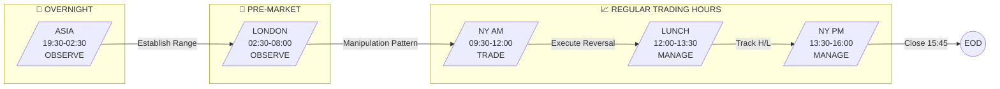
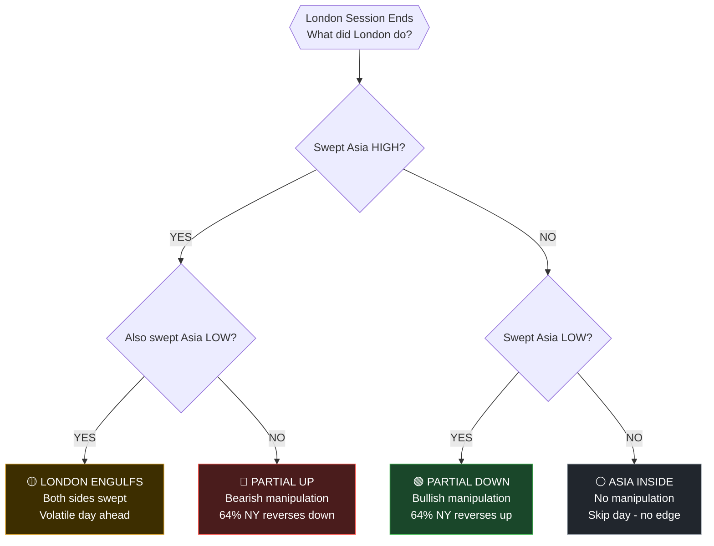
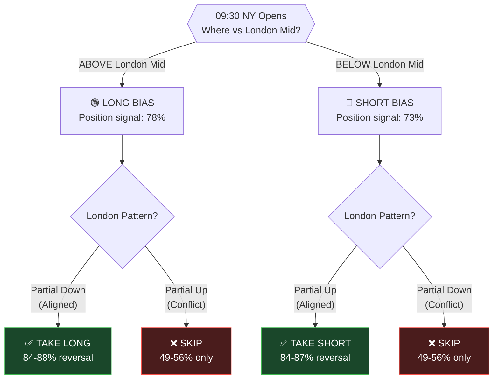
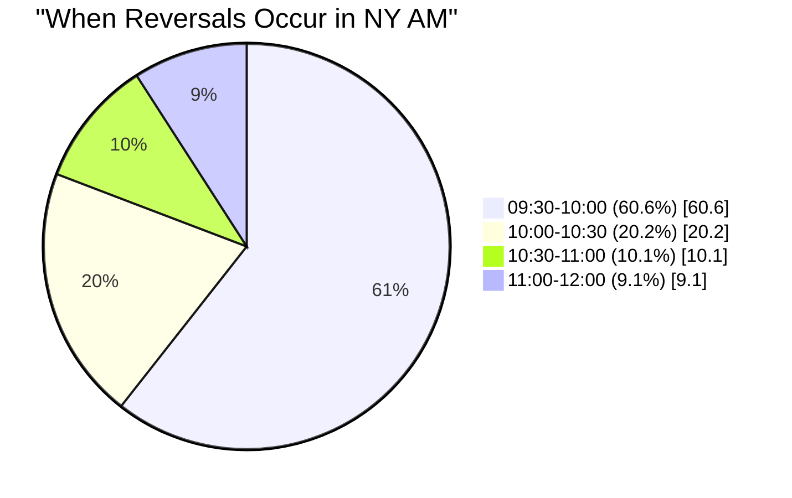
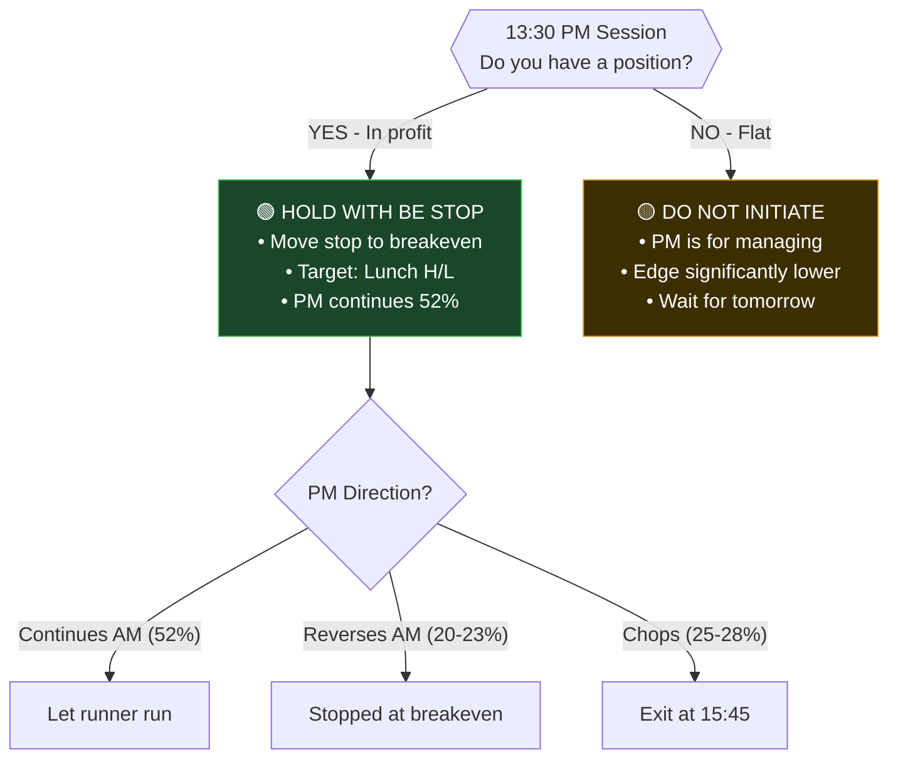
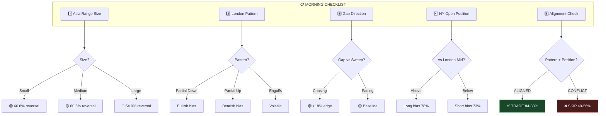
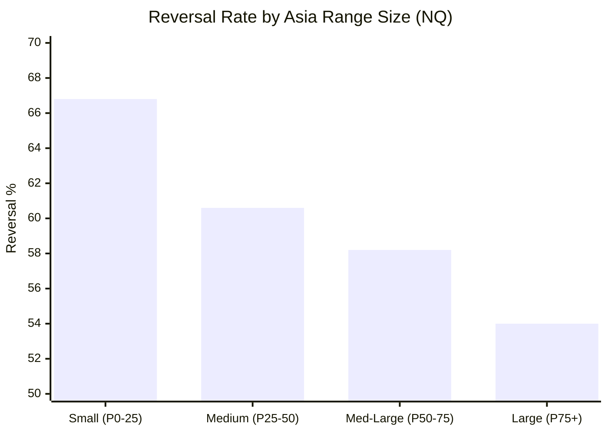

# NQ Playbook — Mermaid Flowcharts

Use these diagrams in any markdown-compatible documentation, Notion, Obsidian, GitHub, etc.

---

## 1. Session Flow Overview



---

## 2. London Pattern Classification



---

## 3. NY AM Entry Decision Tree



---

## 4. 72-Scenario Matrix (Simplified)

```mermaid
flowchart TD
    subgraph BEST["🟢 BEST SETUPS (75%+)"]
        B1["Small Asia + Partial Down + Above Mid<br/>LONG: 88.6%"]
        B2["Small Asia + Partial Up + Below Mid<br/>SHORT: 87.5%"]
        B3["Any Asia + Aligned Pattern + Position<br/>84-86%"]
    end
    
    subgraph MEDIUM["🟡 MEDIUM SETUPS (60-75%)"]
        M1["Medium Asia + Aligned<br/>73.2%"]
        M2["Large Asia + Any Pattern<br/>61-68%"]
    end
    
    subgraph SKIP["🔴 SKIP SETUPS (<60%)"]
        S1["Misaligned: Bearish Manip + Above Mid<br/>49-56%"]
        S2["Misaligned: Bullish Manip + Below Mid<br/>49-56%"]
    end
    
    style BEST fill:#1a472a,stroke:#3fb950
    style MEDIUM fill:#3d2e00,stroke:#d29922
    style SKIP fill:#4a1c1c,stroke:#f85149
```



---

## 5. Gap Confluence Analysis

```mermaid
flowchart LR
    subgraph CHASING["🟢 GAP CHASING (+18% Edge)"]
        C1["London swept LOW<br/>+ Gap UP"] --> C1R["78.5% reversal up"]
        C2["London swept HIGH<br/>+ Gap DOWN"] --> C2R["76.2% reversal down"]
    end
    
    subgraph FADING["🟡 GAP FADING (Baseline)"]
        F1["London swept LOW<br/>+ Gap DOWN"] --> F1R["60.3% reversal"]
        F2["London swept HIGH<br/>+ Gap UP"] --> F2R["58.1% reversal"]
    end
    
    style CHASING fill:#1a472a,stroke:#3fb950
    style FADING fill:#3d2e00,stroke:#d29922
```



---

## 6. Reversal Timing Distribution



---

## 7. PM Session Management



---

## 8. CBDR Sigma Targets

```mermaid
flowchart LR
    subgraph BULL["🟢 BULLISH MANIPULATION<br/>(London swept Asia Low)"]
        direction TB
        B_NEG2["-2σ: 58.3%<br/>(Manipulation leg)"]
        B_NEG1["-1σ: 73.1%"]
        B_POS1["+1σ: 41.2%"]
        B_POS2["+2σ: 25.6%<br/>(Target)"]
    end
    
    subgraph BEAR["🔴 BEARISH MANIPULATION<br/>(London swept Asia High)"]
        direction TB
        S_POS2["+2σ: 56.8%<br/>(Manipulation leg)"]
        S_POS1["+1σ: 71.4%"]
        S_NEG1["-1σ: 43.7%"]
        S_NEG2["-2σ: 27.2%<br/>(Target)"]
    end
    
    style BULL fill:#1a472a,stroke:#3fb950
    style BEAR fill:#4a1c1c,stroke:#f85149
```



---

## 9. Complete Pre-Market Checklist



---

## 10. Asia Range Effect on Reversal



---

## Usage Notes

### Rendering in Different Platforms

**GitHub/GitLab**: Native support - just paste the code blocks

**Notion**: Use `/mermaid` block and paste content

**Obsidian**: Native support with Mermaid plugin

**VS Code**: Install "Markdown Preview Mermaid Support" extension

**Confluence**: Use Mermaid macro

**Static Site Generators**: Most support Mermaid (Hugo, Jekyll, Docusaurus)

### Live Editor

Test and modify diagrams at: https://mermaid.live/

### Customization

Change colors by modifying the `style` lines:
```
style NODENAME fill:#hexcolor,stroke:#hexcolor,color:#textcolor
```

Color reference:
- Green (trade): `#1a472a` fill, `#3fb950` stroke
- Yellow (caution): `#3d2e00` fill, `#d29922` stroke  
- Red (skip): `#4a1c1c` fill, `#f85149` stroke
