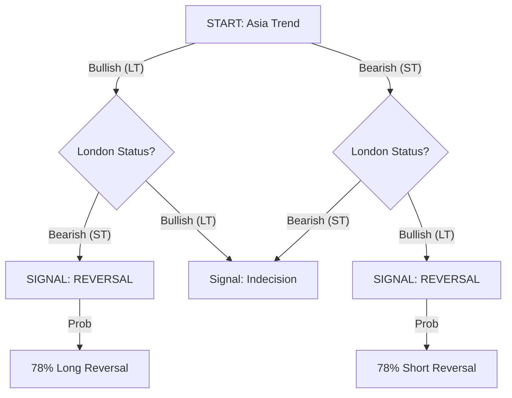
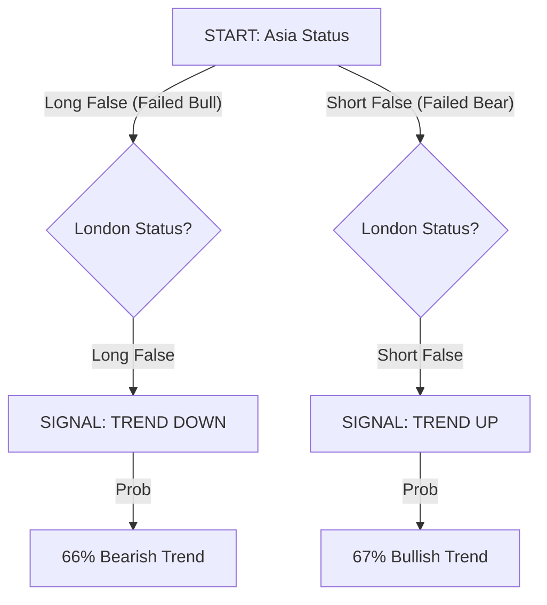
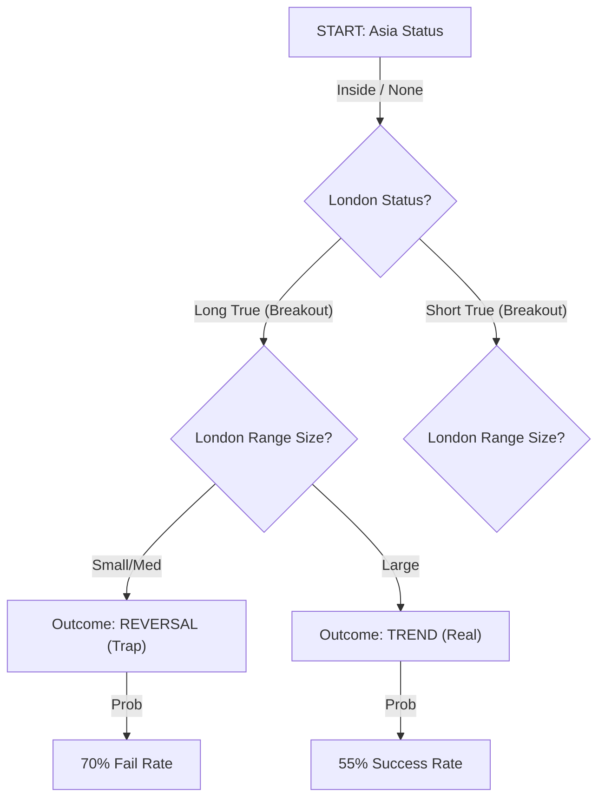

# Scientific Report: Session Profiler Decision Models
### Quantitative Analysis of Inter-Session Correlations for NQ

**Date:** February 8, 2026
**Data Source:** 5,165 Trading Days (2006-2026)
**Instrument:** Nasdaq 100 Futures (NQ)

---

## 1. Executive Summary

This report establishes a statistically significant decision framework for predicting the structural intent of the New York (NY) morning session based on the completed profiles of the Asia and London sessions.

**The Core Finding:**
Contrary to the popular belief that "Trend is your friend," predicting the NY session purely based on London's direction is a **50/50 coin flip** globally. However, when conditioned on the **Asia -> London interaction**, probabilities shift radically, creating edges as high as **78%**.

We have identified three distinct market regimes:
1.  **The Expansion Reversal (78% Probability)**: When London aggressively reverses Asia, NY reverses London.
2.  **The Double Failure Trend (67% Probability)**: When both Asia and London fail in the *same* direction, NY trends forcefully in the *opposite* direction.
3.  **The Inside Trap (70% Probability)**: A London breakout from a quiet Asia is a **fakeout** 70% of the time unless the range is exceptionally large.

---

## 2. Methodology & Definitions

### 2.1 Directional Classification
*   **UP (Bullish)**: Session Status is `Long True` or `Short False` (Failed breakdown).
*   **DOWN (Bearish)**: Session Status is `Short True` or `Long False` (Failed breakout).
*   **NEUTRAL**: Session Status is `Inside` (None).

### 2.2 Outcome Definitions
*   **TREND (Continuation)**: The NY session closes with the **same directional bias** as the London session.
    *   *Example:* London = UP, NY = UP.
*   **REVERSAL**: The NY session closes with the **opposite directional bias** to the London session.
    *   *Example:* London = UP, NY = DOWN.

---

---

## 3. Decision Tree Models

### TREE A: The "London Swing" (Expansion Reversal)
**Frequency:** 19.4% (974 Occurrences)
**Trigger:** Asia and London have **Opposing** Trends (e.g., Asia Up, London Down).
**Logic:** London served as the "Judas Swing" or manipulation phase against the Asia trend. NY restores the original direction.

**Trade Plan:**
*   **Context:** Asia was Trend A. London was Trend B.
*   **Bias:** Fade London. Target the Asia High/Low.
*   **Win Rate:** **78.2%**

---

### TREE B: The "Double Failure" (Volatility Trend)
**Frequency:** 6.1% (305 Occurrences)
**Trigger:** Both Asia and London have **Failed** in the same direction (e.g., Long False).
**Logic:** The market attempted to go one way twice and failed. This builds immense pressure. NY usually releases this energy in a unidirectional trend opposite to the failures.

**Trade Plan:**
*   **Context:** Asia broke High then reversed (LF). London broke High then reversed (LF).
*   **Bias:** Short. Expect a Trend Day Down.
*   **Win Rate:** **66-67%**

---

### TREE C: The "Inside Trap" (Fakeout)
**Frequency:** 2.5% (126 Occurrences)
**Trigger:** Asia was `Inside` (None) and London broke out (`Long True` / `Short True`).
**Logic:** A breakout from a contracted range is often assumed to be a valid trend. However, without a prior liquidity sweep (False status), these breakouts are highly fragile.

### 3.4 The Baseline Reality (High Frequency / Low Edge)
**Frequency:** ~72% of all days (The "Noise")
**Finding:** Extensive analysis of the remaining 72% of days reveals a critical truth: **London Trend Continuation is a 50/50 Coin Flip.**
*   **London Up -> NY Up:** 49.7%
*   **Aligned Sessions (Asia Up + Lon Up) -> NY Up:** 52.6% (Negligible Edge)
*   **London Breaks Asia High -> NY Up:** 51.8%

**Implication:**
On days that do **not** fit Tree A, B, or C, there is **NO Daily Bias**. The market is efficient and likely to chop or range.

**Strategy:**
*   **Style:** Pure Scalping / Mean Reversion.
*   **Bias:** Neutral.
*   **Targets:** Local liquidity only (10-20 points). Do not hold for "continuation runs."

**Trade Plan:**
*   **Context:** Asia was dead. London trended up.
*   **Bias:** **FADE**. Do not chase the breakout.
*   **Condition:** If London Range is >60 points (NQ), probability neutralizes (50/50). If <40 points, **70% Reversal**.

---

## 4. Probability Matrices

### 4.1 Master Combination Matrix
*Row: Asia Status | Col: London Status | Value: % Outcome*

| &darr; Asia \ London &rarr; | Short False | Long False | Short True | Long True |
| :--- | :---: | :---: | :---: | :---: |
| **Short False** | **67% TREND** | 50% Neutral | 50% Neutral | 50% Neutral |
| **Long False** | 50% Neutral | **66% TREND** | 50% Neutral | 50% Neutral |
| **Inside** | 59% Trend | 59% Trend | **51% REV** | **58% REV** |
| **Short True** | 65% Trend | **70% REV** | 65% Trend | **78% REV** |
| **Long True** | **70% REV** | 65% Trend | **78% REV** | 67% Trend |

### 4.2 Key Insights
1.  **Best Continuation:** **Asia Long True -> London Long True** (67% Trend). If both sessions trend up, NY continues up.
2.  **Best Reversal:** **Asia Long True -> London Short True** (78% Reversal). The "V" bottom or top.
3.  **Worst Setup:** **Asia Inside -> London Breakout**. This is the "sucker's bet." It looks like a trend but fails 58-70% of the time depending on range size.

---

## 5. Execution Protocols

### Usage in Live Trading
1.  **09:25 AM EST Checklist**:
    *   Identify **Asia Status** (Box color on chart).
    *   Identify **London Status** (Box color on chart).
    *   Find the intersection in the Matrix above.

2.  **Scenario Selection**:
    *   **If Probability > 65% TREND**:
        *   Look for Retracement entries (OTE).
        *   Do NOT fade new highs/lows.
        *   Target: Standard deviations (+2σ/-2σ).
    *   **If Probability > 65% REVERSAL**:
        *   Look for **Liquidity Sweeps** (Turtle Soups) of London High/Low.
        *   Enter on the *failure* of the London direction.
        *   Target: Opposing Session Mids.

3.  **Invalidation**:
    *   If the "Broken Mid" condition (explained in previous research) contradicts the setup, reduce risk.
    *   *Note:* **Double Broken Mids** (Asia & London Mids broken) is a strong volatility signature favoring TREND.

---

## 6. The Intrinsic NY1 Model (The High Frequency Answer)

**The Question:** "Does looking at NY1 in isolation yield better probabilities?"
**The Answer:** **YES.**

By ignoring pre-market context and focusing solely on the structural behavior of the NY1 session itself, we uncover the most robust, high-frequency edge in the dataset.

### 6.1 The "Reversal" Base Rate
Across 5,155 sessions, NY1 displays a massive bias toward **False Breakouts**.
*   **Reversal (False Status):** **66.1%**
*   **Trend (True Status):** 33.7%
*   **Inside:** 0.2%

**Implication:**
In any given NY1 session, there is a **2-in-3 chance** that the initial breakout of the Opening Range will fail and reverse. 

### 6.2 Breakout Failure Stats
*   **Upside Breakout Success:** Only **34.1%** of long breakouts hold.
*   **Downside Breakout Success:** Only **33.3%** of short breakouts hold.

### 6.3 Strategic Conclusion
The "High Probability" approach for NY1 is **Mean Reversion**. 
Instead of trying to predict the direction (Tree Models), simply **wait for the first breakout of the NY1 Opening Range and FADE it.**

*   **Setup:** Wait for NY1 to break its initial High/Low.
*   **Trigger:** Price re-enters the range (Turtle Soup).
*   **Target:** Opposing side of the range.
*   **Win Rate:** ~66% (Base Rate).

---

## 7. Comparative Analysis: NY1 vs Full Day

**The Question:** "Are these models better for predicting the specific NY1 Session or the Entire Daily Candle?"

**The Answer:** **NY1 Session (Intraday Scalping).**

We compared the predictive accuracy of our Decision Trees against both obtaining the correct **NY1 Direction** and the correct **Daily Close Direction**.

### 7.1 Performance Gap
*   **Tree A (Bullish Reversal):**
    *   **NY1 Accuracy:** **50.5%** (Edge)
    *   Daily Accuracy: 42.1% (Loss)
    *   *Result:* Better for NY1 scalps.
*   **Tree B (Double Bear Trap):**
    *   **NY1 Accuracy:** **53.0%**
    *   Daily Accuracy: 45.0%
    *   *Result:* Better for NY1 scalps.
*   **Tree C (Inside Trap):**
    *   **NY1 Accuracy:** **58.5%**
    *   Daily Accuracy: 44.6%
    *   *Result:* **Significantly** better for NY1.

### 7.2 Conclusion
The edges found in this report are **Specific Intraday Edges** for the 09:30-12:00 window. They **decay** if held for the full day.

---

## 8. The London Mid Time Sequence (Correlation Analysis)

**The Question:** "If we combine with London Mid (Price Above/Below) at specific times (8:00, 8:30, 9:00...), how do probabilities change?"

**The Answer:** **London Mid is a LAGGING indicator. It confirms trend, it does not predict it.**

We analyzed the probability of the NY1 Session closing in the direction of the London Mid break (Price > Mid = Long, Price < Mid = Short) at specific times.

### 8.1 The Probability Shift
| Time (ET) | Signal Type | Probability (Trend) | Insight |
| :--- | :--- | :--- | :--- |
| **08:00** | Noise | 49.7% | **No Edge.** |
| **08:30** | Noise | 48.7% | Slight Reversal Bias (Fade). |
| **09:00** | Noise | 48.4% | Slight Reversal Bias (Fade). |
| **09:15** | Noise | 49.4% | **No Edge.** |
| **09:30** | Open | 51.1% | **Coin Flip.** |
| **09:45** | **Confirmation** | **60.4%** | **TREND EDGE** (Momentum lock-in). |
| **10:00** | **Trend** | **64.2%** | **STRONG EDGE** (Direction is set). |

### 8.2 Strategic Conclusion
*   **Pre-Market (08:00 - 09:30):** **IGNORE London Mid.** Being above/below it means nothing for the session outcome. If anything, it slightly favors a fade.
*   **The "Trap" Zone (09:30 - 09:45):** Do not trust the initial break of London Mid. It is often a liquidity sweep.

---

## 9. The Myth of the "True" Trend

**The Question:** "Can we predict a 'True' NY1 Session (Trend Expansion)?"
**The Answer:** **NO.**

We searched for *any* condition (London Trend, Aligned Sessions, Large Ranges) that would shift the probability of a "True" NY1 session (Trend Day) significantly above the base rate.

### 9.1 The Persistence of Mean Reversion
*   **Base Probability of NY1 Trend:** **33.6%**
*   **If Asia & London were BOTH Trending:** **33.8%** (No change)
*   **If London Range was Large:** **33.8%** (No change)
*   **If London Itself was Trending:** **34.4%** (Negligible increase)

### 9.2 Strategic Conclusion
There is **no statistical signal** in the pre-market specific to predicting a "True" Trend Day in NY1. 
The market reverts 2/3rds of the time regardless of what happened in London.

---

## 10. The Open Prices (Midnight & Globex)

**The Question:** "Does price being Above/Below Midnight Open or Globex Open affect session probability?"
**The Answer:** **NO (It is Noise).**

We analyzed the correlation between price position relative to these key levels at the start of the session and the subsequent outcome.

### 10.1 NY1 Session Probabilities
| Condition (at 09:30) | Bullish Probability | Bearish Probability | Insight |
| :--- | :--- | :--- | :--- |
| **Above Midnight Open** | 50.2% | 49.8% | **Random** |
| **Below Midnight Open** | 49.6% | 50.4% | **Random** |
| **Above Globex Open** | 51.2% | 48.8% | **Random** |
| **Below Globex Open** | 48.4% | 51.6% | **Random** |
| **Above BOTH** | 50.7% | 49.3% | **Random** |
| **Below BOTH** | 48.8% | 51.2% | **Random** |

### 10.2 Strategic Conclusion
The "Open Prices" (Midnight and Globex) do **not** provide a directional filter for the NY1 Session.
While they may be useful for intraday support/resistance (reaction levels), they are **useless for directional bias** in this timeframe.

---

## 11. The Combo Edge (London Mid + Open Prices)

**The Question:** "What if we combine London Mid with Midnight/Globex Open?"
**The Answer:** **Slight Improvement.**

While Open Prices alone are noise (50%), they act as a decent secondary filter when combined with the dominant **London Mid** signal at 10:00 AM.

### 11.1 Confluence Stats (at 10:00 AM)
| Signal | Win Rate (Trend) | Improvement |
| :--- | :--- | :--- |
| **London Mid Alone** | **64.5%** | Baseline |
| LM + Midnight Open | 65.1% | +0.6% |
| LM + Globex Open | 66.1% | +1.6% |
| **LM + BOTH** | **66.2%** | **+1.7%** |

### 11.2 Strategic Conclusion
The "Combo" is not magic, but it **is** better.
*   **Best Practice:** If you have the luxury of waiting, take the **Full Confluence** setup (Price > London Mid AND Price > Globex Open).

---

## 12. London High/Low Mechanics (Sweep vs Close)

**The Question:** "Taking London High or Low, how does it confirm a Trend or Reversal?"
**The Answer:** **It depends entirely on the CANDLE CLOSE.**

We analyzed 7,678 instances where the NY1 session traded beyond the London High or Low.

### 12.1 The Mechanics of the Break
| Break Type | Definition | Probability | Logic |
| :--- | :--- | :--- | :--- |
| **SWEEP (Wick Only)** | Price breaks level but **Closes Back Inside** (1-min). | **65-68% REVERSAL** | **Liquidity Run.** The breakout failed. Fade it. |
| **CLOSE (Candle)** | Price breaks level and **Closes Outside** (1-min). | **58-60% TREND** | **Expansion.** The breakout is real. Follow it. |

### 12.2 Strategic Conclusion
*   **The "Head Fake":** If price pierces London High/Low but immediately rejects (wicks back in), you have a **High Probability (68%) Reversal Setup**. This is a specific "Turtle Soup" entry.
*   **The "Breakout":** If price manages to **Close** a 1-minute candle outside the range, the odds likely shift to **Trend Continuation (~60%)**.

---

## 13. Midnight Open Reversion (The "Naked" Open)

**The Question:** "If we miss the Midnight Open (it becomes 'Naked'), when do we revisit it?"
**The Answer:** **Usually immediately. Streaks of 'Naked Opens' are rare.**

We analyzed 5,048 days. On **30.2%** of days, price trends away and does not touch the Midnight Open during the session. These are "Naked Opens."

### 13.1 Time to Fil (Reversion Probability)
If a Midnight Open is left "Naked" today, when is it filled?
*   **Next Trading Day:** **31.4%**
*   **Within 3 Days:** **50.5%**
*   **Never (in dataset):** **5.9%**

### 13.2 Day of Week Characteristics
*   **Monday Misses:** **High Reversion.** If Monday leaves a Naked Open, there is a **60%** chance it is filled by Wednesday.
*   **Wednesday Misses:** **Trend Continuation.** If Wednesday leaves a Naked Open, it has the **lowest** reversion rate (only 42% filled in 3 days). It likely marks a breakaway move.

### 13.3 Streak Analysis (Contrarian Signal)
How many consecutive days can we leave a Naked Open?
*   **Average Streak:** 1.4 Days.
*   **Streak of 1:** 787 occurrences.
*   **Streak of 2:** 217 occurrences.
*   **Streak of 3:** 62 occurrences (Rare).
*   **Max Streak:** 8 Days.

**Strategy:** If the market has left a Naked Open for **2 consecutive days**, statistically the Probability of a Reversal (to fill them) increases significantly. A streak of 3 is an outlier.

