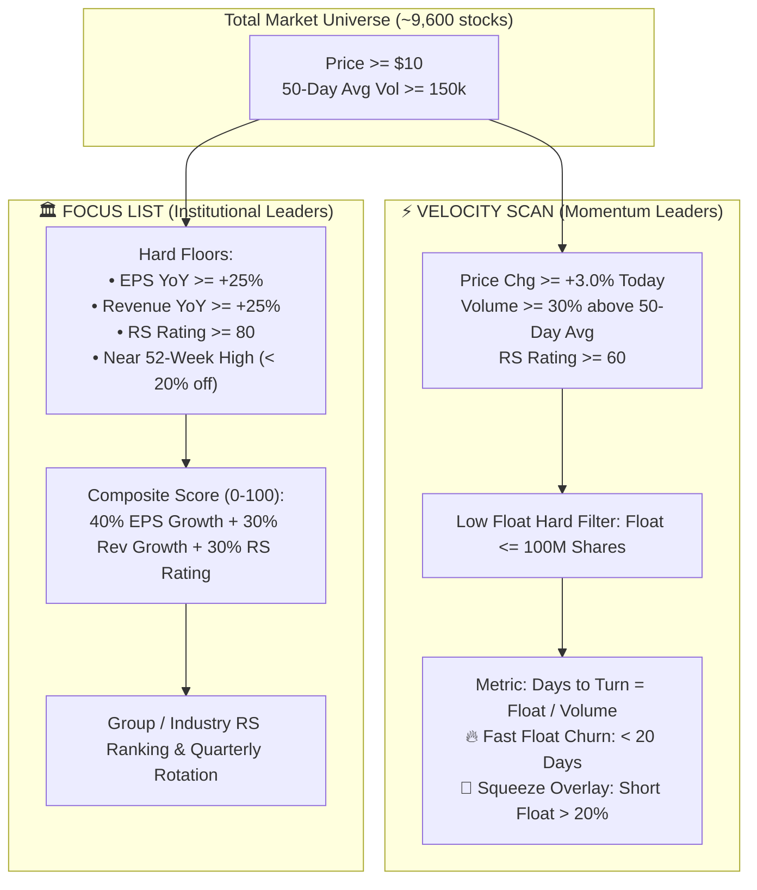

# Ben Bennett (@PatternProfits) Velocity & Focus List Methodology

This document details the quantitative screening formulas, composite weighting models, and float-turnover metrics developed by Ben Bennett (@PatternProfits) as presented in the TraderLion / Stage Analysis Masterclass.

---

## 1. Executive Summary & Strategy Philosophy

Ben's trading methodology identifies two distinct types of high-probability equity opportunities:
1. **Velocity Momentum Leaders**: High-demand, low-float growth stocks undergoing rapid supply absorption and float turnover ($\text{Days to Turn} < 20\text{ days}$) on heavy institutional volume.
2. **Focus List Institutional Leaders**: High-conviction fundamental powerhouses with top-tier EPS growth, revenue acceleration, and dominant Relative Strength ($\text{RS} \ge 80$).



---

## 2. Velocity Scan — Momentum Leaders

### A. Core Criteria & Hard Floors
| Criterion | Threshold | Rationale |
|---|---|---|
| **Price** | $\ge \$10.00$ | Eliminates illiquid penny stocks and institutional no-fly zones |
| **Price % Gain** | $\ge +3.0\%$ | Confirms active directional demand expansion today |
| **50-Day Avg Volume** | $\ge 150,000$ | Ensures institutional baseline liquidity |
| **Volume % Chg vs 50-Day Avg** | $\ge +30\%$ ($\text{Rel Vol} \ge 130\%$) | Confirms unusual institutional accumulation |
| **Relative Strength (RS Rating)** | $\ge 60$ (Percentile 1–99 vs SPY) | Outperforming benchmark universe |
| **Low Float Cap** | $\le 100,000,000$ shares ($100\text{M}$) | **Low Supply + Heavy Demand = Maximum Price Velocity** |

### B. Mathematical Formulas

#### 1. Days to Turn (Float Turnover Speed)
$$\text{Days to Turn} = \frac{\text{Shares in Float}}{\text{Today's Volume}}$$
* **Interpretation**: The estimated number of trading sessions required to completely churn the entire tradable float at current volume.
* **Institutional Signal**: Values **$< 20.0\text{ days}$** indicate that supply is being locked up rapidly by institutions.

#### 2. Short Squeeze Mechanics
A stock is flagged with the **🍋 Short Squeeze Overlay** when:
$$\text{Short Float \%} \ge 20.0\% \quad \text{OR} \quad \text{Short Ratio (Days to Cover)} \ge 5.0\text{ days}$$
* Combines organic fundamental buying with forced short covering panics.

---

## 3. Focus List — Institutional Leaders

### A. Hard Floors
To qualify for Ben's Focus List, a company must clear all three fundamental and technical hurdles:
1. **EPS YoY Growth**: $\ge +25.0\%$ (Most recent quarter vs prior year quarter)
2. **Revenue YoY Growth**: $\ge +25.0\%$ (Most recent quarter vs prior year quarter)
3. **Relative Strength (RS Rating)**: $\ge 80$ (Outperforming $80\%$ of all stocks)
4. **Near 52-Week High**: Within $20\%$ of annual high (avoids broken downtrends)

### B. Earnings-Weighted Composite Score (0–100)
$$\text{Composite Score} = (0.40 \times \text{EPS Score}) + (0.30 \times \text{Rev Score}) + (0.30 \times \text{RS Score})$$

Where:
* $\text{EPS Score} = \min\left(40.0, \frac{\text{EPS YoY \%}}{200.0} \times 40.0\right)$
* $\text{Rev Score} = \min\left(30.0, \frac{\text{Rev YoY \%}}{100.0} \times 30.0\right)$
* $\text{RS Score} = \frac{\text{RS Rating}}{100.0} \times 30.0$

### C. Industry Group Overlay
The engine groups candidates by standard industry classifications and ranks them by quarterly group performance (e.g. *Credit Services $+14.8\%$, Gold $+11.2\%$, Information Technology Services*).

---

## 4. Execution & Usage

### CLI Execution
```bash
# Run standalone Velocity and Focus List scans
python -m scripts.screener.ben_velocity_focus
```

### Python API Integration
```python
from scripts.screener.ben_velocity_focus import scan_velocity_momentum, scan_institutional_leaders

# Run Velocity scan
momentum_leaders = scan_velocity_momentum()
for m in momentum_leaders:
    print(f"{m.ticker}: Price ${m.price:.2f}, Turn {m.days_to_turn:.1f}d, RS {m.rs_rating}")

# Run Focus List scan
inst_leaders = scan_institutional_leaders()
for l in inst_leaders:
    print(f"{l.ticker}: Score {l.score:.1f}, EPS +{l.eps_yoy:.1f}%, Rev +{l.rev_yoy:.1f}%")
```
