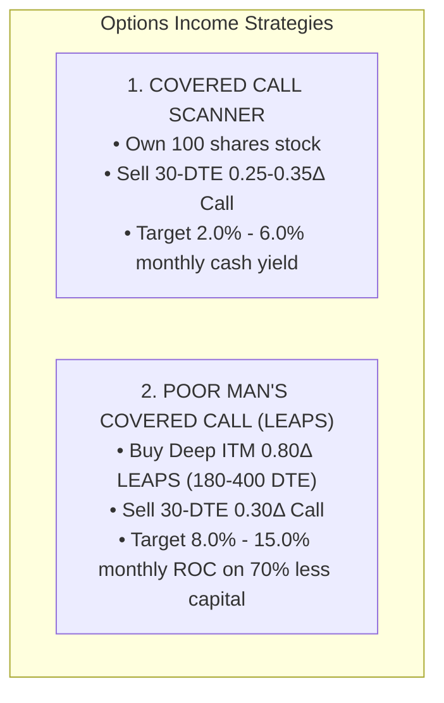

# Options Income Scanner Engine: Covered Calls & Poor Man's Covered Calls (LEAPS)

This document details the quantitative mechanics, yield formulas, and execution architecture of the **Covered Call** and **Poor Man's Covered Call (PMCC / LEAPS)** scanners.

---

## 1. Overview & Strategic Positioning

While Cash-Secured Puts (CSPs) are designed for bottom-up accumulation, Covered Calls and LEAPS provide systematic **cash-flow harvesting** and **stock replacement leverage**:



---

## 2. Covered Call Income Scanner

### A. Screener Filters
1. **Underlying Trend Health**:
   * Current Price $> \$10.00$
   * Current Price $> 50\text{ SMA}$ (in an established institutional uptrend, avoiding declining stocks).
2. **Forward Earnings Protection**:
   * No earnings announcement scheduled between trade entry and option expiration date (eliminating binary earnings gap risk).
3. **Expiration & Strike Selection**:
   * DTE window: **20 to 45 DTE** (the sweet spot of theta decay).
   * Call Delta: $\mathbf{0.20 \le \Delta \le 0.35}$ (provides $5\% - 15\%$ upside appreciation room before strike is reached).
4. **Liquidity & Spread Tightness**:
   * Open Interest $\ge 5$ contracts.
   * Bid-Ask spread width $\le 40\% - 50\%$ of mid-price.

### B. Yield & Return Formulas

#### 1. Static Monthly Option Yield (Unchanged Stock)
$$\text{Static Yield \%} = \left(\frac{\text{Call Mid Premium}}{\text{Stock Price}}\right) \times 100$$
* Minimum target floor: $\ge 1.2\% - 2.0\%$ per month.

#### 2. If-Called Total Return (Stock Rises to Strike)
$$\text{If-Called Total Return \%} = \left(\frac{(\text{Strike} - \text{Stock Price}) + \text{Call Mid Premium}}{\text{Stock Price}}\right) \times 100$$

#### 3. Annualized Yield
$$\text{Annualized Yield \%} = \text{Static Yield \%} \times \left(\frac{365}{\text{DTE}}\right)$$

#### 4. Downside Buffer (Break-Even Cushion)
$$\text{Break-Even Price} = \text{Stock Price} - \text{Call Premium}$$
$$\text{Downside Cushion \%} = \text{Static Yield \%}$$

---

## 3. Poor Man's Covered Call (LEAPS) Scanner

### A. Strategy Philosophy
The **Poor Man's Covered Call (PMCC)** replaces buying 100 shares of stock at full cash value ($100 \times \text{Spot}$) with purchasing a **Deep In-The-Money (ITM) LEAPS Call** for a fraction of the cost, while selling short-dated Out-Of-The-Money (OTM) calls against it.

### B. Screener Architecture
1. **Long LEAPS Leg**:
   * Expiration: **180 to 400 DTE** (long runway, minimal daily theta decay).
   * Delta: $\mathbf{0.75 \le \Delta \le 0.85}$ (acts 1:1 like owning the underlying shares with intrinsic value $> 80\%$).
2. **Short Front-Month Call Leg**:
   * Expiration: **25 to 45 DTE**.
   * Delta: $\mathbf{0.20 \le \Delta \le 0.35}$ (high theta decay rate).
3. **Net Capital & Return on Capital (ROC)**:
   $$\text{Net Debit Cost} = \text{LEAPS Mid Price} - \text{Front Call Mid Price}$$
   $$\text{Monthly ROC \%} = \left(\frac{\text{Front Call Mid Price}}{\text{Net Debit Cost}}\right) \times 100$$

### C. Live Benchmarks
* Top high-leverage setups routinely achieve **$8.0\% - 12.2\%$ Monthly Return on Capital** (e.g. `AXTI` 12.24% ROC, `ASTS` 10.84% ROC, `COHR` 10.62% ROC, `BE` 9.83% ROC).

---

## 4. Execution & Usage

### CLI Runner
```bash
python -m scripts.screener.options_income_scanners
```

### Python API Integration
```python
from scripts.screener.options_income_scanners import scan_covered_calls, scan_pmcc_leaps

# 1. Pull Covered Calls
cc_picks = scan_covered_calls()
for c in cc_picks[:5]:
    print(f"{c.ticker}: Strike ${c.strike:.1f}C, Mo. Yield {c.static_yield_pct:.2f}%, If Called {c.if_called_yield_pct:.2f}%")

# 2. Pull PMCC LEAPS
pmcc_picks = scan_pmcc_leaps()
for p in pmcc_picks[:5]:
    print(f"{p.ticker}: Net Cost ${p.net_debit:.2f}, Monthly ROC {p.roc_pct:.2f}%")
```
