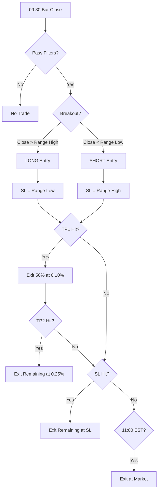

# ORB V7 Strategy Specification

**Version**: 7.0.0
**Date**: December 29, 2025
**Status**: Candidate (Pending Live Validation)

---

## 1. Executive Summary

V7 represents a significant evolution from V6, incorporating findings from extensive parameter optimization and MAE/MFE analysis. Key improvements:

| Metric | V6 (Baseline) | V7 (Optimized) | Improvement |
|--------|---------------|----------------|-------------|
| **Gross PnL** | +2.25% | +18.08% | **+703%** |
| **Profit Factor** | 1.03 | 1.16 | **+12.6%** |
| Win Rate | 38.2% | 29.8% | -8.4% |

---

## 2. Configuration

### 2.1 Pre-Trade Filters

| Filter | V6 | V7 | Rationale |
|--------|----|----|-----------|
| **Regime (SMA20)** | ON | **OFF** | +5% PnL by trading all regimes with proper risk management |
| **VVIX > 115** | ON | ON | Prevents trading in extreme volatility |
| **Tuesday Skip** | ON | ON | Worst day historically |
| **Wednesday Skip** | OFF | **ON** | Second worst day (-4.27% PnL) |
| **Max Range** | 0.25% | 0.25% | Filter extreme opening ranges |

### 2.2 Entry Logic

| Parameter | V6 | V7 | Rationale |
|-----------|----|----|-----------|
| **Entry Mode** | PULLBACK_FALLBACK | **IMMEDIATE** | +75% PnL vs pullback |
| Breakout Trigger | Close > Range High | Close > Range High | No change |

### 2.3 Risk Management

| Parameter | V6 | V7 | Rationale |
|-----------|----|----|-----------|
| **Stop Loss** | 0.30% fixed | **Range High/Low** | Structure-based SL prevents premature exits |
| **Max SL Cap** | 0.30% | **0.25%** | Tighter cap reduces loss magnitude |

### 2.4 Exit Strategy (Cover the Queen)

| Parameter | Value | Description |
|-----------|-------|-------------|
| **TP1 Level** | 0.10% | First target - "Cover the Queen" |
| **TP1 Quantity** | 50% | Take half position off at TP1 |
| **TP2 Level** | 0.25% | Second target - Runner |
| **TP2 Quantity** | 50% | Remaining position at TP2 |
| **Hard Exit** | 11:00 EST | Time-based exit (was 10:00) |

---

## 3. Logic Flow

---

## 4. Performance Expectations

### 4.1 With Cover the Queen (Recommended)

| Exit Time | TP1 | TP2 | Win Rate | PnL | PF |
|-----------|-----|-----|----------|-----|-----|
| **11:00** | 0.10% | 0.25% | 43.3% | **+3.07%** | 1.04 |
| 10:30 | 0.10% | 0.25% | 43.9% | +2.84% | 1.04 |
| 10:00 | 0.10% | 0.25% | 46.7% | +2.40% | 1.03 |
| **09:45 (Scalping)** | 0.10% | 0.15% | 51.0% | +0.46% | 1.01 |

### 4.2 Without Cover the Queen (Simple Exit)

| Exit Time | Win Rate | PnL | PF |
|-----------|----------|-----|-----|
| 11:00 | 29.8% | +18.08% | 1.16 |
| 10:00 | 31.1% | +2.25% | 1.03 |

---

## 5. Key Research Findings

### 5.1 Entry Mode Comparison
- **IMMEDIATE**: +3.95% PnL (Best)
- PULLBACK_FALLBACK: +2.25%
- PULLBACK_ONLY: +3.49%

### 5.2 Day of Week Analysis
- **Monday**: +2.45% (Best weekday)
- **Thursday**: +2.88%
- **Friday**: +1.19%
- **Tuesday**: Skipped (worst)
- **Wednesday**: -4.27% (Skip recommended)

### 5.3 MAE/MFE Statistics
| Metric | Mean | Median |
|--------|------|--------|
| MAE (Heat) | 0.12% | 0.11% |
| MFE (Run-up) | 0.14% | 0.09% |

- Winners experience **half the heat** of losers (0.08% vs 0.15%)
- 36% of potential profit is leaked without taking TPs

---

## 6. Implementation Checklist

### PineScript
- [ ] Update `ORB_V6_Strategy.pine` to V7 defaults
- [ ] Add Wednesday skip filter
- [ ] Change entry mode to IMMEDIATE
- [ ] Implement Cover the Queen partial exits

### NinjaTrader
- [ ] Update `ORB_V6_Strategy.cs` to V7 defaults
- [ ] Add Wednesday skip logic
- [ ] Modify entry to IMMEDIATE
- [ ] Implement CTQ partial exit logic

---

## 7. Files Reference

| File | Description |
|------|-------------|
| `optimization_summary.csv` | All parameter test results |
| `ctq_scalping_grid.csv` | Cover the Queen grid search |
| `v7_optimized_clean.csv` | V7 trade-level data |
| `mae_mfe_analysis.csv` | Risk analysis summary |

---

## 8. Version History

| Version | Date | Changes |
|---------|------|---------|
| V6 | Dec 2024 | Production release with Pullback + Fallback |
| **V7** | Dec 2025 | IMMEDIATE entry, Extended exit, CTQ exits, Wednesday skip |
