# Strategy Building Blocks: Modular Components

This document defines **reusable strategy components** that can be applied across multiple trading strategies. Each component is self-contained with clear inputs and behaviors.

---

# 📥 ENTRY SYSTEMS

## Entry Flow Overview

---

## Component 1: Breakout Trigger

Determines **when** a valid breakout has occurred.

```mermaid
flowchart TD
    subgraph Breakout Trigger Options
        A[Price Action] --> B{Trigger Mode}
        B -->|Standard| C[Candle CLOSES outside boundary]
        B -->|Displacement| D[Candle CLOSES beyond buffer]
        B -->|Aggressive| E[Wick touches outside boundary]
    end
    
    C --> F[✅ Breakout Confirmed]
    D --> F
    E --> F
```

### Configuration

| Input | Options | Description |
|-------|---------|-------------|
| **Trigger Mode** | `Standard`, `Displacement`, `Aggressive` | How to confirm the breakout |
| **Buffer %** | 0.10% (default) | For Displacement mode only |

### Logic Table

| Mode | Long Trigger | Short Trigger |
|------|--------------|---------------|
| **Standard** | Close > Upper Boundary | Close < Lower Boundary |
| **Displacement** | Close > Upper + Buffer | Close < Lower - Buffer |
| **Aggressive** | High > Upper Boundary | Low < Lower Boundary |

---

## Component 2: Entry Execution

Determines **how** to enter after breakout is confirmed.

```mermaid
flowchart TD
    A[Breakout Confirmed] --> B{Entry Mode}
    
    B -->|Immediate| C[Enter at Market NOW]
    B -->|Pullback| D[Place Limit Order at Target]
    B -->|Pullback + Fallback| E[Limit Order + Timer]
    
    D --> K{Price Closes Deeply Inside?}
    K -->|Yes| H[❌ Cancel Order]
    K -->|No| F{Limit Filled?}
    
    F -->|Yes| G[✅ Entry Complete]
    F -->|No, Window Closed| H
    
    E --> L{Price Closes Deeply Inside?}
    L -->|Yes| H
    L -->|No| I{Limit Filled?}
    
    I -->|Yes| G
    I -->|Timeout & Price Outside| J[Enter at Market]
    I -->|Price Reversed| H
    
    C --> G
    J --> G
```

### Configuration

| Input | Options | Description |
|-------|---------|-------------|
| **Entry Mode** | `Immediate`, `Pullback`, `Pullback + Fallback` | Execution style |
| **Pullback Target** | `0%` (boundary), `25%`, `50%` | Depth into range |
| **Timeout Bars** | 5 (default) | Bars before fallback (if enabled) |

### Entry Mode Comparison

| Mode | Risk | Reward | Best When |
|------|------|--------|-----------|
| **Immediate** | Higher (worse fill) | Catches runners | Strong trend days |
| **Pullback** | Lower (better fill) | May miss trade | Mean-reversion days |
| **Pullback + Fallback** | Balanced | Balanced | Default choice |

---

# 📤 EXIT SYSTEMS

## Exit Flow Overview

---

## Component 3: Multi-TP Ladder

Progressive profit-taking at multiple levels.

```mermaid
flowchart TD
    A[Position Open] --> B[TP1 Level Reached?]
    
    B -->|Yes| C[Exit TP1 Qty %]
    B -->|No| B
    
    C --> D[TP2 Level Reached?]
    D -->|Yes| E[Exit TP2 Qty %]
    D -->|No| D
    
    E --> F{Runner Mode}
    F -->|None| G[Exit Remaining at TP2]
    F -->|Trailing| H[Trail from Peak]
    F -->|Forever| I[Hold until Time Exit]
    
    H --> J[Trail Stop Hit?]
    J -->|Yes| K[✅ Exit Complete]
    J -->|No| H
    
    I --> L[Time Exit]
    L --> K
    G --> K
```

### Configuration

| Input | Default | Description |
|-------|---------|-------------|
| **TP1 Level** | 0.10% | First target |
| **TP1 Qty** | 50% | Portion to close at TP1 |
| **TP2 Level** | 0.25% | Second target |
| **TP2 Qty** | 25% | Portion to close at TP2 |
| **Runner Mode** | `Trailing` | What to do with remaining 25% |
| **Trail %** | 0.08% | Distance from peak to trail |

### Quick Configs

| Profile | TP1 | TP2 | Runner | Best For |
|---------|-----|-----|--------|----------|
| **Conservative** | 0.08% (60%) | 0.15% (40%) | None | Choppy markets |
| **Balanced** | 0.10% (50%) | 0.25% (25%) | Trailing | Default |
| **Aggressive** | 0.15% (40%) | 0.35% (20%) | Forever | Trend days |

---

## Component 4: Stop Loss Management

```mermaid
flowchart TD
    A[Position Open] --> B[Initial SL = Range Boundary]
    
    B --> C{Protection Mode}
    C -->|Static| D[SL remains at boundary]
    C -->|Breakeven| E[Move SL to entry after TP1]
    C -->|Trailing| F[Trail SL from peak]
    
    D --> G{SL Hit?}
    E --> G
    F --> G
    
    G -->|Yes| H[❌ Exit - Stop Loss]
    G -->|No| I{Check Special Exits}
```

---

## Component 5: Special Exits

Early exit conditions that override normal TP/SL.

```mermaid
flowchart TD
    A[Check Each Bar] --> B{MAE Filter}
    B -->|Adverse > Threshold| C[🔥 Exit - Heat Filter]
    B -->|OK| D{Signal Candle Breach?}
    
    D -->|Yes| E[⚠️ Exit - Reversal Detected]
    D -->|No| F{Close Inside Range?}
    
    F -->|Yes| G[📉 Exit - Failed Breakout]
    F -->|No| H{Time Exit?}
    
    H -->|Yes| I[⏰ Exit - Session End]
    H -->|No| J[Continue Holding]
```

### Configuration

| Exit Type | Input | Default | Description |
|-----------|-------|---------|-------------|
| **MAE Heat** | Threshold % | 0.12% | Max adverse move before exit |
| **Signal Candle** | Mode | `Wick` | Exit on wick/close breach |
| **Early Exit** | Enabled | OFF | Exit if close back inside range |
| **Time Exit** | Time | 10:00 AM | Force-close all positions |

---

# 🔧 STRATEGY ASSEMBLY

Combine components to build complete strategies:

### Example Configurations

| Strategy | Trigger | Entry | TP System | Stop |
|----------|---------|-------|-----------|------|
| **9:30 Conservative** | Standard | Pullback Only | TP1+TP2, No Runner | Static |
| **9:30 Balanced** | Displacement | Pullback + Fallback | TP1+TP2, Trailing | Breakeven |
| **9:30 Aggressive** | Aggressive | Immediate | TP1 only, Forever Runner | Trailing |

---

> [!TIP]
> **To add a new strategy**: Define its Signal Zone, then plug in the appropriate Entry and Exit components from this library.
