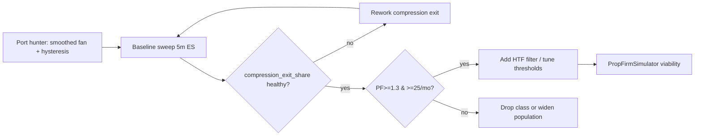

# EMA Ribbon Fan — Slope-Acceleration / Compression Strategy

> **Status**: 🧪 Research — Concept Evaluated, Not Yet Implemented
> **Created**: 2026-08-27
> **Source**: TradingView `X0F9OE4L` "Gradient Ribbon | EMA Ribbon Slope-Acceleration System" by `blitz_locked` (open-source, 2026-08-25)
> **Symbol**: ES1 (expandable to NQ1, RTY1)
> **Standard**: ADR-017 (Zero-Loop `hunt()`), ADR-002 (Percentage Metrics), ADR-020 (16:00 ET Exit)

---

## 1. Why this class is worth a look

We have never treated **moving averages as a standalone strategy** — MAs appear only as filters inside other classes (BB, Supertrend, VWAP). This script is a genuine candidate for a first MA-native strategy, and it earns that on two ideas that are *not* the usual "are the MAs stacked in order":

1. **Acceleration (fan-open)** — measure the *slope* of each EMA, not just its ordering. A ribbon can stay stacked long after momentum dies; slope isolates the moments where the trend is genuinely *gaining* speed.
2. **Compression (fan-close)** — exit when the fan starts flattening back toward parallel, *before* the lagging EMA cross. This is an early-deceleration read, the mirror image of the entry.

Both are defensible, and both are **orthogonal to our existing classes** — they measure the *second derivative* of price (acceleration) rather than level or reversion. That makes this a good complement to the BB (reversion) and Supertrend (trend-follow) classes already in the roadmap.

---

## 2. The source strategy — how it works

### 2.1 Ribbon & slope

5-EMA ribbon (8/13/21/34/55). Per-line slope is a simple % change over a configurable lookback:

```
slope(ema) = (ema - ema[slopeLookback]) / ema[slopeLookback] * 100
```

### 2.2 Fan-open (entry) — the acceleration read

Bullish requires **all five** slopes positive **and** strictly increasing from slowest to fastest:

```
allPositive     = s8>0 and s13>0 and s21>0 and s34>0 and s55>0
increasingFanUp = s8>s13 and s13>s21 and s21>s34 and s34>s55
fanningOpenUp   = allPositive and increasingFanUp
```

Bearish is the exact mirror. A `fanScore = s8 - s55` (fastest minus slowest slope) measures "how open" the ribbon is; entry needs `|fanScore| > fanEnterThresh` (default 0.8%).

### 2.3 Confirmation filters

- **RSI** — bullish needs RSI in (50, 70); bearish mirrors to (30, 50). Avoids both weak momentum and overbought/oversold extremes.
- **Volume** — `volume > SMA(volLen) × volMult`, so fans opening on thin volume are filtered.

### 2.4 Risk / exit

- **Sizing**: `qty = (equity × risk%) / (ATR × mult)` — risk a fixed % of equity against an ATR stop. Correct sizing instinct.
- **TP**: fixed R-multiple (default 2R).
- **Compression exit**: `exitLong = (not increasingFanUp) or (fanScore < fanExitThresh)` — closes when the fan stops opening, ahead of the cross.

---

## 3. Evaluation — what's good, what's broken

### 3.1 The two ideas worth keeping (the user's instinct is right)

| Idea | Verdict | Why |
|---|---|---|
| **Acceleration (slope + fan-open)** | ✅ Keep | Measures 2nd derivative; genuinely different from stacking. The core edge. |
| **Compression (fan-close exit)** | ✅ Keep, but rework | Early-exit concept is sound; the *implementation* is broken (below). |
| **Slope as a standalone signal** | ✅ Keep | First MA-native strategy; orthogonal to BB/ST classes. |

### 3.2 Critical bugs in the source (do NOT port as-is)

**B1 — Exit is ~5× more sensitive than entry (fatal).**
Entry needs *all five* slopes strictly ordered **and** `|fanScore| > 0.8`. Exit fires on `not increasingFanUp` — the instant **any single** EMA slope ticks against the ordering, even if `fanScore` is still 0.9. Result: enter on a rare strict setup, get stopped out by noise within a few bars, long before 2R. **This cuts nearly every winner early → low win-rate, small winners.** The compression exit must be *smoothed* and use *hysteresis* (see §4).

**B2 — Fractional/zero contract sizing on futures.**
`qty = riskAmount / stopDistance`. On $10k risking 1%, riskAmount = $100. If ATR×2 = $1000 (common on NQ/ES), `qty = 0.1` → rounds to **0 → the trade silently never fires**. No minimum-qty guard, no whole-contract rounding, no max-position cap.

**B3 — `strategy.close` + `strategy.exit` conflict.**
An OCO stop/limit is placed via `strategy.exit`, then a separate `strategy.close` fires on compression. The close doesn't cleanly cancel the resting OCO → stale exit order fighting a now-flat position. Double-exit hazard.

**B4 — Entry-price vs execution-price mismatch.**
Stop/TP computed from the current bar's `close`, but `strategy.entry` fills on the **next** bar's open. Actual risk ≠ sized risk.

### 3.3 Conceptual concerns

- **Direction-agnostic, no HTF filter** → chopped in ranging markets (author acknowledges).
- **`fanEnterThresh`/`fanExitThresh` are magic numbers** in % units, wildly instrument/timeframe dependent.
- **Fixed 5-bar slope lookback is noisy** on choppy instruments; the strict 5-EMA ordering amplifies that noise.

---

## 4. Proposed rework — "EMA Ribbon Fan" (our version)

The goal is to keep acceleration + compression but make them **robust and vectorizable** (ADR-017), and fix B1-B4.

### 4.1 Smoothed, hysteresis-based fan state (fixes B1)

Replace the brittle strict-ordering boolean with a **continuous, smoothed fan score** and a state machine with separate open/close thresholds:

```
# Smoothed per-EMA slope (EMA of the raw slope, or a longer slopeLookback)
s_i = ema( slope(ema_i), slopeSmooth )          # vectorizable

# Fan score = spread between fastest and slowest smoothed slope
fanScore = s_fast - s_slow

# Hysteresis state machine (per direction)
state = flat
  flat  → open  when |fanScore| > openThresh   (and direction sign)
  open  → flat  when |fanScore| < closeThresh  (closeThresh << openThresh)
```

- **Hysteresis** (`closeThresh` well below `openThresh`) prevents the "enter at 0.9, exit at 0.89" whipsaw.
- **Drop the `not increasingFanUp` term** (or require it to persist N bars) — it is the source of the asymmetric sensitivity.
- **Smoothed slope** kills the single-bar noise spike.

### 4.2 Whole-contract sizing with minimum guard (fixes B2)

```
qty = floor( (equity × risk%) / stopDistance )
qty = max(qty, 1) if qty >= 1 else 0   # never a silent zero; skip if < 1 contract
qty = min(qty, maxPositionCap)
```

### 4.3 Single exit path (fixes B3)

Use **one** `strategy.exit` with `from_entry` carrying the OCO (stop + limit), and let the **compression condition cancel the OCO** and issue a market close — never both live at once. In the vectorized hunter, this is just: exit on `state == flat` OR stop OR target, whichever comes first.

### 4.4 Execution-price-aware stop/TP (fixes B4)

Compute stop/TP from the **actual fill price** (next bar open in backtest), not the signal bar close. In the `hunt()` output, emit `entry_price` and let the engine handle fill; the stop/target are derived from the fill.

### 4.5 Optional HTF filter (addresses §3.3)

Add a configurable higher-timeframe trend gate (e.g. daily EMA slope or daily Supertrend state) so the fan only trades in the direction of the larger structure. Test with/without — the author's script is direction-agnostic by design, and our ST research (T01) showed HTF alignment helps trend-following classes.

---

## 5. Test matrix — configurable arms

All variants are parameters on a single hunter class (ADR-017). The sweep runner iterates combinations.

| Dimension | Values | Notes |
|---|---|---|
| **Ribbon lengths** | `(8,13,21,34,55)` default; alt `(5,10,20,40,60)` | Keep 5-EMA fan shape |
| **Slope lookback** | `5` / `10` / `20` | Longer = smoother, higher-TF |
| **Slope smoothing** | `none` / `ema(3)` / `ema(5)` | Kills single-bar noise |
| **Open threshold** | `0.5` / `0.8` / `1.2` | % units, instrument-dependent |
| **Close threshold (hysteresis)** | `0.2` / `0.3` / `0.4` | Must be << open |
| **RSI filter** | `on` / `off`; band `(50,70)` / `(45,75)` | Test if it adds edge |
| **Volume filter** | `on` / `off`; mult `1.0` / `1.5` | Thin-market caveat |
| **HTF filter** | `none` / `daily_ema_slope` / `daily_st` | §4.5 |
| **TP** | `1R` / `2R` / `3R` | |
| **Stop** | `2×ATR` / `3×ATR` | |

**Total**: keep the grid modest first (slope lookback × open × close × HTF × TP) — ~3×3×3×3×3 = 243 arms, then expand.

---

## 6. Data pipeline

- **Execution TF**: 5m (consistent with our ST/BB harness; 1m is cost-noise per E05/E06).
- **Data**: `load_fused_data('ES1')` ≥ 2025-01-01 resampled 5m, or `data/derived/nt_es_09_26_1m/5m_2025_2026_mergeBA.csv` (same harness as `STRATEGY_REVIEW_2026_08_27.md`).
- **All indicators are set-based columns** (EMA, slope, smoothed slope, fanScore, RSI, ATR, volume SMA) computed before signal hunting — no loops (ADR-017).
- **HTF filter**: daily EMA slope / daily ST state joined on `trade_date` (reuse `supertrend_daily.py`).

---

## 7. Metrics captured

All in **price percentage** per ADR-002. Core from `VectorizedBacktester`:

| Metric | Description |
|---|---|
| `total_return_%` | Cumulative return |
| `win_rate_%` | Winning trade share |
| `avg_mae_%` / `avg_mfe_%` | Avg adverse / favorable excursion (price %) |
| `num_trades` | Trade count |
| `sharpe_ratio` / `max_drawdown_%` | Risk-adjusted return / peak-to-trough |
| `r_multiple` | Outcome in R units |

**Strategy-specific diagnostics** (the whole point of the class):

| Metric | Description |
|---|---|
| `fan_score_at_entry` | How open the fan was at entry |
| `bars_to_compression_exit` | Bars from entry to fan-close exit (vs stop/target) |
| `exit_reason` | `compression` / `stop` / `target` / `eod` |
| `compression_exit_share` | % of trades exited by compression vs stop — **the key health check** |
| `slope_lookback` / `open_thresh` / `close_thresh` | Config echo |

**Key question the metrics must answer:** does the compression exit *preserve* winners (exit_reason=compression with positive R) or *kill* them (compression exits that would have hit 2R)? If the latter, the hysteresis fix (§4.1) is insufficient and the compression idea needs a different form.

---

## 8. Architecture

```
scripts/
├── strategies/ema_ribbon_fan/
│   ├── ema_ribbon_fan.py          ← NEW: hunter class (hunt() → canonical 5-col signal DF)
│   └── runners/
│       └── run_ema_ribbon_sweep.py  ← NEW: sweep runner + comparison report
└── trading_framework/
    └── strategies/
        └── registry.py             ← Register `ema_ribbon_fan`
```

Hunter class skeleton (ADR-017):

```python
class EMARibbonFanStrategy:
    def __init__(self, ticker: str = "ES1"):
        self.ticker = ticker
        self.strategy_name = "EMA Ribbon Fan"

    def hunt(self, data: pd.DataFrame, params: Optional[Dict] = None) -> pd.DataFrame:
        """
        Params:
            ribbon:      (8,13,21,34,55) | (5,10,20,40,60)
            slope_lookback: 5 | 10 | 20
            slope_smooth:   none | 3 | 5
            open_thresh:    0.5 | 0.8 | 1.2
            close_thresh:   0.2 | 0.3 | 0.4
            rsi_filter:     on | off
            vol_filter:     on | off
            htf_filter:     none | daily_ema_slope | daily_st
            tp_rr:          1 | 2 | 3
            atr_mult:       2 | 3
        Returns:
            DataFrame with _COLS + extended metric columns
        """
        ...
```

---

## 9. Run commands

```bash
# Single arm
.\.venv\Scripts\python.exe scripts/trading_framework/run_backtest.py \
    --ticker ES1 --strategy ema_ribbon_fan \
    --params '{"slope_lookback":10,"open_thresh":0.8,"close_thresh":0.3,"htf_filter":"daily_st","tp_rr":2}'

# Full sweep
.\.venv\Scripts\python.exe scripts/strategies/ema_ribbon_fan/runners/run_ema_ribbon_sweep.py

# Results
# results/RESEARCH/ema_ribbon_sweep/
# ├── sweep_results.csv
# ├── sweep_results_sorted.md
# ├── best_arms.md
# └── per_trade_detail.parquet
```

---

## 10. Sequencing & prop-firm fit



| Target | Metric | Goal |
|---|---|---|
| EMA Ribbon Fan | PF / trades per mo | ≥ 1.3 / ≥ 25 |
| Compression exit | share of exits that are compression AND positive-R | majority, not minority |

**Prop-firm guardrails (ADR-020/021):** hard exit at 15:50 ET liquidation; any Monte Carlo viability runs go through `PropFirmSimulator` only.

---

## 11. Open questions / next steps

1. **Does compression actually preserve winners?** This is the single most important unknown. The source's implementation is broken (B1), but the *concept* is untested. The `exit_reason` + `compression_exit_share` metrics are designed to answer it.
2. **Is slope-acceleration a real edge or just a trend proxy?** Compare against a plain "EMA stacked + price > EMA" baseline. If the fan adds nothing over stacking, the acceleration idea is decorative.
3. **Which instrument?** ES first (harness parity); NQ reverts harder intraday and may suit a different threshold set.
4. **HTF filter direction** — test `daily_ema_slope` vs `daily_st` (reuse existing daily ST computation).

---

## 12. References

- Source: TradingView `X0F9OE4L` — "Gradient Ribbon | EMA Ribbon Slope-Acceleration System" (`blitz_locked`, open-source, 2026-08-25).
- Harness: `BacktestEngine` (`scripts/analysis/range_strategy_comparison.py:509`), same as `STRATEGY_REVIEW_2026_08_27.md`.
- Standards: `docs/architecture/STRATEGY_WORKFLOW.md` §2 (the `hunt()` contract, absorbed from the deleted design standard), ADR-002, ADR-020.
