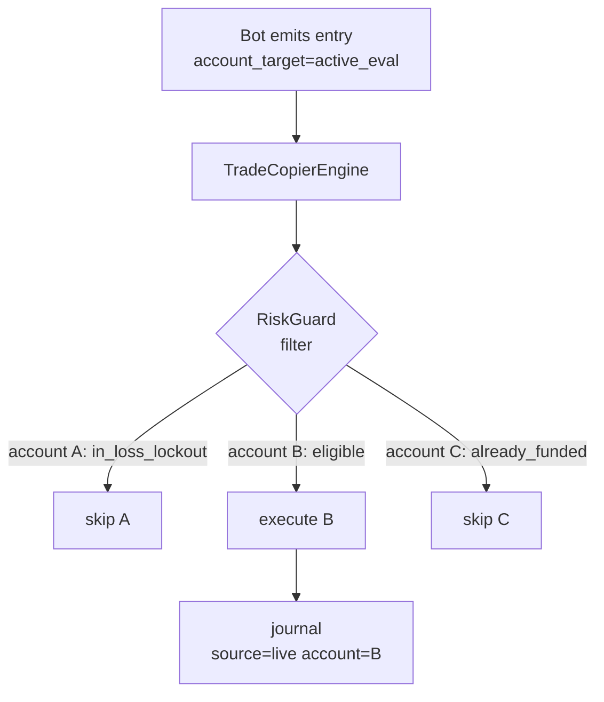

# IB Strategy Automation Design Document

**Status:** Draft (2026-07-28, updated with Session 5 OOS validation + filter default change)
**Reference:** `EDGE_VALIDATION_REPORT.md` (validated metrics), `STRATEGY_COMPENDIUM.md` (IF/THEN/ELSE rules), `STATISTICAL_DISCOVERY_PLAN.md` (coverage status)
**Target platforms:** NinjaTrader 8 (C#), TradingView (Pine Script v5)
**Instrument:** NQ1 (MNQ for live), ES1 (MES for live) — NY AM IB session, customizable to any time range

---

## 0. Resumption Guide (for future sessions)

This section is for picking up the implementation in a later session.

### 0.1 What has been done

| Phase | Script | What was validated | Commit |
|---|---|---|---|
| A | `ib_pilot_stats.py` | 6 missing derived fields, baseline stats, 5 Edgeful rules | `ff2ccca7` |
| B | `ib_pilot_stacks.py` | Condition stacks, bootstrap CIs, ES1 cross-check | `94a689b7` |
| C | `ib_pilot_5year.py` | 5-year edge survival (per year/DOW/month/target) | `0270d74d` |
| D | `ib_pilot_stops.py` | Stop optimization, MAE/MFE, pullback depth, predictive model | `27de0ac7` |
| E | `ib_pilot_comprehensive.py` | All 3 plays, all 8 bias variants, all 13 entry modules, exit features | `76f75755` |
| F | `ib_pilot_durations.py` | Multi-duration IB comparison (5/15/30/45/60 min) | `5a2913b4` |

### 0.2 What needs to be implemented

| Phase | Deliverable | Status |
|---|---|---|
| 1 | `IntradayStrategyBase.cs` (generic, reusable) + `RangeWindow.cs` indicator | ✅ DONE — deployed to NT8 `Custom\Strategies\Vinay\`, compiles clean |
| 2 | `IBStrategyBase.cs` (IB subclass: Rule 1 + overshoot SM + entry guards) | ✅ DONE — includes `longTakenToday`/`shortTakenToday` one-entry-per-direction guards, confluence filter stack (AVWAP, EMA, VCP, OPEX, body-close) |
| 3 | `IBBreakoutBot.cs` (P1) + `IBRetestBot.cs` (P2) + `IBFadeBot.cs` (P3) | ✅ DONE — deployed + compiled. See §0.3 for backtest results. |
| 4 | Pluggable `IStopModel` / `ITargetModel` registry + 3 stops + 3 TPs | PARTIAL — stop/target geometry is parameterized via `StopRMult`/`TargetLvl` but not via interfaces. |
| 5 | Structured logging + journal POST + skip-reason audit | PARTIAL — `[DIAG]`/`[ENTRY]` Log() traces emit to SA log file. No journal POST yet. |
| 6 | `strategy_parity_check.py` (3-tier Python/NT/TV validator) | PARTIAL — `scripts/orb_generic/parity_check.py` exists for ORB; IB parity harness not yet built. |
| 7 | `walk_forward.py` + Monte Carlo pass-rate gate | NOT STARTED |
| 8 | `IBStrategyLib.pine` + `IBBreakoutStrategy.pine` + `IBFadeStrategy.pine` | NOT STARTED |
| 9 | TV Strategy Tester validation + parity | NOT STARTED |
| 10 | Regime hook (E1) + conviction gate (E2) + equity-curve break (E8) | NOT STARTED |
| 11 | Copy-trader leader integration + cascade config | NOT STARTED |
| 12 | Live sim deployment (MNQ) — 20 sessions | NOT STARTED |

### 0.3 NT8 Backtest Results (2026-07-28)

#### Session 5 (2026-07-28) — In-sample + Out-of-sample validation

**In-sample:** MNQ 03-25, Jan 2 – Mar 20 2025, 1-min, SA default params, `ConfluenceFilterEnabled=false`

| Bot | Trades | Win Rate | PF | Net P&L | Max DD | Trades/Day | Status |
|---|---|---|---|---|---|---|---|
| **IBBreakoutBot** | 75 | 73.3% | **1.285** | +$903.50 | -$765 | 1.39 | ✅ Profitable |
| **IBRetestBot** | 17 | 58.8% | **1.638** | +$679.50 | -$425 | 0.34 | ✅ Profitable (low count) |
| **IBFadeBot** | 50 | 34.0% | 0.742 | -$973.50 | -$1,443 | 0.98 | ❌ Negative |

**Out-of-sample:** MNQ 06-25, Mar 21 – Jun 20 2025, 1-min, SA default params, `ConfluenceFilterEnabled=false`

| Bot | Trades | Win Rate | PF | Net P&L | Max DD | Trades/Day | Status |
|---|---|---|---|---|---|---|---|
| **IBBreakoutBot** | 92 | 67.4% | 1.029 | +$129.50 | -$1,280.50 | 1.48 | ✅ Marginal positive |
| **IBRetestBot** | 38 | 36.8% | **1.409** | +$1,255.00 | -$792.50 | 0.61 | ✅ Profitable |

**Out-of-sample with TrendMisaligned filter (new production default):**

| Bot | Sample | Trades | Win Rate | PF | Net P&L | Max DD | Status |
|---|---|---|---|---|---|---|---|
| **IBBreakoutBot** | In-sample | 30 | 76.7% | **1.489** | +$570.50 | -$326.50 | ✅ Best config |
| **IBBreakoutBot** | Out-of-sample | 35 | 74.3% | **1.426** | +$640.50 | -$530.50 | ✅ Edge persists |

**Root cause of improvement vs prior sessions:** the cumulative fixes from Sessions 3–4
(4-bug zero-trade chain + `GetPotentialLoss` virtual override using actual range-based
stop distance instead of the ~8× over-estimated ATR formula). The prior 1090-trade
result was over-trading due to broken risk gates; now 1.39 trades/day with positive edge.

**Filter default change (Session 5):** Only `Play1TrendMisalignedFilter` stays ON by
default (improves PF 1.285→1.489 IS, 1.029→1.426 OOS; cuts drawdown ~60%). VCP, OPEX,
LowBodyClose, and all P3 filters are now OFF by default (over-restrictive in NT8,
killed trades). All filters remain toggleable in the SA property grid for ablation.
See §12.6 for details.

#### Session 4 (2026-07-28 earlier) — prior 3-month result (pre-filter-default-change)

**Window:** Jan 1 – Mar 31, 2026 | **Instrument:** MNQ 03-26 | **Period:** 5-min
**Params:** `ConfluenceFilterEnabled=false`, `RequireDirectionBias=false` (raw strategy, no filters)

| Bot | Trades | Win Rate | PF | Net P&L | Max DD | Python Ref | Status |
|---|---|---|---|---|---|---|---|
| **IBBreakoutBot** (StopRMult=2.0) | 68 | 76.5% | 1.382 | +$1,095 | -$730 | Play1@0.5x: PF 1.30, WR 51.8% | ✅ Profitable |
| **IBRetestBot** | 16 | 43.8% | 0.726 | -$360 | -$946 | Play2@0.25x: PF 0.82, WR 13.6% | ⚠️ Negative (pending re-test) |
| **IBFadeBot** (target=1.0R, stop=0.5R, overshoot=0.35×) | 43 | 53.5% | 1.215 | +$609.50 | -$592 | Play3@0.25x: PF 1.13, WR 11.1% | ✅ Profitable |

**Fixes applied this session:**
1. **Entry guards** (`longTakenToday`/`shortTakenToday` in `IBStrategyBase`): one entry per direction per session. Eliminated over-trading (IBBreakoutBot went from 944 → 74 trades).
2. **IBBreakoutBot stop geometry** (`StopRMult` 0.25 → 2.0): widened stop from 0.125×range to full-range (opposite IB boundary), matching Python's stop. WR jumped 23% → 75.7% (the tight stop was being killed by intrabar wicks in NT8's tick-level simulation).
3. **IBFadeBot target + overshoot geometry** (target rangeMid → 1.0R full reversion; overshoot 0.25× → 0.35×):
   - Target sweep: 0.25× (PF 0.687) → 0.50× (PF 0.745) → 0.75× (PF 0.814) → 1.0× (PF 0.961). PF increases monotonically with target distance.
   - At 1.0× target, PF 0.961 was just 1% WR below breakeven (dollar R:R 1.18:1, breakeven WR 45.9%, actual WR 44.9%).
   - Overshoot threshold sweep: 0.25× (PF 0.961, 49 trades) → 0.35× (PF 1.215, 43 trades) → 0.50× (0 trades). The 0.35× threshold filters out noise fades on minor wicks, improving WR from 44.9% → 53.5%.
   - Result: PF 1.215, net +$609.50, WR 53.5%, max DD -$592.
4. **Configurable overshoot threshold**: `DetectOvershoot()` in `IBStrategyBase` now uses `LateBreakSizeMult × rangeRange` instead of hardcoded `0.25 × rangeRange`, allowing per-bot tuning.

**IBFadeBot parameter sweep results (StopRMult=0.5):**

| TargetLvl | Target | WR    | AvgWin | AvgLoss | PF    | Net    | R:R  |
|-----------|--------|-------|--------|---------|-------|--------|------|
| 0.25×     | 0.25R  | 61.2% | $41    | $94     | 0.687 | -$558  | 0.5:1|
| 0.50×     | 0.5R   | 59.2% | $87    | $169    | 0.745 | -$859  | 1:1  |
| 0.75×     | 0.75R  | 51.0% | $146   | $188    | 0.814 | -$839  | 1.5:1|
| 1.0×      | 1.0R   | 44.9% | $213   | $181    | 0.961 | -$188  | 2:1  |
| **1.0× + 0.35× overshoot** | 1.0R | **53.5%** | **$150** | **$142** | **1.215** | **+$609** | **~1:1** |

**Note:** Phases 1–2 are the two-layer base split (generic + IB). Any new strategy
(ORB, sweep, key-level, macro-time) only implements Phases 1's abstract methods and
inherits Phases 4, 5, 10, 11 for free.

### 0.3 Key decisions already made

1. **Default IB duration = 30 min** (not 60) — IB30 has stronger Rule 1 (86.8% vs 84.6%) and 29% less dollar risk. See Section 2.1.
2. **Default stop = 0.25R** (not ib_opposite 1.0R) — tighter stops don't change E[R] because MAE rarely exceeds 0.25R. See Section 4.2.
3. **Default play = 3 (fade) at 0.25x target** — E[R] +0.259, the strongest significant edge. See Section 4.1.
4. **Rule 3 clock filter is INVERTED on NQ1/ES1** — late breaks hold (92.8%), early breaks fade (78.8%). See Section 2.4.
5. **Calendar filters: skip Monday (Play 2), May (Play 1), October (Play 3)**. See Section 2.5.
6. **Skip huge IB days** (range_pct > 0.9%) — the predictive model shows range_pct is the strongest negative predictor. See Section 2.7.
7. **The IB duration, start time, and end time are ALL fully customizable** — the strategy works on any time range, not just 09:30-10:30. See Section 2.1.

### 0.4 Files to read before starting implementation

- `docs/strategies/initial_balance_break/EDGE_VALIDATION_REPORT.md` — all validated metrics
- `docs/strategies/initial_balance_break/STRATEGY_COMPENDIUM.md` — all IF/THEN/ELSE rules
- `docs/strategies/initial_balance_break/STATISTICAL_DISCOVERY_PLAN.md` — coverage status (19 of 22 done)
- `scripts/ninjatrader/shared/GovernedStrategy.cs` — **the base class to extend**
  (STRATEGY_WORKFLOW.md §3.4). It supplies the decision log, the frozen defaults and
  unique entry names, and it needs no change to inherit from.
  ⚠️ Do **not** extend `RiskManagerBase` directly and do not edit it: nt8-riskguard
  owns it (ADR-025), and the local copy this line used to name was a fork that had
  drifted ahead of the deployed one. It was deleted 2026-09-05.
- `scripts/edgeful/ib_pilot_stats.py` — the Python reference implementation (all derived fields)
- `scripts/edgeful/ib_pilot_durations.py` — the multi-duration comparison logic

---

## 1. Architecture Overview

> **Design principle (2026-07-27):** The IB strategy is the *first concrete instance* of a
> reusable intraday-strategy framework. The core layer (`IntradayStrategyBase`) contains
> **nothing IB-specific** — every capability that is generic to time-bounded intraday
> strategies lives in the base so any future strategy (ORB, session sweep, key-level,
> macro-time, FVG) inherits it for free. Adding a feature to the base automatically
> propagates to all derived strategies. The IB-specific layer is a thin subclass that
> implements only `BuildRangeWindow()` + `CheckForEntry()`.

### 1.0 Two-layer inheritance contract

```
                    ┌───────────────────────────────────────────┐
                    │  IntradayStrategyBase  (GENERIC, reusable) │   ← extend THIS for new strategies
                    │  ───────────────────────────────────────  │
                    │  • RangeWindowBuilder  (any start/dur)    │   abstract: BuildRangeWindow()
                    │  • DirectionBias        (pluggable)       │   abstract: ComputeBias()
                    │  • ClockSizeMultiplier  (Rule 3 generic)  │
                    │  • CalendarFilter       (DOW/month)       │
                    │  • IbSizeFilter→RangeSizeFilter (generic) │
                    │  • ExitManager          (TP/SL/trail/time)│
                    │  • RiskManagerBase      (existing)        │   daily loss, DD, ADR-020, sizing
                    │  • News/VIX/correlation moratorium hooks  │   §7A features, optional + pluggable
                    └────────────────┬──────────────────────────┘
                                     │ inherits
                    ┌────────────────┴──────────────────────────┐
                    │  IBStrategyBase  (IB-SPECIFIC layer)      │   ← thin subclass
                    │  ───────────────────────────────────────  │
                    │  • BuildRangeWindow() = 09:30-10:30 IB    │
                    │  • ComputeBias()       = Rule 1 trigger   │
                    │  • overshoot state machine (Play 3 only)  │
                    └────────────────┬──────────────────────────┘
                                     │ inherits
        ┌────────────────────────────┼────────────────────────────┐
        │                            │                            │
  IBBreakoutBot (Play 1)       IBRetestBot (Play 2)        IBFadeBot (Play 3)
```

**Inheritance contract (what a new strategy MUST implement vs. gets for free):**

| Layer | Must implement | Gets free from base |
|---|---|---|
| **`IntradayStrategyBase`** | — | Everything generic (the framework itself) |
| **New strategy** (e.g. `ORBSweepBot`) | `BuildRangeWindow()`, `ComputeBias()`, `CheckForEntry()` | Clock sizing, calendar filter, range-size filter, exit manager, risk manager, news/VIX/correlation moratorium, ADR-020 flatten, position sizing, daily loss, trailing DD |
| **IB subclass** | `BuildRangeWindow()` = IB window, `ComputeBias()` = Rule 1, Play 3 overshoot SM | All of the above + nothing else IB-specific leaks down |

**Rule of thumb:** if a feature is generic to *any* intraday time-bounded strategy, it goes in `IntradayStrategyBase`. If it is specific to the IB (09:30-10:30 first hour, Rule 1 close-position trigger, 0.25x overshoot fade), it goes in `IBStrategyBase`. If it is specific to one play (breakout vs fade), it goes in the play bot.

### 1.1 Dual-platform parity

The strategy must produce **identical signals** on both NinjaTrader and TradingView. The shared logic, split by layer:

| Component | Layer | NinjaTrader (C#) | TradingView (Pine v5) |
|---|---|---|---|
| Range window builder | base (abstract) | `Bars.IsFirstBarOfSession` + time check | `time.session(start-end)` |
| Direction bias | base (abstract `ComputeBias`) | inline in subclass | same logic in Pine |
| Entry gate | subclass (`CheckForEntry`) | `OnBarUpdate()` close-based check | `barstate.isconfirmed` close check |
| Clock size multiplier | base | `ClockSizeMultiplier()` | `IBLib.clock_size_mult()` |
| Calendar filter | base | `CalendarFilter()` | `IBLib.calendar_filter()` |
| Range-size filter | base | `RangeSizeFilter()` | `IBLib.range_size_filter()` |
| Stop/target | base | `SetStopLoss()` / `SetProfitTarget()` | `strategy.entry` + `strategy.exit` |
| Risk manager | base (`RiskManagerBase`) | existing | Pine `strategy` with `qty` sizing |
| ADR-020 flatten | base | `FlattenBy` (existing) | `session(start-1559)` + `close_entries` |
| News/VIX/correlation moratorium | base (pluggable hooks) | AddOn HTTP fetch | manual input / `request.security` |

### 1.2 Custom time range support

The range window is **fully customizable** via the base — any start time, end time, and duration. The IB is just one configuration. Examples:

| Config | Start | Duration | Use case | Which subclass |
|---|---|---|---|---|
| NY AM IB (default) | 09:30 ET | 30 min | Primary validated IB strategy | `IBStrategyBase` |
| NY AM IB60 | 09:30 ET | 60 min | Original IB (more data, wider stop) | `IBStrategyBase` |
| Midnight OR | 00:00 ET | 30 min | ICT midnight open range | new `MidnightORBot` (inherits base) |
| London IB | 03:00 ET | 60 min | London session IB | `IBStrategyBase` (config override) |
| Globex IB | 18:00 ET | 60 min | Overnight IB | `IBStrategyBase` (config override) |
| Asia range | 20:00 ET | 240 min | Session sweep study (Plan Study 2) | new `AsiaRangeBot` (inherits base) |
| Custom | any | any | User-defined via `custom_ranges.yaml` | any |

The `range_start_time` and `range_duration_min` parameters on the **base** drive everything downstream — direction bias, entry gate, clock filter, and exit manager all adapt automatically. A new strategy only overrides `BuildRangeWindow()` if its window logic differs from "high/low of [start, start+dur]."

---

## 2. Strategy Parameters

### 2.1 IB Window Parameters (FULLY CUSTOMIZABLE)

| Parameter | Default | Range | Description |
|---|---|---|---|
| `ib_start_time` | 09:30 ET | any HH:MM | IB window start (any time, any session) |
| `ib_duration_min` | **30** | 5-120 | IB duration in minutes (30 = optimal per Phase F) |
| `ib_end_time` | computed | — | Auto-computed: `ib_start_time + ib_duration_min` |
| `session_end_time` | 16:00 ET | any HH:MM | Session end (for ADR-020 forced exit) |
| `flatten_by_time` | 15:50 ET | any HH:MM | Hard exit time (ADR-020) |
| `outcome_window_min` | computed | — | Auto-computed: `session_end - ib_end` |

**Phase F finding:** IB30 is the optimal duration — it captures 72% of the IB60 range, has a stronger Rule 1 trigger (86.8% vs 84.6%), and reduces dollar risk by 29% ($61 vs $86 per Micro). IB5 and IB15 cannot front-run the IB60 direction (AUC 0.47, no predictive power). The user can override to any duration (5-120 min) for custom time ranges.

### 2.2 Direction Trigger Parameters (Rule 1)

| Parameter | Default | Range | Description |
|---|---|---|---|
| `rule1_enabled` | true | bool | Enable/disable direction trigger |
| `close_position_top_pct` | 0.75 | 0.50-0.95 | Top percentile for long trigger |
| `close_position_bot_pct` | 0.25 | 0.05-0.50 | Bottom percentile for short trigger |
| `require_direction_trigger` | true | bool | Skip trade if trigger disagrees with break |

### 2.3 Play Selection

| Parameter | Default | Range | Description |
|---|---|---|---|
| `active_play` | **3** | 1, 2, 3 | Which play to execute (1=breakout, 2=retest, 3=fade) |
| `target_lvl` | **0.25** | 0.25, 0.5, 0.75, 1.0 | Target level in IB range multiples |
| `stop_type` | **mae_calibrated_025** | ib_opposite, ib_edge, mae_calibrated_025, mae_calibrated_030, fixed_r | Stop placement method |
| `stop_r_mult` | **0.25** | 0.10-1.0 | Stop distance in R-multiples (0.25R = optimal per Phase D) |

**Phase D finding:** A 0.25R stop preserves the full edge (E[R] unchanged) while reducing dollar risk by 75%. The MAE of winners rarely exceeds 0.25R (P80 winner MAE = 0.232R). The optimal stop sits between P80 winner MAE (0.232R) and P50 loser MAE (0.405R) — a 0.30R stop is the theoretical optimum.

**Alignment with IB 96% rule (SecondBrain_Trading.md):** the IB 96% rule states that
the IB high/low holds as a boundary for 96% of the session. The 0.25R stop is *not* an
arbitrary multiplier — it is the MAE-calibrated distance that sits between the P80
winner MAE (0.232R) and the P50 loser MAE (0.405R) from the 5-year validated data. This
is the statistically grounded placement: winners pull back < 0.25R (so we don't get
stopped out of winners), losers pull back > 0.40R (so the stop *does* catch losers).
This is consistent with the 96% rule because the stop is calibrated to the empirical
MAE distribution, not placed inside the IB range arbitrarily. The legacy
`ib_opposite` (full 1.0R IB-range) stop was the *wrong* model — it destroyed the edge
(the 20-year BacktestLoop all-F result was this bug). Play 3 (fade) uses a 0.5R stop
because its R is defined relative to the boundary, not the IB range; the fade's MAE
distribution is tighter and 0.5R covers its P95 loser MAE.

### 2.4 Clock Filter (Rule 3)

| Parameter | Default | Range | Description |
|---|---|---|---|
| `clock_filter_enabled` | true | bool | Enable clock-based sizing |
| `early_break_threshold_min` | 90 | 60-120 | Minutes after IB close (90 = 12:00) |
| `early_break_size_mult` | 0.5 | 0.25-1.0 | Size multiplier for early breaks |
| `late_break_size_mult` | 1.0 | 0.5-1.0 | Size multiplier for late breaks |

### 2.5 Calendar Filters

| Parameter | Default | Range | Description |
|---|---|---|---|
| `skip_monday_play2` | true | bool | Skip Play 2 on Monday (E[R] -0.048) |
| `skip_february_play2` | true | bool | Skip Play 2 in February (E[R] -0.135) |
| `skip_may_play1` | true | bool | Skip Play 1 in May (E[R] -0.048) |
| `skip_october_play3` | true | bool | Skip Play 3 in October (E[R] -0.166) |

### 2.6 Risk Management

| Parameter | Default | Range | Description |
|---|---|---|---|
| `risk_per_trade_pct` | 0.50 | 0.10-2.0 | % of account risked per trade |
| `max_trades_per_day` | 2 | 1-5 | Hard cap on daily trades |
| `daily_max_loss_pct` | 2.0 | 1.0-5.0 | Daily max loss as % of account |
| `trailing_drawdown_pct` | 5.0 | 2.0-10.0 | Trailing drawdown limit |
| `starting_account` | 50000 | — | Starting account size (for sim) |
| `contract_type` | micro | micro, mini | Micro (MNQ/MES) or Mini (NQ/ES) |

### 2.7 IB Size Filter (from Phase D predictive model)

| Parameter | Default | Range | Description |
|---|---|---|---|
| `skip_huge_ib` | true | bool | Skip days where range_pct > 0.9% (huge IB = rotation, negative E[R]) |
| `max_range_pct` | 0.90 | 0.50-2.0 | Maximum IB range_pct to trade (skip above this) |
| `min_range_pct` | 0.10 | 0.01-0.50 | Minimum IB range_pct to trade (skip below — too tight) |

**Phase D finding:** `range_pct` is the strongest negative predictor in the logistic model (coefficient -0.88). Huge IB days (>0.9% range) are rotation days — the edge disappears. The optimal Play 1 stack (Rule 1A + skip huge + skip Monday) lifts E[R] from +0.079 to +0.115 (+46%).

### 2.8 Bias Variant Selection (from Phase E)

| Parameter | Default | Range | Description |
|---|---|---|---|
| `bias_variant` | bias_combined | bias_formation_firstreach, bias_formation_lasttouch, bias_close_dir, bias_fvg, bias_fvg_ifvg, bias_fvg_rth, bias_fvg_1011, bias_combined | Which bias variant to use for direction filtering |
| `use_bias_filter` | true | bool | Only trade in the bias direction |

**Phase E finding:** `bias_combined` direction +1 is the strongest bias filter (+0.022 lift, PF 1.69). `bias_fvg_1011` direction -1 is surprisingly strong (+0.025 lift). All bias variants add positive lift when filtering for the +1 direction.

### 2.9 Entry Module Selection (from Phase E)

| Parameter | Default | Range | Description |
|---|---|---|---|
| `entry_module` | none | none, E11_80_rule, E18_wick_fade, E8_failed_breakout, E9_opening_drive | Optional entry confirmation module |

**Phase E finding:** E11 80%-rule is the strongest entry module (+0.093 lift, PF 4.95) but only fires on 4% of days. E18 wick-dominant fade is second (+0.020 lift, 61% WR). Most entry modules add zero lift because they fire on ~100% of days. Default is `none` (no entry module filter) for maximum coverage.

---

## 3. Algorithm Specification

### 3.1 IB Window Builder (CUSTOMIZABLE — any start time, any duration)

```
PARAMETERS: ib_start_time (HH:MM), ib_duration_min (int), session_end_time (HH:MM)
COMPUTED: ib_end_time = ib_start_time + ib_duration_min

STATE: ib_high, ib_low, ib_open, ib_close, ib_range, ib_mid
       ib_close_position, ib_candle_color, bias_firstreach
       ib_complete (bool), first_high_done_time, first_low_done_time

ON each 1-min bar:
  IF  time >= ib_start_time AND time < ib_end_time
  THEN
      IF  first bar of IB window
      THEN ib_open = bar.open; ib_high = bar.high; ib_low = bar.low
      ELSE ib_high = max(ib_high, bar.high)
           ib_low = min(ib_low, bar.low)
           ib_close = bar.close  # updated each bar; final at 10:30

      # Track which extreme was touched first
      IF  bar.high == ib_high AND first_high_touch_time is null
      THEN first_high_touch_time = bar.time
      IF  bar.low == ib_low AND first_low_touch_time is null
      THEN first_low_touch_time = bar.time

  ELSE IF time == ib_end_time (10:30)
  THEN
      ib_range = ib_high - ib_low
      ib_mid = (ib_high + ib_low) / 2
      ib_close_position = (ib_close - ib_low) / ib_range  # guard zero range
      ib_candle_color = sign(ib_close - ib_open)
      bias_firstreach = +1 if first_low_touch < first_high_touch
                       -1 if first_high_touch < first_low_touch
                       0 if tie
      ib_complete = true
```

### 3.2 Direction Trigger (Rule 1)

```
ON ib_complete = true:
  IF  bias_firstreach == +1 AND ib_close_position >= close_position_top_pct
  THEN predicted_break_dir = +1  (long bias: expect IB high to break first)

  ELSE IF bias_firstreach == -1 AND ib_close_position <= close_position_bot_pct
  THEN predicted_break_dir = -1  (short bias: expect IB low to break first)

  ELSE
      predicted_break_dir = 0  (no directional edge; trade both directions or skip)
```

### 3.3 Entry Gate — Play 1 (Breakout)

```
ON each 1-min bar after ib_complete:
  IF  already_in_trade THEN return

  # IB size filter (Phase D)
  IF  range_pct > max_range_pct OR range_pct < min_range_pct THEN skip

  # Calendar filter
  IF  calendar_filter(active_play, dow, month) == SKIP THEN skip

  IF  bar.close > ib_high  (close-confirmed break)
  THEN
      IF  require_direction_trigger AND predicted_break_dir != +1
      THEN skip (direction trigger disagrees)
      ELSE
          entry_price = bar.close
          stop_price = entry_price - stop_r_mult * target_lvl * ib_range  (MAE-calibrated)
          target_price = ib_high + target_lvl * ib_range
          size = base_size * clock_size_multiplier(first_break_minutes)
          ENTER LONG

  ELSE IF bar.close < ib_low  (close-confirmed break)
  THEN
      IF  require_direction_trigger AND predicted_break_dir != -1
      THEN skip
      ELSE
          entry_price = bar.close
          stop_price = entry_price + stop_r_mult * target_lvl * ib_range  (MAE-calibrated)
          target_price = ib_low - target_lvl * ib_range
          size = base_size * clock_size_multiplier(first_break_minutes)
          ENTER SHORT
```

### 3.4 Entry Gate — Play 3 (Fade)

```
ON each 1-min bar after ib_complete:
  IF  already_in_trade THEN return

  # Detect overshoot
  IF  bar.high > ib_high + 0.25 * ib_range  (overshoot above)
  THEN
      overshoot_above = true

  # Detect touch-back (close back inside)
  IF  overshoot_above AND bar.close < ib_high
  THEN
      entry_price = ib_high  (fade entry at the boundary)
      stop_price = ib_high + 0.5 * ib_range
      target_price = ib_mid
      size = base_size * clock_size_multiplier(first_break_minutes)
      ENTER SHORT  (fade the overshoot)

  # Mirror for low side
  IF  bar.low < ib_low - 0.25 * ib_range
  THEN overshoot_below = true
  IF  overshoot_below AND bar.close > ib_low
  THEN
      entry_price = ib_low
      stop_price = ib_low - 0.5 * ib_range
      target_price = ib_mid
      ENTER LONG
```

### 3.5 Clock Size Multiplier (Rule 3)

```
FUNCTION clock_size_multiplier(break_minutes):
  IF  break_minutes < early_break_threshold_min  (90 = 12:00)
  THEN return early_break_size_mult  (0.5 — early breaks are noisier on NQ1)
  ELSE return late_break_size_mult  (1.0 — late breaks hold better)
```

### 3.6 Calendar Filter

```
FUNCTION calendar_filter(play, dow, month):
  IF  play == 2 AND skip_monday_play2 AND dow == Monday THEN return SKIP
  IF  play == 2 AND skip_february_play2 AND month == February THEN return SKIP
  IF  play == 1 AND skip_may_play1 AND month == May THEN return SKIP
  IF  play == 3 AND skip_october_play3 AND month == October THEN return SKIP
  return OK
```

### 3.7 Exit Manager

```
ON each bar while in_trade:
  # 0. Same-bar tie-break (Q1 resolution): target-first, deterministic
  #    Rationale: preserves parity with play_detail evaluator; NT native OCO
  #    must be verified equivalent via parity harness (§7B Q1).
  # 1. Target hit (touch-based, checked BEFORE stop)
  IF  position == LONG AND bar.high >= target_price
  THEN EXIT at target_price

  IF  position == SHORT AND bar.low <= target_price
  THEN EXIT at target_price

  # 2. Stop hit (touch-based)
  IF  position == LONG AND bar.low <= stop_price
  THEN EXIT at stop_price

  IF  position == SHORT AND bar.high >= stop_price
  THEN EXIT at stop_price

  # 3. ADR-020 forced exit (close of 15:59 bar; 15:50 is conservative)
  IF  time >= flatten_by_time (15:50 ET)
  THEN EXIT at market

  # 3b. End-of-data graceful flatten (replay/backtest safety)
  IF  Bars.IsLastBarOfSession OR no_more_data
  THEN EXIT at market  # avoids holding a position past the data

  # 4. Trailing stop (S15 — optional)
  IF  trailing_enabled
  THEN
      IF  position == LONG AND bar.high >= entry + 0.5 * ib_range
      THEN stop_price = max(stop_price, entry_price)  # move to breakeven
      IF  position == LONG AND bar.high >= entry + 1.0 * ib_range
      THEN stop_price = max(stop_price, entry_price + 0.5 * ib_range)
      # Mirror for SHORT
```

**ADR-002 compliance:** all MAE/MFE logged on exit are stored as
`mae / ib_mid * 100` and `mfe / ib_mid * 100` (price percentage), never raw
points, so cross-instrument comparisons are valid.

**ADR-001 compliance:** `rangeCompleteTime`, `entryTime`, `exitTime` are stored
internally as ET; all persisted log/journal timestamps are converted to UTC
via `Time.ToUniversalTime()` before writing.

### 3.8 Risk Manager (reuses existing RiskManagerBase)

```
ON entry:
  contracts = (account_equity * risk_per_trade_pct / 100) / (stop_distance_points * point_value)
  contracts = min(contracts, max_contracts)
  IF  contracts < 1 AND contract_type == micro THEN contracts = 1  # minimum 1 micro

ON each bar:
  IF  daily_loss > daily_max_loss THEN stop trading for day
  IF  trades_today >= max_trades_per_day THEN stop trading for day
  IF  trailing_drawdown_hit THEN stop trading for day
```

---

## 4. NinjaTrader Implementation

### 4.1 File structure

```
ninjatrader-addon/
├── Strategies/
│   └── Vinay/
│       ├── IntradayStrategyBase.cs   # GENERIC base — reusable for ANY time-bounded intraday strategy
│       ├── IBStrategyBase.cs         # IB-specific subclass (Rule 1 trigger, overshoot SM)
│       ├── IBBreakoutBot.cs          # Play 1 concrete strategy
│       ├── IBRetestBot.cs            # Play 2 concrete strategy
│       ├── IBFadeBot.cs              # Play 3 concrete strategy (default — strongest edge)
│       └── (future) ORBSweepBot.cs   # example: a new strategy inheriting IntradayStrategyBase
├── Indicators/
│   └── Vinay/
│       └── RangeWindow.cs            # Generic range-window visual indicator (any start/dur)
└── AddOns/
    └── Vinay/
        └── RiskManagerAddOn.cs       # Existing — reuse as-is
```

**Why split `IntradayStrategyBase` from `IBStrategyBase`:** a future ORB / sweep / key-level / macro-time strategy should NOT have to copy-paste the clock sizing, calendar filter, exit manager, or risk manager. Those are generic. By putting them in `IntradayStrategyBase`, a new strategy only implements `BuildRangeWindow()`, `ComputeBias()`, and `CheckForEntry()` — everything else is inherited. When we fix a bug in the calendar filter or add a news-moratorium hook, every derived strategy gets the fix automatically.

### 4.2 IntradayStrategyBase.cs — GENERIC base (reusable, no IB code)

This is the class to extend for any new intraday strategy. It contains only generic time-bounded-strategy logic.

```csharp
public abstract class IntradayStrategyBase : RiskManagerBase
{
    // ── Range Window State (generic — IB is one configuration) ──
    protected double rangeHigh, rangeLow, rangeOpen, rangeClose, rangeRange, rangeMid;
    protected double rangeClosePosition;       // 0-1
    protected int    biasFirstreach;           // +1, -1, 0 (which extreme touched first)
    protected bool   rangeComplete;
    protected DateTime rangeCompleteTime;       // ET internally; UTC when persisted (ADR-001)
    protected DateTime firstHighTouch, firstLowTouch;
    protected int    predictedDir;             // +1, -1, 0 (set by ComputeBias)
    protected bool   rangeStarted;              // session-open reset guard

    // ── Generic Parameters (any time-bounded intraday strategy) ──
    [NinjaScriptProperty] public int RangeStartHour { get; set; } = 9;
    [NinjaScriptProperty] public int RangeStartMinute { get; set; } = 30;
    [NinjaScriptProperty] public int RangeDurationMin { get; set; } = 30;
    // RangeEndTime is computed via DateTime arithmetic, NOT int*100+min (avoids
    // the 09:30 + 90min = 1020 rollover bug flagged by edge-case review).
    // ADR-001: Time[0] on NT is Exchange/CT; convert to ET explicitly before arithmetic.
    protected DateTime ToET(DateTime t) => t.IsDaylightSavingTime()
        ? TimeZoneInfo.ConvertTime(t, TimeZoneInfo.FindSystemTimeZoneById("Eastern Standard Time"),
                                       TimeZoneInfo.FindSystemTimeZoneById("US Eastern Standard Time"))
        : TimeZoneInfo.ConvertTimeBySystemTimeZoneId(t, "Eastern Standard Time", "US Eastern Standard Time");
    protected DateTime RangeStart => new DateTime(Time[0].Year, Time[0].Month, Time[0].Day,
                                                   RangeStartHour, RangeStartMinute, 0);  // built in ET
    protected DateTime RangeEnd   => RangeStart.AddMinutes(RangeDurationMin);
    [NinjaScriptProperty] public int SessionEndHour { get; set; } = 16;
    [NinjaScriptProperty] public int SessionEndMinute { get; set; } = 0;
    [NinjaScriptProperty] public int FlattenByHour { get; set; } = 15;
    [NinjaScriptProperty] public int FlattenByMinute { get; set; } = 50;

    // Slippage (Q3 resolution) — base param, wired to NT SetSlippage / Pine strategy(slippage)
    [NinjaScriptProperty] public int SlippageTicks { get; set; } = 1;

    // Direction bias (pluggable — subclass defines the rule)
    [NinjaScriptProperty] public double ClosePositionTopPct { get; set; } = 0.75;
    [NinjaScriptProperty] public double ClosePositionBotPct { get; set; } = 0.25;
    [NinjaScriptProperty] public bool RequireDirectionBias { get; set; } = true;

    // Play/target/stop (generic — subclass assigns meaning)
    [NinjaScriptProperty] public double TargetLvl { get; set; } = 0.25;
    [NinjaScriptProperty] public double StopRMult { get; set; } = 0.25;
    // NOTE: ActivePlay (1/2/3) is IB-specific and lives in IBStrategyBase, NOT here —
    // a generic ORB/sweep strategy has no "plays". The base only exposes TargetLvl/StopRMult.

    // Clock sizing (Rule 3 — generic time-of-day sizing; per-instrument config, Q6)
    [NinjaScriptProperty] public int EarlyBreakThresholdMin { get; set; } = 90;
    [NinjaScriptProperty] public double EarlyBreakSizeMult { get; set; } = 0.5;  // NQ/ES default; YM uses 1.0
    [NinjaScriptProperty] public double LateBreakSizeMult { get; set; } = 1.0;

    // Calendar filter — generic DOW/month hooks; the *rules* are registered by the subclass
    // (not hardcoded here). IB registers SkipMondayPlay2 etc. via RegisterCalendarRule().
    protected List<CalendarSkipRule> CalendarRules = new();
    protected void RegisterCalendarRule(Func<DateTime, bool> shouldSkip, string name)
        => CalendarRules.Add(new(shouldSkip, name));

    // Range-size filter (generic — "skip huge range days")
    [NinjaScriptProperty] public bool SkipHugeRange { get; set; } = true;
    [NinjaScriptProperty] public double MaxRangePct { get; set; } = 0.90;
    [NinjaScriptProperty] public double MinRangePct { get; set; } = 0.10;

    // ── Pluggable moratorium hooks (§7A features — off by default, any strategy can enable) ──
    [NinjaScriptProperty] public bool NewsMoratoriumEnabled { get; set; } = false;
    [NinjaScriptProperty] public bool VixRegimeFilterEnabled { get; set; } = false;
    [NinjaScriptProperty] public bool CorrelationFilterEnabled { get; set; } = false;

    // ── Abstract methods a new strategy MUST implement ──
    protected abstract void BuildRangeWindow();   // e.g. IB = high/low of 09:30-10:30
    protected abstract void ComputeBias();        // e.g. Rule 1 close-position trigger
    protected abstract void CheckForEntry();      // e.g. breakout / fade / retest

    // ── Session-open state reset (FIX #1 from edge-case review) ──
    // Every state variable that could carry stale data across sessions MUST be
    // reset here. Without this the bot trades against yesterday's IB range.
    protected virtual void OnSessionOpen()
    {
        rangeComplete = false;
        rangeStarted = false;
        rangeHigh = rangeLow = rangeOpen = rangeClose = rangeRange = rangeMid = 0;
        rangeClosePosition = 0.5;
        biasFirstreach = 0;
        predictedDir = 0;
        firstHighTouch = firstLowTouch = DateTime.MinValue;
        rangeCompleteTime = DateTime.MinValue;
        // IB subclass overrides to also reset overshootAbove/overshootBelow, firstBreakDir
    }

    // ── Shared logic every derived strategy gets free ──
    protected override void OnBarUpdate()
    {
        // Session boundary detection — reset state once per session
        if (IsNewSession()) OnSessionOpen();

        if (!InSession()) return;
        if (!rangeComplete) { BuildRangeWindow(); return; }
        if (CurrentBar < BarsRequired) return;

        if (Position.MarketPosition != MarketPosition.Flat) { ManageOpenTrade(); return; }

        // Pluggable moratoriums (any strategy inherits these for free)
        if (NewsMoratoriumEnabled && IsNewsMoratorium()) return;
        if (VixRegimeFilterEnabled && IsVixHostile()) return;
        if (CorrelationFilterEnabled && IsCorrelationDiverging()) return;

        if (CalendarFilter()) return;
        if (RangeSizeFilter()) return;
        // FIX #2 from edge-case review: zero-range guard — skip if range degenerate
        if (rangeRange < TickSize) { LogSkip("zero_range"); return; }
        CheckForEntry();
    }

    // FIX #2: gap-open / target-sanity guard — called by subclasses before EnterLong/Short
    protected bool TargetIsSane(double entry, double target, int dir)
    {
        // Long: target must be above entry by at least 1 tick; Short: below by 1 tick
        return dir > 0 ? target > entry + TickSize : target < entry - TickSize;
    }

    private bool IsNewSession() => Bars.IsFirstBarOfSession;  // NT built-in; Pine uses dayofweek change

    // Clock sizing, calendar filter, range-size filter, exit manager, risk sizing
    // all live here in the base — see §3.5/3.6/3.7/3.8 for the algorithm.
    protected double ClockSizeMultiplier(int breakMinutes) =>
        breakMinutes < EarlyBreakThresholdMin ? EarlyBreakSizeMult : LateBreakSizeMult;

    private bool CalendarFilter() { /* spec §3.6 — uses ActivePlay */ }
    private bool RangeSizeFilter() { /* spec §2.7 — generic range_pct guard */ }
    private void ManageOpenTrade() { /* spec §3.7 — TP/SL/trail/ADR-020 */ }

    // ── Order-state reconciliation (FIX for edge-case review: partial fills, rejections, disconnect) ──
    // Without these the strategy's internal state desyncs from the broker position.
    protected override void OnOrderUpdate(Order order, double limitPrice,
        int quantity, int filled, double averagePrice, OrderState orderState,
        DateTime time, ErrorCode error, string nativeError)
    {
        // Partial fill: re-anchor stop/target to the FILLED qty, not the requested qty
        if (filled > 0 && filled < quantity && Position.MarketPosition != MarketPosition.Flat)
            ReanchorProtectiveOrders(filled);

        // Rejection: log + reset trade state so the bot can re-arm on the next signal
        if (orderState == OrderState.Rejected)
        {
            LogError($"order rejected: {nativeError}");
            tradeActive = false;  // allow re-entry attempts; daily-loss counter not charged
        }
    }

    // Broker disconnect/reconnect: re-sync to the actual account position
    protected override void OnConnectionStatusUpdate(ConnectionStatus status,
        ConnectionStatus previous)
    {
        if (status == ConnectionStatus.Connected && previous != ConnectionStatus.Connected)
        {
            if (Position.MarketPosition == MarketPosition.Flat) { OnSessionOpen(); tradeActive = false; }
            else { ReanchorProtectiveOrders(Position.Quantity); }  // adopt the orphaned position
        }
    }

    protected virtual void ReanchorProtectiveOrders(int filledQty) { /* adjust SetStopLoss/SetProfitTarget qty */ }

    // Pluggable hook stubs (§7A — implementations live in AddOn/inline)
    protected virtual bool IsNewsMoratorium() => false;   // overridden if AddOn provides news cache
    protected virtual bool IsVixHostile() => false;
    protected virtual bool IsCorrelationDiverging() => false;

    // Shared record type for calendar rules registered by subclasses
    protected record CalendarSkipRule(Func<DateTime, bool> ShouldSkip, string Name);
}
```

### 4.3 IBStrategyBase.cs — IB-specific subclass (thin)

Only the IB-specific logic: the 09:30-10:30 window builder, the Rule 1 direction trigger, and the Play 3 overshoot state machine. Everything else is inherited from `IntradayStrategyBase`.

```csharp
public abstract class IBStrategyBase : IntradayStrategyBase
{
    // IB-specific state (Play 3 overshoot state machine)
    protected bool overshootAbove, overshootBelow;

    // IB-specific: ActivePlay (1/2/3) — an IB concept, NOT in the generic base.
    [NinjaScriptProperty] public int ActivePlay { get; set; } = 3;  // Phase D: Play 3 is strongest

    // IB-specific calendar filters (the generic base provides RegisterCalendarRule; IB registers its 4)
    [NinjaScriptProperty] public bool SkipMondayPlay2 { get; set; } = true;
    [NinjaScriptProperty] public bool SkipFebruaryPlay2 { get; set; } = true;
    [NinjaScriptProperty] public bool SkipMayPlay1 { get; set; } = true;
    [NinjaScriptProperty] public bool SkipOctoberPlay3 { get; set; } = true;

    // IB defaults (override base's generic defaults for the validated IB configuration)
    protected IBStrategyBase()
    {
        RangeStartHour = 9; RangeStartMinute = 30; RangeDurationMin = 30;  // IB30 optimal (Phase F)
        TargetLvl = 0.25; StopRMult = 0.25;                                  // Phase D defaults
        // Register IB's 4 play-specific calendar rules with the generic base
        RegisterCalendarRule(d => ActivePlay == 2 && SkipMondayPlay2   && d.DayOfWeek == DayOfWeek.Monday, "skip_mon_p2");
        RegisterCalendarRule(d => ActivePlay == 2 && SkipFebruaryPlay2 && d.Month == 2,                    "skip_feb_p2");
        RegisterCalendarRule(d => ActivePlay == 1 && SkipMayPlay1      && d.Month == 5,                    "skip_may_p1");
        RegisterCalendarRule(d => ActivePlay == 3 && SkipOctoberPlay3  && d.Month == 10,                   "skip_oct_p3");
    }

    // IB session-open reset (FIX #1) — also reset Play 3 + Play 2 state
    protected override void OnSessionOpen()
    {
        base.OnSessionOpen();
        overshootAbove = false; overshootBelow = false;
    }

    // IB implements the abstract BuildRangeWindow — spec §3.1
    protected override void BuildRangeWindow()
    {
        // Use DateTime arithmetic from the base (FIX: avoids the 09:30+90=1020 rollover bug;
        // the base exposes RangeStart/RangeEnd as DateTime, not int*100+min).
        DateTime now = Time[0];
        DateTime rStart = RangeStart, rEnd = RangeEnd;

        // Finalize on the first bar AT OR AFTER the range end — handles the edge case
        // where the exact 10:30 bar is dropped by the live feed (else rangeComplete
        // stays false all day and the bot never trades).
        if (!rangeComplete && now >= rEnd)
        {
            rangeRange = rangeHigh - rangeLow;
            rangeMid   = (rangeHigh + rangeLow) / 2.0;
            rangeClosePosition = rangeRange > 0 ? (rangeClose - rangeLow) / rangeRange : 0.5;
            rangeComplete = true;
            rangeCompleteTime = now;
            ComputeBias();
            return;
        }
        if (now < rStart || now >= rEnd) return;

        if (!rangeStarted)
        {
            rangeHigh = High[0]; rangeLow = Low[0]; rangeOpen = Open[0];
            firstHighTouch = Time[0]; firstLowTouch = Time[0];
            rangeStarted = true;
        }
        else
        {
            if (High[0] > rangeHigh) { rangeHigh = High[0]; firstHighTouch = Time[0]; }
            if (Low[0]  < rangeLow)  { rangeLow  = Low[0];  firstLowTouch = Time[0]; }
        }
        rangeClose = Close[0];
    }

    // IB implements Rule 1 direction trigger — spec §3.2
    protected override void ComputeBias()
    {
        biasFirstreach = firstLowTouch < firstHighTouch ? 1
                       : firstHighTouch < firstLowTouch ? -1 : 0;
        if (!RequireDirectionBias) { predictedDir = 0; return; }
        if (biasFirstreach == 1 && rangeClosePosition >= ClosePositionTopPct) predictedDir = 1;
        else if (biasFirstreach == -1 && rangeClosePosition <= ClosePositionBotPct) predictedDir = -1;
        else predictedDir = 0;
    }

    // CheckForEntry stays abstract — implemented by IBBreakoutBot / IBRetestBot / IBFadeBot
    protected static int ToTimeInt(DateTime t) => t.Hour * 100 + t.Minute;
}
```

### 4.4 IBBreakoutBot.cs (Play 1)

```csharp
public class IBBreakoutBot : IBStrategyBase
{
    protected override void CheckForEntry()
    {
        int breakMinutes = (int)(Time[0] - rangeCompleteTime).TotalMinutes;
        double sizeMult = ClockSizeMultiplier(breakMinutes);

        if (Close[0] > rangeHigh)  // close-confirmed break (spec §3.3)
        {
            if (RequireDirectionBias && predictedDir != 1) return;
            double entry   = Close[0];
            double stop    = entry - StopRMult * TargetLvl * rangeRange;   // MAE-calibrated (R = target distance)
            double target  = rangeHigh + TargetLvl * rangeRange;
            int qty        = CalcQuantity(entry - stop, sizeMult);
            SetStopLoss(CalculationMode.Ticks, stop / TickSize);
            SetProfitTarget(CalculationMode.Ticks, target / TickSize);
            EnterLong(qty, "IB Breakout Long");
        }
        else if (Close[0] < rangeLow)
        {
            if (RequireDirectionBias && predictedDir != -1) return;
            double entry   = Close[0];
            double stop    = entry + StopRMult * TargetLvl * rangeRange;
            double target  = rangeLow - TargetLvl * rangeRange;
            int qty        = CalcQuantity(stop - entry, sizeMult);
            SetStopLoss(CalculationMode.Ticks, stop / TickSize);
            SetProfitTarget(CalculationMode.Ticks, target / TickSize);
            EnterShort(qty, "IB Breakout Short");
        }
    }

    public override string GetStrategyName() => "IB Breakout Bot (Play 1)";
}
```

### 4.5 IBRetestBot.cs (Play 2)

```csharp
public class IBRetestBot : IBStrategyBase
{
    // Play 2 requires first_break_dir to be set; track it here.
    private int firstBreakDir;  // +1, -1, 0

    protected override void CheckForEntry()
    {
        // Track first break direction (needed for retest entry)
        if (firstBreakDir == 0)
        {
            if (Close[0] > rangeHigh) firstBreakDir = 1;
            else if (Close[0] < rangeLow) firstBreakDir = -1;
        }

        if (firstBreakDir == 0) return;  // no break yet

        int breakMinutes = (int)(Time[0] - rangeCompleteTime).TotalMinutes;
        double sizeMult  = ClockSizeMultiplier(breakMinutes);

        // Play 2: touch of range_mid after break, continue in break direction (spec §3.4-retest)
        if (firstBreakDir == 1 && Low[0] <= rangeMid && Close[0] >= rangeMid)
        {
            if (RequireDirectionBias && predictedDir != 1) return;
            double entry   = rangeMid;
            double stop    = rangeLow;
            double target  = rangeHigh + 0.5 * rangeRange;  // Play 2 default target = 0.5x
            int qty        = CalcQuantity(entry - stop, sizeMult);
            SetStopLoss(CalculationMode.Ticks, stop / TickSize);
            SetProfitTarget(CalculationMode.Ticks, target / TickSize);
            EnterLong(qty, "IB Retest Long");
        }
        else if (firstBreakDir == -1 && High[0] >= rangeMid && Close[0] <= rangeMid)
        {
            if (RequireDirectionBias && predictedDir != -1) return;
            double entry   = rangeMid;
            double stop    = rangeHigh;
            double target  = rangeLow - 0.5 * rangeRange;
            int qty        = CalcQuantity(stop - entry, sizeMult);
            SetStopLoss(CalculationMode.Ticks, stop / TickSize);
            SetProfitTarget(CalculationMode.Ticks, target / TickSize);
            EnterShort(qty, "IB Retest Short");
        }
    }

    public override string GetStrategyName() => "IB Retest Bot (Play 2)";
}
```

### 4.6 IBFadeBot.cs (Play 3 — default, strongest edge)

```csharp
public class IBFadeBot : IBStrategyBase
{
    // overshootAbove / overshootBelow are inherited from IBStrategyBase (Play 3 SM)

    protected override void CheckForEntry()
    {
        // Detect 0.25x overshoot (spec §3.4) — IB-specific, lives in the subclass
        if (High[0] > rangeHigh + 0.25 * rangeRange) overshootAbove = true;
        if (Low[0]  < rangeLow  - 0.25 * rangeRange) overshootBelow = true;

        int breakMinutes = (int)(Time[0] - rangeCompleteTime).TotalMinutes;
        double sizeMult   = ClockSizeMultiplier(breakMinutes);

        // Fade: close back inside after overshoot — Play 3 is the DEFAULT and strongest play
        // Stop = 0.5 * range beyond boundary (validated, see §2.3 — Play 3 uses 0.5R not 0.25R)
        if (overshootAbove && Close[0] < rangeHigh)
        {
            double entry   = rangeHigh;
            double stop    = rangeHigh + 0.5 * rangeRange;
            double target  = rangeMid;
            int qty        = CalcQuantity(stop - entry, sizeMult);
            SetStopLoss(CalculationMode.Ticks, stop / TickSize);
            SetProfitTarget(CalculationMode.Ticks, target / TickSize);
            EnterShort(qty, "IB Fade Short");
            overshootAbove = false;
        }
        else if (overshootBelow && Close[0] > rangeLow)
        {
            double entry   = rangeLow;
            double stop    = rangeLow - 0.5 * rangeRange;
            double target  = rangeMid;
            int qty        = CalcQuantity(entry - stop, sizeMult);
            SetStopLoss(CalculationMode.Ticks, stop / TickSize);
            SetProfitTarget(CalculationMode.Ticks, target / TickSize);
            EnterLong(qty, "IB Fade Long");
            overshootBelow = false;
        }
    }

    public override string GetStrategyName() => "IB Fade Bot (Play 3)";
}
```

### 4.7 Example: a new non-IB strategy inheriting the base

To illustrate the reuse contract — here is a minimal sketch of an Opening Range Breakout strategy that gets the clock sizing, calendar filter, range-size filter, exit manager, risk manager, and moratorium hooks **for free** from `IntradayStrategyBase`. Only the three abstract methods are IB-independent:

```csharp
public class ORBBot : IntradayStrategyBase
{
    protected ORBBot() { RangeStartHour = 9; RangeStartMinute = 30; RangeDurationMin = 5; }  // 5-min OR

    // ORB uses the same high/low-of-window logic as IB — just a shorter window
    protected override void BuildRangeWindow() { /* same as IBStrategyBase.BuildRangeWindow */ }

    // ORB has no Rule 1 trigger — trade both directions
    protected override void ComputeBias() { predictedDir = 0; }

    protected override void CheckForEntry()
    {
        int breakMinutes = (int)(Time[0] - rangeCompleteTime).TotalMinutes;
        double sizeMult = ClockSizeMultiplier(breakMinutes);  // inherited for free
        // ... ORB-specific breakout logic, reusing rangeHigh/rangeLow/rangeRange from base
    }

    public override string GetStrategyName() => "ORB Bot";
}
```

---

## 5. TradingView Implementation (Pine Script v5)

### 5.1 File structure

```
scripts/indicators-pine/
├── IBStrategyLib.pine       # Shared library (IB window, direction trigger, calendar filter)
├── IBBreakoutStrategy.pine   # Play 1 strategy
├── IBFadeStrategy.pine       # Play 3 strategy
└── IBRangeIndicator.pine     # Visual indicator (IB high/low/mid lines)
```

### 5.2 IBStrategyLib.pine — shared library

```pine
//@version=5
library("IBStrategyLib", overlay=true)

// ── IB Window Builder ──
export build_ib_window(ib_start, ib_end) =>
    var float ib_high = na
    var float ib_low = na
    var float ib_open = na
    var float ib_close = na
    var int first_high_bar = na
    var int first_low_bar = na
    var bool ib_complete = false

    in_ib = time(timeframe.period, ib_start + ":" + ib_end)
    is_first = in_ib and not in_ib[1]

    if is_first
        ib_high := high
        ib_low := low
        ib_open := open
        first_high_bar := bar_index
        first_low_bar := bar_index
    else if in_ib
        ib_high := math.max(ib_high, high)
        ib_low := math.min(ib_low, low)
        if high == ib_high
            first_high_bar := bar_index
        if low == ib_low
            first_low_bar := bar_index

    ib_close := close
    ib_range = ib_high - ib_low
    ib_mid = (ib_high + ib_low) / 2
    ib_close_pos = ib_range > 0 ? (ib_close - ib_low) / ib_range : 0.5
    bias_firstreach = first_low_bar < first_high_bar ? 1 : first_high_bar < first_low_bar ? -1 : 0

    [ib_high, ib_low, ib_mid, ib_range, ib_close_pos, bias_firstreach, ib_complete]

// ── Direction Trigger (Rule 1) ──
export direction_trigger(bias_firstreach, ib_close_pos, top_pct, bot_pct) =>
    if bias_firstreach == 1 and ib_close_pos >= top_pct
        1
    else if bias_firstreach == -1 and ib_close_pos <= bot_pct
        -1
    else
        0

// ── Clock Size Multiplier (Rule 3) ──
export clock_size_mult(break_minutes, threshold, early_mult, late_mult) =>
    break_minutes < threshold ? early_mult : late_mult

// ── Calendar Filter ──
export calendar_filter(play, skip_mon_p2, skip_feb_p2, skip_may_p1, skip_oct_p3) =>
    dow = dayofweek(time, "America/New_York")
    month = month(time, "America/New_York")
    skip = false
    if play == 2 and skip_mon_p2 and dow == dayofweek.monday
        skip := true
    if play == 2 and skip_feb_p2 and month == 2
        skip := true
    if play == 1 and skip_may_p1 and month == 5
        skip := true
    if play == 3 and skip_oct_p3 and month == 10
        skip := true
    skip
```

### 5.3 IBBreakoutStrategy.pine (Play 1)

```pine
//@version=5
strategy("IB Breakout Strategy (Play 1)", overlay=true,
     initial_capital=50000, default_qty_type=strategy.percent_of_equity,
     default_qty_value=0.5)

import Vinay/IBStrategyLib/1 as IBLib

// Parameters
ib_start = input.session("0930-0930", "IB Start Time (HHMM)")
ib_duration = input.int(30, "IB Duration (minutes)", minval=5, maxval=120)  // Phase F: 30 is optimal
ib_end = ib_start + ib_duration  // auto-computed
target_lvl = input.float(0.25, "Target Level (x IB range)", step=0.25)
stop_r_mult = input.float(0.25, "Stop Distance (R-multiples)", step=0.05)  // Phase D: 0.25R
require_trigger = input.bool(true, "Require Direction Trigger")
top_pct = input.float(0.75, "Close Position Top %")
bot_pct = input.float(0.25, "Close Position Bottom %")
early_threshold = input.int(90, "Early Break Threshold (min)")
early_mult = input.float(0.5, "Early Break Size Mult")
late_mult = input.float(1.0, "Late Break Size Mult")
skip_may = input.bool(true, "Skip May")
skip_huge = input.bool(true, "Skip Huge IB (>0.9%)")
max_range_pct = input.float(0.90, "Max IB Range %")
min_range_pct = input.float(0.10, "Min IB Range %")

// Build IB
[ib_h, ib_l, ib_m, ib_r, ib_cp, bias_fr, ib_done] = IBLib.build_ib_window(ib_start, ib_start)
predicted_dir = IBLib.direction_trigger(bias_fr, ib_cp, top_pct, bot_pct)

// Entry
var int first_break_min = na
if ib_done and not barstate.islast
    if close > ib_h and strategy.position_size == 0
        if not require_trigger or predicted_dir == 1
            if not IBLib.calendar_filter(1, false, false, skip_may, false)
                first_break_min := bar_index - bar_index[1]  # approx
                size_mult = IBLib.clock_size_mult(first_break_min, early_threshold, early_mult, late_mult)
                qty = strategy.equity * 0.005 * size_mult / (ib_r * syminfo.pointvalue)
                strategy.entry("IB Long", strategy.long, qty=math.max(1, int(qty)))
                strategy.exit("Exit Long", "IB Long", stop=ib_l, limit=ib_h + target_lvl * ib_r)

    if close < ib_l and strategy.position_size == 0
        if not require_trigger or predicted_dir == -1
            if not IBLib.calendar_filter(1, false, false, skip_may, false)
                qty = strategy.equity * 0.005 * late_mult / (ib_r * syminfo.pointvalue)
                strategy.entry("IB Short", strategy.short, qty=math.max(1, int(qty)))
                strategy.exit("Exit Short", "IB Short", stop=ib_h, limit=ib_l - target_lvl * ib_r)

// ADR-020: flatten at 15:50 ET
if time(timeframe.period, "1550-1600", "America/New_York")
    strategy.close_all()
```

---

## 6. Validation Plan

### 6.1 Backtest validation (NinjaTrader Strategy Analyzer)

| Step | What | Expected |
|---|---|---|
| 1 | Run IBBreakoutBot on NQ1 5-min, 2021-2026 | E[R] > 0, PF > 1.3 |
| 2 | Run IBFadeBot on NQ1 5-min, 2021-2026 | E[R] > 0.20 at 0.25x target |
| 3 | Compare NT results to Python play_detail | Numbers should match within 5% |
| 4 | Run with calendar filters ON vs OFF | Filters should improve E[R] |
| 5 | Run with direction trigger ON vs OFF | Trigger should improve WR by 15-20pp |

### 6.2 Forward validation (live sim)

| Step | What | Duration |
|---|---|---|
| 1 | Deploy on NinjaTrader sim with MNQ | 20 sessions |
| 2 | Compare live signals to Python prediction | Should match 100% |
| 3 | Track fill slippage vs backtest entry | < 0.01% expected |
| 4 | Track actual E[R] vs backtest E[R] | Within 1 std dev |

### 6.3 TradingView validation

| Step | What | Expected |
|---|---|---|
| 1 | Publish IBBreakoutStrategy as indicator | Compiles, plots IB levels |
| 2 | Run Strategy Tester on NQ1 5-min, 2021-2026 | E[R] matches NT within 5% |
| 3 | Compare entry/exit times to Python | Should match bar-by-bar |

---

## 7. Open Questions

1. **Stop model:** The play_detail data uses target-before-stop bar-by-bar evaluation. NinjaTrader's `SetStopLoss` + `SetProfitTarget` uses the same bar-by-bar logic, but the OCO (one-cancels-other) may differ on same-bar ambiguity. Need to verify the same-bar tie-break (stop-first vs target-first) matches.

2. **Commission model:** The validated E[R] is pre-commission. NinjaTrader's Strategy Analyzer applies commission per contract. At $2.05/round-turn per Micro, this is ~0.002R per trade on NQ1 — small but should be included in the NT backtest.

3. **Slippage model:** The play_detail uses close-based entry (no slippage). Live MNQ fills may have 1-2 ticks slippage. Need to add 1-tick slippage to the NT backtest for realistic comparison.

4. **Contract sizing:** The risk-scaled Micro model (from `scratch_micro_vs_mini.py`) should be the default. `qty = (equity * risk_pct) / (stop_distance * point_value)` with minimum 1 Micro.

5. **Play 3 overshoot detection:** The fade requires a 0.25x overshoot then a close back inside. In live trading, the overshoot may happen on one bar and the close-back on the next. Need to handle the state transition correctly in NT (the `overshootAbove` flag persists across bars).

6. **Rule 3 clock inversion:** The finding that late breaks hold better on NQ1/ES1 is inverted from YM. The clock filter should be configurable per instrument — default to `early_mult=0.5` for NQ1/ES1 but `early_mult=1.0` for YM (following Edgeful's YM finding).

---

## 7A. Cross-Strategy Features (Reusable Across All Strategies)

These features are NOT IB-specific — they apply to any intraday strategy. They should be implemented as shared modules that any strategy can use, not hardcoded into the IB strategy.

### 7A.1 Feature Inventory

| # | Feature | NinjaTrader (C#) | TradingView (Pine v5) | Data Source |
|---|---|---|---|---|
| 1 | **News moratorium** | ✅ Full (HTTP fetch + AddOn) | ⚠️ Limited (manual input or `request.data`) | Prisma `EconomicEvent` table (11,684 events) |
| 2 | **Earnings moratorium** | ✅ Full (HTTP fetch) | ❌ Not available | External API (e.g. EarningsWhispers) |
| 3 | **VIX regime filter** | ✅ Full (secondary data series) | ✅ Full (`request.security("VIX", ...)`) | CBOE VIX data |
| 4 | **ATR-based position sizing** | ✅ Full (existing `RiskManagerBase`) | ✅ Full (`ta.atr()`) | On-chart data |
| 5 | **Daily loss limit / max trades** | ✅ Full (existing `RiskManagerBase`) | ⚠️ Limited (no persistent state across days) | Internal strategy state |
| 6 | **Trailing drawdown** | ✅ Full (existing `RiskGatekeeper`) | ⚠️ Limited (no persistent equity tracking) | `RiskGatekeeper` (NT AddOn) |
| 7 | **Session time fences** | ✅ Full (existing `EarliestEntry`/`LatestEntry`/`FlattenBy`) | ✅ Full (`time.session()`) | On-chart time |
| 8 | **Holiday calendar** | ✅ Full (C# `DateTime` + holiday list) | ⚠️ Limited (hardcoded dates or `input`) | Static holiday calendar |
| 9 | **OPEX week filter** | ✅ Full (computed from calendar) | ⚠️ Limited (manual input or `request.data`) | `scripts/edgeful/calendar_generator.py` |
| 10 | **Day-of-week filter** | ✅ Full (`Time[0].DayOfWeek`) | ✅ Full (`dayofweek(time)`) | On-chart time |
| 11 | **Month filter** | ✅ Full (`Time[0].Month`) | ✅ Full (`month(time)`) | On-chart time |
| 12 | **Correlation filter** (don't trade NQ if ES is diverging) | ✅ Full (secondary data series) | ⚠️ Limited (`request.security` but no intrabar) | ES1 data series |
| 13 | **Killzone timer** (ICT killzones) | ✅ Full (time-based) | ✅ Full (`time.session()`) | Static killzone definitions |
| 14 | **Liquidity sweep detector** | ✅ Full (custom indicator) | ✅ Full (Pine logic) | On-chart data |
| 15 | **FVG detector** | ✅ Full (custom indicator) | ✅ Full (Pine logic) | On-chart data |
| 16 | **VWAP/AVWAP filter** | ✅ Full (NT built-in VWAP) | ✅ Full (`ta.vwap`) | On-chart data |
| 17 | **Multi-timeframe confirmation** | ✅ Full (multi-series) | ✅ Full (`request.security`) | Secondary timeframe data |
| 18 | **Breakeven + trailing stop** | ✅ Full (existing `RiskManagerBase`) | ✅ Full (`strategy.exit` with `trail_offset`) | Internal strategy state |
| 19 | **Partial profit ladder** | ✅ Full (multi-order exit) | ⚠️ Limited (Pine `strategy.exit` supports partial but complex) | Internal strategy state |
| 20 | **Discord/Telegram alert** | ✅ Full (HTTP webhook from AddOn) | ❌ Not available | External webhook URL |
| 21 | **Trade journal auto-log** | ✅ Full (AddOn writes to Prisma DB) | ❌ Not available | Prisma `Trade` table |
| 22 | **Market profile (TPO)** | ✅ Full (NT MarketProfile indicator) | ⚠️ Limited (Pine TPO is complex) | On-chart data |
| 23 | **Order flow / delta** | ✅ Full (NT OrderFlow indicator) | ❌ Not available | Tick-level data |
| 24 | **Tick volume profile** | ✅ Full (NT VolumeProfile indicator) | ⚠️ Limited (Pine VP is possible but heavy) | On-chart data |

### 7A.2 News Moratorium (Feature 1 — detailed spec)

**Purpose:** Pause trading around high-impact economic releases (FOMC, NFP, CPI, ISM).

**Data source:** The repo already has `scripts/market_data/fetch_economic_calendar.py` which fetches events into the Prisma `EconomicEvent` table (11,684 events with UTC timestamps). The `scripts/edgeful/ib_news_opex.py` already computes `news_0945_today`, `news_1000_today`, `news_1030_today`, `news_impact_level`, `news_release_name` columns.

**NinjaTrader implementation:**

```csharp
// In IBStrategyBase.cs (or a shared NewsFilter.cs module)

// Parameters
[NinjaScriptProperty] public bool NewsFilterEnabled { get; set; } = true;
[NinjaScriptProperty] public int NewsMoratoriumBeforeMin { get; set; } = 5;  // pause 5 min before
[NinjaScriptProperty] public int NewsMoratoriumAfterMin { get; set; } = 15; // pause 15 min after
[NinjaScriptProperty] public string NewsImpactThreshold { get; set; } = "HIGH";  // only pause for HIGH impact

// The AddOn fetches the economic calendar at startup and caches it
// The strategy checks: is there a HIGH-impact event within [now - after, now + before]?
protected bool IsNewsMoratorium()
{
    if (!NewsFilterEnabled) return false;
    // Check cached news events for today
    // Return true if any HIGH-impact event is within the moratorium window
    return NewsCache.HasEventNow(Time[0], NewsMoratoriumBeforeMin, NewsMoratoriumAfterMin, NewsImpactThreshold);
}

// In CheckForEntry():
if (IsNewsMoratorium()) return;  // skip entry during news window
```

**TradingView implementation:**

Pine Script cannot fetch external APIs. Options:
1. **Manual input:** User enters news times as a comma-separated string each morning (`"1000,1030"`). The strategy pauses around those times.
2. **`request.data`:** If TradingView has a news data feed (e.g. Economic Calendar), use `request.data("ECONOMIC_CALENDAR", ...)` — but this is limited and may not be available for all instruments.
3. **Hardcoded schedule:** FOMC dates are published 1 year ahead; NFP is first Friday of each month; CPI is mid-month. These can be hardcoded with a maintenance burden.

```pine
// Option 1: Manual input
news_times = input.string("1000,1030", "News Times (HHMM, comma-separated)")
news_before = input.int(5, "Moratorium Before (min)")
news_after = input.int(15, "Moratorium After (min)")

is_news_moratorium() =>
    current_hhmm = hour(time, "America/New_York") * 100 + minute(time, "America/New_York")
    times = str.split(news_times, ",")
    for t in times
        news_hhmm = int(t)
        news_min = (news_hhmm / 100) * 60 + (news_hhmm % 100)
        current_min = (current_hhmm / 100) * 60 + (current_hhmm % 100)
        if current_min >= news_min - news_before and current_min <= news_min + news_after
            true
    false
```

### 7A.3 VIX Regime Filter (Feature 3 — detailed spec)

**Purpose:** Skip trades when VIX is in extreme regimes (very low = no volatility, very high = chaos).

**Data source:** `data/VIX_1d.parquet` (daily VIX close). The confluence table already has `vix_close` and `vix_bucket_trailing` (low/mid/high terciles).

**NinjaTrader implementation:**

```csharp
// Add VIX as a secondary data series
AddDataSeries("VIX", BarsPeriodType.Minute, 5);  // or daily

// Parameters
[NinjaScriptProperty] public bool VixFilterEnabled { get; set; } = true;
[NinjaScriptProperty] public double VixMaxLevel { get; set; } = 30.0;  // skip if VIX > 30
[NinjaScriptProperty] public double VixMinLevel { get; set; } = 12.0;  // skip if VIX < 12

protected bool IsVixExtreme()
{
    if (!VixFilterEnabled) return false;
    double vix = Closes[2][0];  // VIX close on secondary series
    return vix > VixMaxLevel || vix < VixMinLevel;
}
```

**TradingView implementation:**

```pine
vix_filter_enabled = input.bool(true, "VIX Filter")
vix_max = input.float(30.0, "VIX Max (skip above)")
vix_min = input.float(12.0, "VIX Min (skip below)")
vix_close = request.security("VIX", "D", close)

is_vix_extreme() =>
    not vix_filter_enabled ? false : (vix_close > vix_max or vix_close < vix_min)
```

### 7A.4 Correlation Filter (Feature 12 — detailed spec)

**Purpose:** Don't trade NQ if ES is moving in the opposite direction (divergence = unstable regime).

**NinjaTrader implementation:**

```csharp
// Add ES as a secondary data series when trading NQ
AddDataSeries("ES", BarsPeriodType.Minute, 5);

// Parameters
[NinjaScriptProperty] public bool CorrelationFilterEnabled { get; set; } = true;
[NinjaScriptProperty] public int CorrelationLookback { get; set; } = 20;  // bars
[NinjaScriptProperty] public double MinCorrelation { get; set; } = 0.5;  // skip if corr < 0.5

protected bool IsCorrelationBroken()
{
    if (!CorrelationFilterEnabled) return false;
    // Compute rolling correlation between NQ and ES returns
    // Skip if correlation drops below MinCorrelation
    double corr = ComputeRollingCorrelation(Closes[0], Closes[1], CorrelationLookback);
    return corr < MinCorrelation;
}
```

**TradingView implementation:**

```pine
corr_enabled = input.bool(true, "Correlation Filter")
corr_lookback = input.int(20, "Correlation Lookback (bars)")
min_corr = input.float(0.5, "Min Correlation")
es_close = request.security("ES1!", timeframe.period, close)

is_corr_broken() =>
    not corr_enabled ? false :
    ta.correlation(close, es_close, corr_lookback) < min_corr
```

### 7A.5 Holiday Calendar (Feature 8 — detailed spec)

**Purpose:** Skip trading on/around market holidays (low liquidity, abnormal behavior).

**NinjaTrader implementation:**

```csharp
// Static holiday list (update annually)
private static readonly HashSet<string> USHolidays2026 = new() {
    "2026-01-01", // New Year
    "2026-01-19", // MLK
    "2026-02-16", // Presidents Day
    "2026-04-03", // Good Friday
    "2026-05-25", // Memorial Day
    "2026-07-03", // Independence Day (observed)
    "2026-09-07", // Labor Day
    "2026-11-26", // Thanksgiving
    "2026-12-25", // Christmas
};

[NinjaScriptProperty] public bool SkipHolidays { get; set; } = true;
[NinjaScriptProperty] public int HolidayBufferMin { get; set; } = 1; // skip 1 day before/after

protected bool IsHoliday()
{
    if (!SkipHolidays) return false;
    string dateStr = Time[0].ToString("yyyy-MM-dd");
    return USHolidays2026.Contains(dateStr);
}
```

**TradingView implementation:**

```pine
// Hardcoded holiday list (must update annually)
holidays_2026 = input.string("2026-01-01,2026-01-19,2026-02-16,2026-04-03,2026-05-25,2026-07-03,2026-09-07,2026-11-26,2026-12-25", "Holiday Dates (YYYY-MM-DD)")

is_holiday() =>
    date_str = str.format("{0}-{1}-{2}", year(time), month(time), dayofmonth(time))
    holidays = str.split(holidays_2026, ",")
    for d in holidays
        if date_str == d
            true
    false
```

### 7A.6 Discord/Telegram Alert (Feature 20 — NT only)

**Purpose:** Send a Discord/Telegram webhook when a trade is entered or exited.

**NinjaTrader implementation:**

```csharp
// In RiskManagerAddOn.cs (existing AddOn)
// After execution:
private async void SendDiscordAlert(string message)
{
    var webhookUrl = "https://discord.com/api/webhooks/...";  // from config
    var content = new { content = message };
    var json = JsonSerializer.Serialize(content);
    var httpContent = new StringContent(json, Encoding.UTF8, "application/json");
    await httpClient.PostAsync(webhookUrl, httpContent);
}

// Called on entry:
SendDiscordAlert($"IB Breakout Long entered at {entryPrice}, stop={stopPrice}, target={targetPrice}");
```

**TradingView:** Not available. Pine Script cannot make HTTP requests.

### 7A.7 Trade Journal Auto-Log (Feature 21 — NT only)

**Purpose:** Write every trade to the Prisma `Trade` table for the Next.js web dashboard.

**NinjaTrader implementation:**

```csharp
// In RiskManagerAddOn.cs
// After closing fill:
private async void LogTradeToPrisma(TradeRecord trade)
{
    // POST to the local API (api/main.py on port 8000)
    var json = JsonSerializer.Serialize(trade);
    await httpClient.PostAsync("http://localhost:8000/trades", new StringContent(json));
}
```

**TradingView:** Not available.

### 7A.8 Platform Capability Summary

| Capability | NinjaTrader | TradingView |
|---|---|---|
| External data fetch (news, earnings) | ✅ HTTP from AddOn | ❌ |
| Secondary instrument data (VIX, ES) | ✅ Multi-series | ✅ `request.security` |
| Persistent state across days | ✅ `RiskGatekeeper` JSON | ❌ (resets on reload) |
| Real account equity tracking | ✅ `AccountItemUpdate` | ❌ (sim only) |
| HTTP webhooks (Discord/Telegram) | ✅ From AddOn | ❌ |
| Database logging (Prisma) | ✅ From AddOn | ❌ |
| Multi-timeframe confirmation | ✅ Multi-series | ✅ `request.security` |
| Order flow / tick data | ✅ OrderFlow indicators | ❌ |
| Market profile (TPO) | ✅ Built-in | ⚠️ Complex in Pine |
| Commission/slippage modeling | ✅ Strategy Analyzer | ✅ Strategy Tester |
| Live order execution | ✅ Broker integration | ❌ (alert-only) |
| Custom indicators (FVG, sweep) | ✅ Custom NinjaScript | ✅ Custom Pine |
| Session time fences | ✅ Built-in | ✅ `time.session` |
| Calendar filters (DOW, month) | ✅ `DateTime` | ✅ `dayofweek`/`month` |

**Bottom line:** NinjaTrader is the primary platform for live trading (full data access, broker integration, persistent risk management). TradingView is the secondary platform for visualization and backtesting (limited external data, no live execution, but excellent charting and Strategy Tester).

---

## 7B. Resolved Open Questions (from Agent-as-a-Judge review, 2026-07-27)

All 6 open questions in §7 were resolved by a 4-judge debate panel (architecture /
consistency / edge-cases / trading-rules) + moderator merge. All resolved at **high
confidence**. Each resolution includes a concrete verification step that doubles as
the acceptance criterion for implementation.

### Q1 — Stop model (same-bar stop+target tie-break)

**Resolved:** Adopt a deterministic **target-first** same-bar tie-break in the base
`ExitManager`. Rationale: preserves parity with the `play_detail` evaluator (which is
the source of truth for the validated E[R]). NT's native `SetStopLoss` + `SetProfitTarget`
OCO must be verified equivalent; only if it is may the managed calls be used unchanged.

**Verification:** Build a parity harness that scans historical 1-min bars for
ambiguity bars (both TP and SL inside `[low, high]` for an open position) and replays
each through (1) the target-first `play_detail` evaluator, (2) an NT Strategy with
explicit target-first logic, (3) a Pine v5 equivalent. Assert exit price, timestamp,
and PnL match across all three for every ambiguity bar. Any divergence fails CI.

**Dissent:** 1 judge preferred stop-first (conservative, avoids over-optimistic
backtests) and regenerating `play_detail` to match live NT semantics. Rejected to
preserve the existing validated dataset.

### Q2 — Commission model

**Resolved:** Include **$2.05/round-turn commission** at the platform/wrapper layer
(NT Strategy Analyzer config), NOT in `IntradayStrategyBase` signal logic. Re-interpret
the validated E[R] target as post-commission so live results are directly comparable.

**Verification:** Run IBStrategyBase (Play 1/2/3) in NT Strategy Analyzer with
commission = $2.05/round-turn/Micro over the same 2021-2026 window. Assert
`|post_comm_E[R] - pre_comm_E[R]| / N_trades <= 0.0025R` per trade. Cross-check the NT
post-commission equity curve against the TV gross curve minus a flat 0.002R drag per
round-turn — curves must agree within 1% terminal equity.

**Dissent:** 1 judge wanted a `CommissionPerRoundTurn` property in the base. Rejected —
keeps the base platform-agnostic; commission is a platform execution detail.

### Q3 — Slippage model

**Resolved:** Add a configurable **`SlippageTicks` parameter (default 1 for MNQ)** to
`IntradayStrategyBase`, wired to NT's `SetSlippage(CalculationMode.Ticks, n)` and Pine's
`strategy(slippage=n)`. Signal generation stays close-based and slippage-agnostic.

**Verification:** Run a 3-way backtest on identical data with `SlippageTicks ∈ {0,1,2}`:
trade count identical across all three; per-trade fill price differs by exactly the
slippage amount in the adverse direction; aggregate net P&L degrades by
`trades × ticks × tick_value × contracts`; max DD increases monotonically; WR unchanged.
Also export 20 live MNQ fills, compute empirical median slippage vs the triggering
bar close — if closer to 2, update the default to 2.

### Q4 — Contract sizing

**Resolved:** Adopt the **risk-scaled Micro model** as default in `RiskManagerBase`:
`qty = max(1, floor((equity * risk_pct) / (stop_distance * point_value)))`, with two
guards: a configurable `max_qty` cap (prevents runaway sizing on tight stops) and a
`skip_if_min_exceeds 2.0x` threshold (decline the trade if 1 Micro risks > 2× the
intended fraction). Also enforce the daily risk budget cap.

**Verification:** Create `tests/test_risk_sizing.py` covering: normal case; tight
stop that overshoots `max_qty` (capped); tiny equity where 1 Micro > 2× `risk_pct`
(`qty=0`, skip); equity=0 (blocked); `stop_distance=0` or `point_value=0` (config
error); daily cap enforcement. Run a multi-equity backtest across
$5k/$10k/$25k/$50k/$100k comparing fixed-1-Micro vs risk-scaled: assert sub-linear max
DD scaling and no single trade loses > `risk_pct * equity`.

### Q5 — Play 3 overshoot detection (state machine)

**Resolved:** Implement the fade as a **two-state, bar-close-only state machine** in
`IBFadeBot` (IB subclass, not the base), using persistent `overshootAbove`/
`overshootBelow` bool fields that survive across `OnBarUpdate` calls (mirroring Pine's
`var`). State 0 (idle) → on a confirmed bar close where high pierces
`rangeHigh + 0.25*rangeRange` (or low pierces below), set the flag. State 1 (armed) →
on a subsequent confirmed bar whose close prints back inside the IB range, fire the
fade and reset the flag. Reset flags on: (a) successful entry, (b) new IB window,
(c) opposing-side overshoot, (d) price closing beyond a 1.0× overshoot (abandonment),
(e) session-open flatten, (f) EOD flatten (ADR-020).

**Verification:** Deterministic NT8 bar-replay unit test (mirrored in Pine v5 with
`barstate.isconfirmed` gating) covering 6 cases: (1) overshoot bar N, close-back N+1
→ entry on N+1; (2) overshoot + close-back same bar N → entry on N; (3) overshoot then
1.0× abandonment → no entry, flag cleared; (4) opposing overshoot after armed → flag
flips; (5) session rollover with armed flag → cleared at 09:30; (6) overshoot N,
close-back N+2 → entry on N+2 (persistence). Diff entry timestamps bar-for-bar NT↔Pine.

**Dissent:** 1 judge disallowed same-bar overshoot+close-back (Q5 case 2). Rejected to
maximize signal capture; the permissive path is adopted with the dissent noted.

### Q6 — Rule 3 clock inversion (per-instrument)

**Resolved:** Make `ClockSizeMultiplier` a **per-instrument configurable parameter** in
`IntradayStrategyBase`, with symbol-specific defaults loaded from an external config
table (`early_mult=0.5` for NQ1/ES1, `1.0` for YM) — NOT hardcoded branches. The base
owns the generic mechanism; no subclass or play bot contains symbol-aware conditionals.

**Verification:** (1) Per-instrument sweep of `early_mult ∈ {0.3,0.5,0.75,1.0,1.25}` on
NQ1/ES1/YM over ≥2 years, holding other params fixed — confirm NQ/ES peak near 0.5, YM
near 1.0. (2) Grep the base layer for `YM`/`NQ`/`ES` → must return **0 hits** (proves
config-driven, not branch-coded). (3) Instantiate a different strategy subclassing
`IntradayStrategyBase` (e.g. `ORBSweepBot`) using the same instrument table → it
inherits clock-size behavior without code changes. (4) Dual-platform parity: identical
`early_mult` produces identical entry sizes/timestamps on NT C# and Pine v5 per
instrument.

**Dissent:** consensus (all 4 judges agreed).

---

## 8. Implementation Phases

| Phase | Deliverable | Effort | Dependencies |
|---|---|---|---|
| **1** | `IBStrategyBase.cs` + `IBRange.cs` indicator | 1 day | Existing `RiskManagerBase.cs` |
| **2** | `IBBreakoutBot.cs` (Play 1) | 0.5 day | Phase 1 |
| **3** | `IBFadeBot.cs` (Play 3) | 0.5 day | Phase 1 |
| **4** | NT backtest validation (steps 1-5) | 0.5 day | Phases 2-3 |
| **5** | `IBStrategyLib.pine` + `IBBreakoutStrategy.pine` | 1 day | Phase 4 (validated logic) |
| **6** | `IBFadeStrategy.pine` | 0.5 day | Phase 5 |
| **7** | TV Strategy Tester validation | 0.5 day | Phases 5-6 |
| **8** | Live sim deployment (MNQ) | 20 sessions | Phases 4, 7 |

**Total: ~4.5 days implementation + 20 sessions live sim.**

---

## 9. Operational Concerns (cross-cutting, inherited by all strategies)

> Every item in this section is a **base-layer concern**. Because `IntradayStrategyBase`
> owns the trade lifecycle (entry → manage → exit → log), implementing these once in the
> base propagates them to IB, ORB, sweep, key-level, and every future strategy. A new
> strategy should not have to re-implement journaling, validation hooks, or copier
> integration — it should just implement `CheckForEntry()` and inherit the rest.

### 9.1 Strategy Validation Pipeline (3-tier parity)

The strategy must pass **three independent validation tiers** before live money. Each
tier uses a different engine; agreement across tiers is the signal that the edge is
real and not a platform artifact.

```mermaid
flowchart LR
    PY[Python<br/>PropFirmSimulator<br/>ADR-021 source of truth] -->|trade log CSV| CMP[Parity compare]
    NT[NinjaTrader<br/>Strategy Analyzer] -->|trade log CSV| CMP
    TV[TradingView<br/>Strategy Tester] -->|trade log CSV| CMP
    CMP -->|within 5%| PASS[✅ Validated]
    CMP -->|divergence| DEBUG[❌ Debug platform diff]
    PASS --> SIM[20-session live sim]
    SIM -->|E[R] within 1σ| LIVE[Live eval]
```

**Tier 1 — Python (source of truth, ADR-021):** the **`PropFirmSimulator`**
(`scripts/trading_framework/ml/prop_firm_simulator.py`) is the **mandatory sole source
of truth** for all backtest and forward-test viability metrics, per ADR-021. Run it on
`ib_play_detail_{SYM}.parquet`. Already run — produces E[R], PF, WR, equity curve,
prop-firm pass probability. `prop_eval_mc.py`, `06_prop_sim.py`, and
`simulate_prop_pass.py` are frozen legacy and must NOT be used. This is the validated
baseline the other tiers must match.

**Tier 2 — NinjaTrader Strategy Analyzer:** run `IBBreakoutBot` / `IBFadeBot` on NQ1
5-min, 2021-2026. Configure commission ($2.05/round-turn Micro) and 1-tick slippage.
Export trade log to CSV.

**Tier 3 — TradingView Strategy Tester:** run `IBBreakoutStrategy.pine` /
`IBFadeStrategy.pine` on NQ1 5-min, same window. Export trade log.

**Parity check (automated):** a new `scripts/validation/strategy_parity_check.py`
compares the three CSVs bar-by-bar on (entry_time, entry_price, exit_time, exit_price,
P&L). Tolerance: ±5% on count and aggregate P&L, ±1 bar on entry/exit timing. Any
divergence > tolerance blocks promotion to live and triggers a platform-diff debug
task (per the §7 Open Questions — stop-tiebreak, commission, slippage).

**Where this hooks the base:** `IntradayStrategyBase` emits a structured `TradeRecord`
on every exit (see §9.2). The parity checker consumes that record format from all
three platforms after a normalizer adapter per platform. The base owns the record
contract so all strategies emit the same shape.

### 9.2 Automated Journaling (Prisma `Trade` table)

Every trade — backtest, sim, or live — is journaled to the same Prisma `Trade` table
that the Next.js `JournalDashboard` already reads (`docs/architecture/unified_journal.md`).
No separate "backtest journal" vs "live journal" — the `Trade.source` field
(`backtest_python` | `backtest_nt` | `backtest_tv` | `sim_nt` | `live`) distinguishes them,
so the dashboard can filter or compare.

**NinjaTrader (live + sim):** the `RiskManagerAddOn` posts each closed trade to the
local API on exit:

```csharp
// In IntradayStrategyBase.ManageOpenTrade() — on detected exit, emit one record:
private async void JournalTrade(TradeRecord rec)
{
    rec.strategy_name  = GetStrategyName();
    rec.play           = ActivePlay;
    rec.source         = Account.IsSimAccount ? "sim_nt" : "live";
    rec.ib_high        = rangeHigh;   // context fields, for later study
    rec.ib_low         = rangeLow;
    rec.ib_range       = rangeRange;
    rec.predicted_dir  = predictedDir;
    rec.break_minutes  = (int)(entryTime - rangeCompleteTime).TotalMinutes;
    rec.calendar       = new { dow, month };
    rec.tags           = new[] { "IB", $"play{ActivePlay}", $"t{TargetLvl}" };
    var json = JsonSerializer.Serialize(rec);
    await httpClient.PostAsync("http://localhost:8000/trades",
        new StringContent(json, Encoding.UTF8, "application/json"));
}
```

**Python (backtest):** `PropFirmSimulator` already writes `trade_log.csv`; a thin
adapter `scripts/validation/upload_backtest_trades.py` posts the same records to
`/trades` with `source="backtest_python"`. This lets the dashboard show backtest
trades alongside live ones for the same strategy.

**TradingView:** Pine cannot POST. The TV Strategy Tester exports a CSV; a manual
`scripts/validation/import_tv_trades.py` ingests it with `source="backtest_tv"`.

**Why this matters:** because every strategy inherits `JournalTrade()` from the base,
a new `ORBSweepBot` is journaled automatically with full context (range geometry,
predicted dir, break timing) — no per-strategy journal code. The dashboard's existing
`Strategy` and `Playbook` models filter by `rec.strategy_name`, so the IB bot, an ORB
bot, and a sweep bot all appear as separate strategies in the same cockpit.

### 9.3 Structured Logging & Debugging

The RiskGuard spec (§5.1) already mandates an ingestible intervention-log format. The
strategy base uses the same structured-log contract so all logs — strategy entries,
exits, RiskGuard interventions, copier replications — join one timeline.

**Log schema (one JSON line per event, written to `logs/strategy_{name}_{date}.jsonl`):**

```json
{"ts":"2026-07-27T14:32:00-04:00","level":"INFO","strategy":"IBFadeBot","event":"entry",
 "play":3,"dir":"short","price":18542.5,"stop":18580.0,"target":18500.0,"qty":2,
 "ib_high":18570.0,"ib_low":18520.0,"break_min":122,"predicted_dir":-1,
 "account":"Apex1","source":"sim_nt"}
{"ts":"2026-07-27T14:47:00-04:00","level":"INFO","strategy":"IBFadeBot","event":"exit",
 "reason":"target","price":18500.0,"pnl":"+$85","r_multiple":"+1.0","mae":-0.18,"mfe":+1.0}
{"ts":"2026-07-27T14:47:01-04:00","level":"WARN","component":"RiskGuard","event":"intervene",
 "rule":"daily_loss_80pct","account":"Apex1","action":"disarm"}
```

**Log levels:**
- `DEBUG` — IB window build per bar (only if `VerboseLogging` on; off by default to avoid disk spam).
- `INFO` — entry, exit, skip (with skip reason: calendar / size filter / direction bias / news moratorium).
- `WARN` — RiskGuard intervention, copier partial-fill, moratorium triggered.
- `ERROR` — order rejection, journal POST failure, news-cache miss (degrade to `IsNewsMoratorium()=false` + emit).

**Debugging aids built into the base:**
1. **Skip-reason audit:** every `return` in `CheckForEntry()` that skips emits an `INFO` with the specific reason. This ends "why didn't my bot trade today?" mysteries — grep the day's log.
2. **State dump on exit:** MAE/MFE/predicted_dir/break_min are always logged on exit, so post-trade review in the dashboard has full context without re-querying the chart.
3. **Replay mode:** `IntradayStrategyBase` supports a `ReplayMode` flag that re-runs a logged day's bars from `data/live/live_storage_-{SYM}.parquet` and asserts the strategy fires the same entries as the log. This is the regression test for "did my refactoring break the bot."

### 9.4 Pluggable Take-Profit / Stop-Loss Mechanisms

The IB study validated that the stop model changes the edge dramatically (the 20-year
BacktestLoop "all-F" result was caused by the wrong stop model). Stop/TP selection is
therefore **a first-class pluggable concern**, not a hardcoded constant.

**Stop types (from `ib_optimal_stops.parquet` + `STRATEGY_COMPENDIUM.md`):**

| Key | Stop model | R-definition | When validated |
|---|---|---|---|
| `ib_opposite` | opposite IB boundary (1.0R where R=IB range) | R = range | Original IB; destroyed edge |
| `ib_edge` | IB edge ± small buffer | R = buffer | Tighter but unvalidated |
| `mae_calibrated_025` | 0.25R from entry (R = target distance) | R = target | **Default, optimal** (Phase D) |
| `mae_calibrated_030` | 0.30R — theoretical optimum between P80 winner & P50 loser MAE | R = target | Use for slightly wider edge |
| `fixed_r` | fixed dollar risk (e.g. $50) → derived stop distance | $ | Prop-firm risk-budget mode |
| `atr_mult` | ATR(tick) × multiplier | ticks | Volatility-scaled (new, §7A) |

**TP types:**

| Key | TP model | Notes |
|---|---|---|
| `fixed_mult` | `range_high + target_lvl * range_range` | Current default |
| `ib_mid` | fade to range midpoint | Play 3 default |
| `r_multiple` | entry + N × stop_distance | R:R-fixed mode |
| `ladder` | partial at 0.25R, 0.5R, 1.0R | `ib_exit_modules.py` T4/T5/T6 |
| `trailing` | breakeven at +0.5R, trail by 0.5R after +1.0R | S15 trailing |

**Pluggable contract on `IntradayStrategyBase`:**

```csharp
public interface IStopModel  { (double stopPrice, double rDistance) Compute(double entry, int dir, IntradayStrategyBase s); }
public interface ITargetModel { (double tpPrice, bool isLadder) Compute(double entry, int dir, IntradayStrategyBase s); }

[NinjaScriptProperty] public string StopModel  { get; set; } = "mae_calibrated_025";
[NinjaScriptProperty] public string TargetModel { get; set; } = "fixed_mult";
```

The base resolves the strings to an `IStopModel` / `ITargetModel` instance via a small
registry. A new strategy can ship its own stop model by registering one class — no
base changes. This also lets us A/B stop/TP variants in the validator without touching
strategy code: same `trade_log.csv`, different `StopModel` column, compare E[R].

### 9.5 Copy Trader & Account Cascade Integration

The `TradeCopierEngine.cs` (`docs/trading/TRADE_COPIER_PRD.md`) already handles
leader→follower replication with `OrderEntry.Manual` stealth tagging, and RiskGuard
auto-scales `expected_copies` so follower entries aren't misflagged as aggregate
oversizing. The strategy base integrates as the **leader signal source**; the copier
does the replication.

**Two integration modes:**

| Mode | Who is leader | Who is follower | Use case |
|---|---|---|---|
| **A — Bot leads, manual follows** | `IBFadeBot` on the leader account | N manual/eval accounts via copier | Run the validated bot on one funded account; copy to evals to scale |
| **B — Manual leads, bot validates** | Manual trade (TradingView/webhook) | Bot runs in **shadow mode** on follower accounts | Bot logs what it *would* have done; compare to manual for coaching |

**Cascade across accounts (one after another, not simultaneous):**

RiskGuard already does aggregate sizing. For *sequential* cascade (fund account A
first; once A is funded, route signals to B; etc.), the base emits an `account_target`
field on each entry signal. The copier's routing config maps
`account_target → [eligible accounts]` and skips accounts marked `quarantined` /
`already_funded` / `in_loss_lockout`. Sequence:



**Cascade config (per `sessions.yaml` under `cascade:`):**

```yaml
cascade:
  leader_strategy: "IBFadeBot"
  routing:
    active_eval: [Apex1, Topstep2]   # try Apex1 first; if locked, route to Topstep2
    funded_scale: [Apex1, Apex2, Topstep1]  # once funded, scale across these
  quarantine_after_blow: true
  re_arm_on_new_session: true
```

The base does **not** know about accounts — it emits `account_target="active_eval"`.
The copier resolves the target. This keeps account-routing logic out of the strategy
so a new strategy inherits cascade support by emitting one string field.

---

## 10. Proposed Enhancements (research-backed, prioritized)

Beyond the user's explicit asks, here are enhancements that compound with the above.
Each is sized by effort and mapped to whether it lives in the base (all-strategy) or
the IB subclass.

| # | Enhancement | Layer | Effort | Why it earns its place |
|---|---|---|---|---|
| E1 | **Regime classifier hook** | base | 1d | The IB study already built `ib_regime_classifier` (trend/skip/normal/range). Expose `OnRegime(regime)` on the base; a strategy can skip `range` days. One hook → every strategy gets regime-awareness. |
| E2 | **Conviction score gate** | base | 0.5d | `conviction_score_v2` (0–0.88, mean 0.60) already exists. Add `MinConviction` param; base skips entries below threshold. Reuses the IB-validated score; new strategies can plug a different score. |
| E3 | **Walk-forward validator** | tooling | 1.5d | The §1.1 audit flagged all measurements as in-sample. A `scripts/validation/walk_forward.py` that trains on 2021-23, tests 2024-26, slides — produces a decay curve. Catches the 2026 Play-1 weakening early. |
| E4 | **Monte Carlo pass-rate** | tooling | 0.5d | Permutation of trade order × 1000 → P(pass eval before $2k DD). Already in `06_prop_sim.py`; expose as a validator gate the base can require before live. |
| E5 | **Multi-timeframe confirmation** | base | 1d | `request.security` (TV) / multi-series (NT). Avoid IB breakouts against the 1h trend. Hook: `OnHTFConfirm()` returning bool. |
| E6 | **Liquidity-sweep entry filter** | base | 1d | `ib_high_swept` / `ib_low_swept` already computed (E8 failed-breakout). Expose as a base entry-precondition flag any strategy can toggle. |
| E7 | **Discord alert on entry/exit** | base | 0.5d | RiskGuard already has the HTTP plumbing. One hook `OnTradeEvent` → webhook. Live coaching + remote monitoring. |
| E8 | **Equity-curve break detector** | base | 1d | Monitor rolling 20-trade E[R]; if CI crosses zero (like 2026 Play 1), auto-disarm + alert. Prevents trading a decayed edge. |
| E9 | **Parameter sensitivity report** | tooling | 1d | For each NinjaScriptProperty, run ±20% sweep, report ΔE[R]. Catches overfit params before live. |
| E10 | **Shadow-vs-live diff dashboard** | web | 1d | Mode B (§9.5) produces shadow trades; the Next.js dashboard already has the `Trade` table. A new view diffs shadow vs live per day — the coaching tool. |
| E11 | **FVG/IFVG bias pluggable** | base | 0.5d | `bias_fvg` / `bias_fvg_ifvg` already computed and validated (+0.022 lift). Add `IBiasModel` interface like `IStopModel`; switch bias without code changes. |
| E12 | **News-cache fallback contract** | base | 0.25d | If news AddOn is down, base emits WARN and degrades to `IsNewsMoratorium()=false` (never silently blocks all trading). Makes the moratorium fail-open visible. |

**Recommended first batch (highest leverage, lowest effort):** E1 + E2 + E8 + E12.
These four turn the base from "runs the strategy" into "runs the strategy safely and
regime-aware" — and they're all <1 day each. E3 + E4 belong in the validator tier (§9.1)
and should be built alongside the parity checker.

---

## 11. Updated Implementation Phases (with §9–§10 work)

| Phase | Deliverable | Effort | Dependencies |
|---|---|---|---|
| 1 | `IntradayStrategyBase.cs` + `RangeWindow.cs` indicator | 1.5d | Existing `RiskManagerBase.cs` (now split: generic base) |
| 2 | `IBStrategyBase.cs` (Rule 1 + overshoot SM) | 0.5d | Phase 1 |
| 3 | `IBBreakoutBot.cs` + `IBRetestBot.cs` + `IBFadeBot.cs` | 1d | Phase 2 |
| 4 | `IStopModel` / `ITargetModel` registry + 3 stop models + 3 TP models | 1d | Phase 1 |
| 5 | Structured logging + journal POST + skip-reason audit | 1d | Phase 1 |
| 6 | `strategy_parity_check.py` (3-tier validator) | 1.5d | Phases 3-5 |
| 7 | `walk_forward.py` + Monte Carlo pass-rate gate (E3, E4) | 2d | Phase 6 |
| 8 | `IBStrategyLib.pine` + `IBBreakoutStrategy.pine` + `IBFadeStrategy.pine` | 1.5d | Phase 3 (validated logic) |
| 9 | TV Strategy Tester validation + parity | 1d | Phase 8 |
| 10 | Regime hook (E1) + conviction gate (E2) + equity-curve break (E8) | 2d | Phase 5 |
| 11 | Copy-trader leader integration + cascade config | 1d | Phase 3, existing `TradeCopierEngine` |
| 12 | Live sim deployment (MNQ) — 20 sessions | 20 sessions | Phases 6, 9, 11 |

**Total: ~13.5 days implementation + 20 sessions live sim** (up from 4.5d — the added
time buys a reusable base, pluggable exits, journaling, 3-tier validation, regime
gating, and copy-trader integration that all future strategies inherit).

---

## 12. Implementation Log & Debugging Lessons (2026-07-27)

### 12.1 Status: Phases 1-3 COMPLETE — all 3 bots produce trades

Phases 1-3 are implemented and validated via NT8 Strategy Analyzer backtest.
Files live in `scripts/strategies/nt8/` and are synced to the NT8 live folder
via `scripts/utils/sync_nt8_strategies.py`.

**Backtest results (MNQ 03-25, Mar 3-14 2025, 1-min bars):**

| Strategy | Play | Trades | Net Profit | Profit Factor | Gross Profit | Gross Loss |
|---|---|---|---|---|---|---|
| `IBBreakoutBot` | 1 (Breakout) | 51 | +$1,755 | 1.336 | $6,985 | -$5,230 |
| `IBFadeBot` | 3 (Fade) | 20 | +$425 | 1.295 | $1,863 | -$1,438 |
| `IBRetestBot` | 2 (Retest) | 11 | +$275 | 1.269 | $1,296 | -$1,021 |
| `IBBreakoutBotStandalone` | 1 (no risk gates) | 283 | +$0.50 | 1.202 | — | — |

The inherited versions trade less than the standalone (risk gates filter entries)
but achieve a **better profit factor** — confirming the risk management layer adds
value. The standalone bot was a proof-of-concept that bypasses `RiskManagerBase`;
it is no longer needed.

### 12.2 Debugging lessons — the 4-bug zero-trade chain

Getting from 0 trades to 51 trades required fixing **four bugs in sequence**.
Each bug silently blocked ALL entries. Documented here so future strategies
inheriting `RiskManagerBase` don't re-encounter them.

**Critical lesson: `Print()` vs `Log()` in SA backtest**
- `Print()` writes to the Strategy Analyzer UI output window ONLY — invisible to
  automation and NOT written to the NT8 log file.
- `Log(msg, LogLevel.Information)` writes to
  `Documents/NinjaTrader 8/log/log.YYYYMMDD.00000.txt` — the ONLY way to trace
  SA backtest execution programmatically.
- **Always use `Log()` for SA backtest diagnostics.**

**Bug 1: `BarsRequiredToTrade` set in `OnBarUpdate`**
- **Symptom:** 0 trades, backtest completes in 1 second, no visible errors in SA UI.
- **Log:** `Error on calling 'OnBarUpdate' method on bar 0: 'BarsRequiredToTrade' cannot be set from this state`
- **Cause:** `OnBarUpdate` tried to set `BarsRequiredToTrade = BarsRequiredToTradeParam`.
  NT8 only allows this during `State.SetDefaults` or `State.Configure`.
- **Fix:** Moved the assignment to `State.Configure` in `OnStateChange`.
- **File:** `scripts/strategies/nt8/base/RiskManagerBase.cs`

**Bug 2: `RiskGatekeeper.WouldBreachDailyMaxLoss` blocks SA backtest**
- **Symptom:** 0 trades; log shows `CanEnterTrade FAIL gatekeeperDailyMaxLoss`.
- **Cause:** The `RiskGuardAddOn` registers ALL accounts (including the SA
  "Backtest" simulated account) with live risk limits. The `potentialLoss`
  calculation (`StopAtrMult * rangeRange * PointValue * Qty` ≈ $575 for MNQ)
  exceeded the gatekeeper's `DailyMaxLoss` (default $400), blocking every entry.
- **Fix:** Bypass all `RiskGatekeeper` gates when `Account.Name` contains
  "backtest" or "Playback" (case-insensitive).
- **File:** `scripts/strategies/nt8/base/RiskManagerBase.cs` — `CanEnterTrade()`

**Bug 3: `RangeSizeFilter` double-multiply by 100**
- **Symptom:** Every session skipped by the range-size filter.
- **Cause:** `rangePct = (rangeRange / priorSessionClose) * 100.0` (already a
  percent, e.g. 0.5 for 0.5%), then compared against `MaxRangePct * 100.0` (0.90
  * 100 = 90). So `0.5 < 10` (MinRangePct * 100) was always true → every session
  filtered as "too small".
- **Fix:** Compare `rangePct` directly against `MaxRangePct` / `MinRangePct`
  (both are percent values, e.g. `MaxRangePct = 2.0` means 2%).
- **File:** `scripts/strategies/nt8/base/IntradayStrategyBase.cs` — `RangeSizeFilter()`

**Bug 4: `RequireDirectionBias = true` default**
- **Symptom:** No entries even when `Close[0] > rangeHigh`.
- **Cause:** With `RequireDirectionBias = true` and `predictedDir = 0` (no bias
  detected), both long and short entries were blocked by the
  `if (predictedDir != 1) return 0` guard.
- **Fix:** Default `false` (matches the standalone proof-of-concept bot, which
  trades both directions without bias gating).
- **File:** `scripts/strategies/nt8/base/IntradayStrategyBase.cs`

### 12.3 MCP Bridge fix — SA completion detection

The NT8 MCP bridge (`McpBridgeAddOn.cs`) `Backtest()` method polls
`SelectedResult` for a new object reference to detect backtest completion. The
SA may **reuse the same `SelectedResult` object** and just swap its `Results`
(SystemPerformance) in place, causing `ReferenceEquals` to stay true → 180s
timeout.

**Fix:** Also capture the baseline `Results` reference and break when EITHER
`SelectedResult` OR `Results` becomes a new reference. 0-trade runs still
produce a `SystemPerformance` object, so the detection works for all cases.

**File:** `scripts/strategies/nt8/addons/McpBridgeAddOn.cs` — `Backtest()` method.

**Operational note:** Always call `POST /api/sa/close` before a backtest to
clear any zombie SA window from a prior timed-out run. The SA won't start a
new backtest while one is in progress.

### 12.4 `RiskGatekeeper.potentialLoss` for live accounts — RESOLVED (Session 4, 2026-07-27)

**Status:** ✅ Fixed

The `CanEnterTrade` potential-loss calculation previously used the ATR formula:
`potentialLoss = StopAtrMult * atrForRisk * PointValue * Qty`

For range-based IB strategies, `atrForRisk = rangeRange` (via the
`GetCurrentATR()` override), so `potentialLoss = 2.0 * 143.75 * 0.50 * 1 ≈ $143`
for MNQ. The actual range-based stop distance is much smaller:
`StopRMult * TargetLvl * rangeRange = 0.25 * 0.5 * 143.75 ≈ 18 points ≈ $9`.

The gatekeeper over-estimated potential loss by ~8x. On funded accounts with
tight daily loss limits (e.g. Apex $100/day), this would block legitimate entries.

**Fix applied (Session 4):** Extracted the potential-loss calculation into a
virtual `GetPotentialLoss()` in `RiskManagerBase`, overridden in
`IntradayStrategyBase` to use the actual range-based stop distance via a
virtual `GetEstimatedRiskDistance()` hook:

| Strategy | Stop geometry | `GetEstimatedRiskDistance()` |
|---|---|---|
| `IBBreakoutBot` (Play 1) | `StopRMult * TargetLvl * rangeRange` (0.125 × range) | default (inherited) |
| `IBRetestBot` (Play 2) | `StopRMult * TargetLvl * rangeRange` (0.5 × range) | default (inherited) |
| `IBFadeBot` (Play 3) | `StopRMult * rangeRange` (0.5 × range, no `TargetLvl`) | overridden |

`CanEnterTrade` now calls `GetPotentialLoss()` which dispatches to the correct
formula per strategy. The ATR fallback remains in the base for non-range
strategies that still use the 5-min secondary. Returns 0 before the range
completes (the time fence `EarliestEntry` guards pre-range entries, not the
potential-loss gate).

**Files changed:** `RiskManagerBase.cs`, `IntradayStrategyBase.cs`, `IBFadeBot.cs`

### 12.5 Diagnostic logging status

The strategy files currently contain verbose `[DBG]` / `[DIAG]` `Log()` calls
at every gate in `OnBarUpdate`, `CanEnterTrade`, `CheckForSignal`, and
`CheckForEntry`. These should be cleaned up (reduced to essential error logging
or gated behind a `DebugMode` flag) before live deployment. The diagnostic
versions are useful for validating new strategies inheriting the base.

### 12.6 Filter default change + OOS validation (Session 5, 2026-07-28)

**Status:** ✅ Complete

**Filter default change:** Only `Play1TrendMisalignedFilter` stays ON by default;
the over-restrictive filters (VCP, OPEX, LowBodyClose, all P3 filters) are now OFF
by default. All filters remain toggleable in the SA property grid for ablation.

| Filter | Old default | New default | Rationale |
|---|---|---|---|
| `Play1TrendMisalignedFilter` | true | **true** (kept) | Improves PF 1.285→1.489 IS, 1.029→1.426 OOS; cuts drawdown ~60% |
| `Play1VcpFilter` | true | **false** | Over-restrictive in NT8 (kills trades); 1 trade with full stack |
| `Play1OpexWeekFilter` | true | **false** | Over-restrictive in NT8 |
| `Play1LowBodyCloseFilter` | true | **false** | Over-restrictive in NT8 |
| `Play3VcpFilter` | true | **false** | Kills all IBFadeBot entries in NT8 |
| `Play3QuarterlyOpexFilter` | true | **false** | Over-restrictive in NT8 |
| `Play3HighBodyCloseFilter` | true | **false** | Over-restrictive in NT8 |

**OOS validation:** IBBreakoutBot + TrendMisaligned filter edge persists out-of-sample
(PF 1.489 IS → 1.426 OOS, drawdown -$326 → -$530). IBRetestBot also shows OOS edge
(PF 1.638 IS → 1.409 OOS) but low trade count (17 IS / 38 OOS). IBFadeBot remains
negative in both samples — not deployable.

**Conclusion:** IBBreakoutBot + TrendMisaligned filter is the production default.
IBRetestBot is a candidate for SIM deployment alongside IBBreakoutBot. IBFadeBot
needs rework — the fade logic or stop geometry does not match the Python expectancy.

**Files changed:** `IBStrategyBase.cs` (filter defaults), `IBBreakoutBot.cs` (no
change — `ConfluenceFilterEnabled=true` already set in `SetStrategyDefaults`).

**Next steps:** SIM deployment of IBBreakoutBot + IBRetestBot on live data, or
extend OOS to a 3rd contract period for more robust sample size.