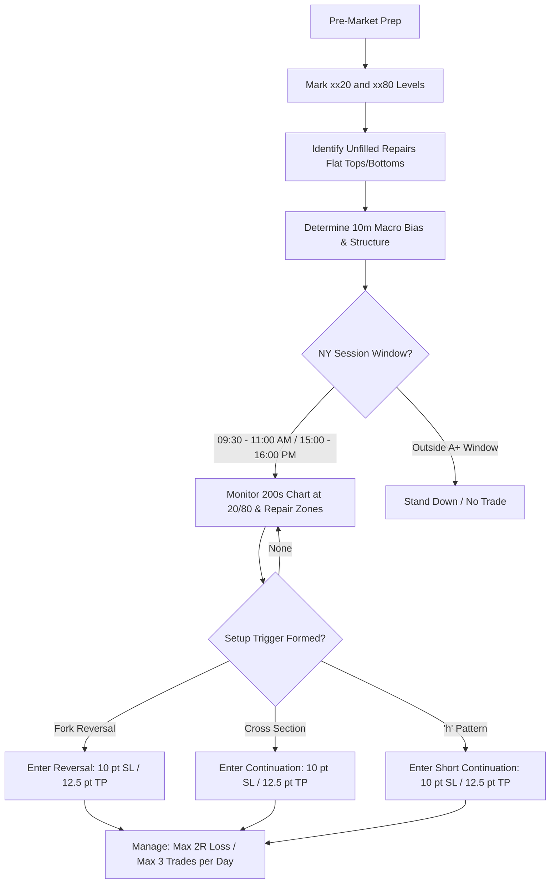

# Prop Firm Bandits: 80/20 Liquidity Code

> **Asset**: NQ (E-mini Nasdaq) & MNQ (Micro E-mini Nasdaq)  
> **Core Edge**: Level Sniping at `xx20` & `xx80` Institutional Liquidity Magnets + Imbalance Repairs  
> **Timeframes**: 10-Minute (Structure & Bias) + 200-Second (Entry & Pattern Development)  
> **Risk Model**: 10-point Stop ($200/NQ, $20/MNQ) | 12.5-point Target ($250/NQ, $25/MNQ) | 1:1.25 R:R | Max 1–3 trades/day (2R daily loss cap)

---

## 1. System Overview & Core Philosophy

The **80/20 Liquidity Code** is an institutional execution playbook designed specifically for high-leverage prop firm evaluation and funded account mechanics (Apex, Take Profit Trader, Tradeify, etc.). It eliminates discretionary chop by standardizing:
1. **Predetermined Liquidity Levels (`xx20` / `xx80`)**: Prices where algorithmic stop runs, sweeps, and structural rebalances cluster.
2. **Repairs (Single-Wick Imbalances)**: Price bars lacking a wick on one side (flat top / flat bottom), representing aggressive institutional flow that the market seeks to re-auction ("repair").
3. **Discrete Microstructure Triggers**: High-probability price patterns (Fork, Cross Section, h Pattern) on the **200-second chart** aligned with **10-minute directional bias**.

---

## 2. Multi-Timeframe Architecture

| Timeframe | Role & Objective | Key Elements Monitored |
| :--- | :--- | :--- |
| **10-Minute Chart** | **Macro Structure & Bias** | Directional trend (HL/LH), 10m Cross-Sections, macro Repairs, session High/Low context. |
| **200-Second Chart (~3.33m)** | **Precision Execution & Triggers** | Fork patterns, micro Cross-Sections, lowercase "h" arch development, shaved-wick Repairs, trigger confirmation closes. |

---

## 3. Core Concepts

### A. The 20/80 Price Levels (Liquidity Magnets)
- Price levels ending with digits **`20`** and **`80`** (e.g., `21,020`, `21,080`, `21,120`, `21,180`, etc.).
- **Mechanism**: These act as natural psychological and institutional strike points where large participant liquidity, retail stops, and options hedging gamma concentrate.
- **Application**: Mark all 20 and 80 levels across the day's expected trading range as primary horizontal sniper zones.

### B. Repairs (Imbalance Voids)
- **Definition**: A candle that has **no wick (or a flat boundary)** on one side of its body.
  - **No Upper Wick (Flat Top / Shaved Top)**: Represents aggressive seller dominance / unfilled buying liquidity above.
  - **No Lower Wick (Flat Bottom / Shaved Bottom)**: Represents aggressive buyer dominance / unfilled selling liquidity below.
- **Role in Trades**:
  1. **Entry Magnet**: Price retracing back to an unvisited Repair acts as an area of interest for entries.
  2. **Target Magnet**: An opposing open Repair serves as a high-probability Take-Profit target.
  3. **Decay Rule**: The most recent and aggressive Repairs are typically filled within 2–4 subsequent bars.

---

## 4. Setup Playbook & Execution Rules

### Setup 1: The Fork Setup (Capitulation Reversal)
*A high-probability reversal pattern that catches exhausted liquidity sweeps at key extremes.*

* **Pre-Conditions**:
  1. Sharp capitulation spike into a fresh session High/Low or a `20`/`80` level.
  2. Convergence with an active **Repair zone**.
* **Pattern Geometry**:
  - Two consecutive (or within 2 bars) **long wicks** pointing into the extreme.
  - Wicks are similar in length and price range, forming the two **"tines" of a fork**.
  - Candle bodies are small, demonstrating rapid rejection and exhaustion of incoming orders.
* **Execution**:
  - **Entry**: Enter market/limit in the opposite direction upon confirmation close of the 2nd wick candle.
  - **Stop Loss**: 10 points fixed (or placed immediately beyond the longest fork wick extreme).
  - **Take Profit**: 12.5 NQ points (reversion move) or opposing Repair magnet.

---

### Setup 2: The Cross Section Setup (Orderflow Continuation)
*A trend continuation mechanism identifying the exact micro-gap between two aggressive bars.*

* **Pre-Conditions**:
  1. Two consecutive strong directional expansion candles in the direction of the 10m trend.
  2. The zone between the **Close of Candle 1** and the **Open of Candle 2** is defined as the **"Cross Section"**.
* **Pattern Geometry**:
  - Price expands away from the Cross Section, creating distance.
  - A healthy, lower-volume pullback returns directly into the Cross Section zone (often coinciding with a `20`/`80` level).
* **Execution**:
  - **Entry**: Enter on touch or bullish/bearish reaction inside the marked Cross Section zone.
  - **Stop Loss**: 10 points (just outside the opposite boundary of the Cross Section).
  - **Take Profit**: 12.5 NQ points or next Repair zone (1:1.25 minimum R:R).

---

### Setup 3: The "h" Pattern (Bearish Continuation)
*A structured rollover formation following an aggressive downside push.*

* **Pre-Conditions**:
  1. 10-minute chart is in a confirmed downtrend (Lower Highs & Lower Lows).
  2. 200-second chart prints a fresh Lower Low.
* **Pattern Geometry**:
  - Price retraces upward in a curve, building the **"stem"** and **"arch"** of a lowercase **"h"** (a lower high).
  - The peak of the arch (h-top) aligns precisely with a `20`/`80` level and/or an unfilled bearish Repair.
  - Exhaustion candles / upper rejection wicks appear at the h-top.
* **Execution**:
  - **Entry**: Short on the first clean rollover candle closing below the h-arch structure.
  - **Stop Loss**: Above the h-top (10 points standard).
  - **Take Profit**: 12.5 points or the prior swing low / lower Repair magnet.
  - **Invalidation**: A clean candle close above the h-top immediately invalidates the setup.

---

## 5. Daily Standard Operating Procedure (SOP)

1. **Pre-Market (08:30 – 09:15 ET)**:
   - Mark all horizontal lines ending in `20` and `80` across the expected day range.
   - Scan 10m and 200s charts for open **Repairs** (shaved-wick candles).
   - Check economic calendar for major High-Impact news (08:30 / 10:00 ET).
2. **Session Trading Windows (A+ Timing)**:
   - **Primary Morning Window**: 09:30 – 11:00 ET (Highest liquidity & clean expansion).
   - **Afternoon Macro Window**: 15:00 – 16:00 ET (Settlement flow & repair rebalancing).
3. **Execution Rules**:
   - Only execute if price is reacting at a `20`/`80` level or inside a marked Repair/Cross-Section.
   - Fixed 10-point stop loss ($200/NQ, $20/MNQ) placed immediately with the bracket order.
   - Fixed 12.5-point profit target ($250/NQ, $25/MNQ).

---

## 6. Prop Firm Account Risk & Scaling Protocol

| Metric | Rule | Rationale |
| :--- | :--- | :--- |
| **Stop Size** | **10 pts** ($200 NQ / $20 MNQ) | Eliminates account-ruining tail risk; respects intraday noise. |
| **Profit Target** | **12.5 pts** ($250 NQ / $25 MNQ) | High hit-rate target achievable on single micro-swings. |
| **Daily Trade Cap** | **1 to 3 trades max** | Prevents revenge trading and over-trading during chop. |
| **Daily Loss Limit** | **2R (-20 pts max)** | Never risk more than 25–30% of prop firm daily drawdown. |
| **Contract Choice** | **MNQ for Evals, NQ for High Buffer** | Micro contracts allow fine-tuning dollar risk per evaluation tier. |

---

## 7. Pine Script (v6) Algorithmic Logic Specifications

For automated detection in TradingView:
1. **20/80 Levels**: `math.round(close / 100) * 100 + 20` and `math.round(close / 100) * 100 + 80`.
2. **Repairs Detection**:
   - Bullish Repair (Flat Bottom): `low == open` (or `(math.min(open, close) - low) <= syminfo.mintick`).
   - Bearish Repair (Flat Top): `high == open` (or `(high - math.max(open, close)) <= syminfo.mintick`).
3. **Cross Section Zone**: `box.new(left=bar_index-1, right=bar_index+10, top=math.max(close[1], open[0]), bottom=math.min(close[1], open[0]))`.
4. **Fork Detection**: Two adjacent bars where `math.abs(low[1] - low[0]) <= 2 * syminfo.mintick` and bottom wicks exceed 2x body height.
