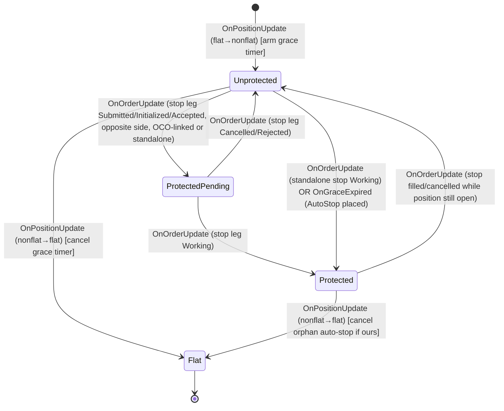

# NinjaTrader Cross-Account Risk Guard — Specification

**Status:** v1.0 (buildable)
**Context:** Prop-firm futures trader (/NQ, /ES, ICT macro windows), multiple funded accounts, no NinjaTrader brokerage account. Trades taken from TradingView, Tradovate Web, NT Web, and NT Desktop; NT Desktop connected to all accounts.
**Purpose:** An independent NinjaTrader Desktop add-on that enforces risk and discipline rules across all connected accounts, regardless of which platform originated the trade. It acts as a post-fill backstop that can only *reduce* risk.

---

## 1. Problem statement

Eliminate three failure modes mechanically:

1. **Oversizing** — more contracts than plan allows (fat-finger or revenge sizing).
2. **Overtrading** — too many trades, trading outside edge windows, revenge re-entry, giving back profits.
3. **Setup/state errors** — unprotected positions, or the guard itself silently not running.

The guard watches the account event stream NT receives over its broker connection and intervenes on bad *state*, not on the cause. Because NT Desktop is connected to every account, it sees fills from any platform.

---

## 2. Design principles (non-negotiable)

- **Risk-reducing actions only.** The guard may flatten, partial-flatten, cancel orders, block, and lock. It may **never** open or add to a position, move stops wider, or place any risk-increasing order. This is what makes it trustworthy; a bug can only cost missed trades, never runaway positions. *(Hard non-goal.)*
- **Post-fill, not pre-trade.** NT sees a trade after the fill (typically sub-second). This is a fast kill-switch, not an order-rejection gate. Where the prop firm offers server-side max-size/max-loss, use it in parallel; this guard catches what those miss.
- **Fail visible, not silent.** The dangerous failure is the guard being off/crashed while the trader assumes protection. The system must make its own liveness obvious (arming ritual + heartbeat).
- **Operates on observed account state only.** No dependence on broker-native NT risk settings (prop connections often lock or omit them).
- **Add-on, not chart indicator.** Runs detached from any instrument's `OnBarUpdate`; driven by account-level events.

---

## 3. Validation gates (must pass before live enforcement)

These block the project; verify empirically before writing rule logic.

- **VG-1 — External event visibility.** NT Desktop fires `ExecutionUpdate`/`PositionUpdate` for trades placed on TradingView, Tradovate Web, and NT Web (not just chart price ticks). *Test:* small manual trade on each external platform; confirm it appears in NT Positions and fires the events; record latency.
- **VG-2 — Programmatic flatten allowed.** The add-on can submit a flattening order through the prop connection. *Test:* flatten a small live position via `Account.Flatten`.
- **VG-3 — Working-order visibility & cancel.** The add-on can see and cancel resting stops/targets placed from external platforms. *Test:* place a stop from TradingView, confirm it appears in `Account.Orders`, cancel it programmatically.
- **VG-4 — Latency acceptable.** From VG-1, the fill->event->action round trip is fast enough to be a meaningful backstop. If not, flag which rules must be paired with firm server-side limits.

---

## 4. Scope

**In scope (v1):** per-account + aggregate size enforcement (tiered); trade-count / cooldown / consecutive-loss governor; ET edge-window entry gate; missing-protective-stop guard; daily loss, trailing-drawdown, and profit-target lockouts; prop-firm-rule mirror with buffer; shadow (dry-run) mode; arming ritual + preflight; heartbeat; intervention logging in an ingestible format; enforcement mode (pure / override-with-friction).

**Out of scope (v1):** pre-trade order rejection (firm server-side); detecting *why* a setup error occurred; behavioral tilt/velocity detection (v2); rich UI beyond an NT window + config file; any risk-increasing automation (permanent non-goal).

---

## 5. System architecture

### 5.1 Components
- **AccountRegistry** — enumerates `Account.All`, subscribes/re-subscribes to `PositionUpdate`, `ExecutionUpdate`, `OrderUpdate`; handles connect/disconnect and account add/remove.
- **StateModel** — live per-account and aggregate model: net position per instrument, total contracts, working orders (with protective-stop classification), session realized PnL, running peak equity/PnL, trade count, consecutive-loss count, last-exit timestamp per account.
- **RuleEngine** — ordered set of independent rule evaluators. Each rule is a pure function `(StateModel, Config, now) -> [Action]`. Rules never act directly; they emit proposed Actions.
- **ActionArbiter** — dedupes/merges proposed Actions (e.g. two rules both flattening the same position -> one flatten), enforces the risk-reducing-only invariant (rejects any non-reducing action as a bug), and in shadow mode logs instead of executing.
- **Executor** — the only component that touches the account (`Flatten`, `CancelAllOrders`, cancel specific order). Guarded by the invariant check.
- **LockoutManager** — holds lockout state per account and aggregate; decides session reset; persists across restarts within a session.
- **Preflight/Arming** — arming ritual and preflight checks; owns armed/disarmed state.
- **Heartbeat** — writes liveness timestamp; optional external watcher.
- **Logger** — structured intervention + session log (ingestible by existing trading-intelligence tooling).

### 5.2 Evaluation flow
1. Account event arrives -> StateModel updates; the relevant per-position FSM (§5.4) transitions.
2. RuleEngine evaluates all enabled rules against the new state (event-driven rules only).
3. Proposed Actions -> ActionArbiter (invariant check + dedupe + shadow gate).
4. Executor performs surviving Actions (or Logger records them in shadow mode).
5. Logger records event, decisions, and outcomes.
6. A 1 s safety-sweep timer re-evaluates *only* cross-account/time-based rules (aggregate sizing, firm-mirror, session reset, heartbeat, watchdog). The missing-stop guard and per-account sizing/window/lockout rules are event-driven and are **not** re-evaluated on the sweep.

### 5.4 Per-position guard state machine
Each `(account, instrument)` pair owns one `PositionGuardFsm` that tracks the protective-stop lifecycle:



This eliminates the duplicate-SL race: the FSM remembers it saw the stop leg's `Submitted` event, so a later sweep or re-entrant position update finds the FSM already in `ProtectedPending`/`Protected` and never places a second auto-stop.

### 5.3 "Trade" and "position" definitions
- A **new entry** = transition of an account+instrument net position from flat to non-flat, or an increase in absolute size.
- A **trade** (for counting) = a completed flat->...->flat cycle per account+instrument. Increases within an open position are *not* new trades but *are* size events.
- **Realized loss/win** = sign of realized PnL delta on the flat->flat close.

---

## 6. Functional requirements

### 6.1 Core monitoring
- **FR-1:** Enumerate all connected accounts on startup; subscribe to position/execution/order events per account.
- **FR-2:** Maintain the StateModel in 5.1, per account and aggregate.
- **FR-3:** Re-enumerate/re-subscribe on reconnect and account add/remove; log connection state changes.
- **FR-4:** Event-driven evaluation for state-derived rules; a 1 s safety-sweep timer covers only cross-account/time-based rules (aggregate sizing, firm-mirror, session reset, heartbeat, watchdog). The missing-protective-stop guard (FR-16/17/18) is owned by a per-position finite-state machine (see §5.4) and is **not** evaluated on the sweep.

### 6.2 Oversizing (tiered)
- **FR-5:** Max contracts per account and aggregate, optionally per instrument.
- **FR-6:** Tiered response — Tier 1 (soft, <= configurable multiple over max): partial-flatten to max, log, alert. Tier 2 (hard, >= configurable multiple): full flatten + cancel that instrument's orders + lockout.
- **FR-7:** Tier-1 partial-flatten toggle (off => all breaches hard).
- **FR-8:** **Expected-copies handling** — config declares whether the same trade is intentionally mirrored across N accounts. Aggregate size limits account for intended N-way replication so mirrored trades aren't misread as stacking. Default: per-account limits authoritative, aggregate limit optional.

### 6.3 Overtrading governor
- **FR-9:** Max trades per session (per account; aggregate optional). Exceed => lockout.
- **FR-10:** Cooldown — minimum minutes between a flat->flat close and the next new entry (per account). Entry inside cooldown => flatten.
- **FR-11:** Consecutive-loss lockout — M consecutive realized losers => lockout.

### 6.4 Edge-window entry gate
- **FR-12:** Config list of permitted entry windows in **ET (DST-correct)**, each start/end + days-of-week (e.g. NY_AM_2 10:50).
- **FR-13:** New entry outside all permitted windows => flatten (configurable flatten/warn).
- **FR-14:** Positions entered inside a window may run past window close — the gate governs *entries*, not holding.
- **FR-15:** Windows evaluated in ET regardless of machine timezone; explicit DST handling.

### 6.5 Missing-protective-stop guard
- **FR-16:** On each new entry (`OnPositionUpdate` flat to nonflat), create a per-`(account,instrument)` finite-state machine record in `Unprotected` and set `GraceDeadline = now + StopGuard.StopAttachSeconds`. The sweep polls `EvaluateGraceExpiry()` once per cycle; the FSM transitions purely on order/position events plus this grace-deadline check. The guard is **not** evaluated by the StopGuard snapshot logic in `EvaluateRules`.
- **FR-17:** At grace expiry, if the FSM is still `Unprotected` and the position is non-flat, flatten (or place an auto-stop per `OnMissing`) and log "unprotected position." If a protective stop arrived before expiry, the FSM is already `Protected` and grace expiry is a no-op (timer cancelled).
- **FR-18:** Protective stop = working Stop/Stop-Limit, opposite side, covering >= (open size - tolerance), same account+instrument, recognised by the FSM via the order's `Oco` id (bracket/OCO legs) or as a standalone working stop. The FSM transitions to `ProtectedPending` on `Submitted`/`Initialized`/`Accepted` and to `Protected` on `Working`, so a slow-arriving bracket leg never triggers a duplicate auto-stop. See §5.4 for the full state diagram.

### 6.6 Loss / drawdown / profit
- **FR-19:** Daily loss limit (per account and/or aggregate) => flatten all + lockout.
- **FR-20:** Trailing drawdown from running peak => flatten all + lockout.
- **FR-21:** Profit-target lockout (stop-after-green), configurable on/off.
- **FR-22:** Lockout = incoming entries flattened, all working orders cancelled, persists until session reset or friction-gated override.
- **FR-23 — PnL basis is explicit per rule.** Each of FR-19/20/21 declares `realized` vs `include_unrealized_peak`. Trailing DD in particular must be able to trail off the intra-trade high-water mark including open profit, because that is how many prop firms compute it.

### 6.7 Prop-firm-rule mirror
- **FR-24:** A dedicated config block encodes the *firm's actual* rules: trailing-DD type (static / intraday-trailing / EOD-trailing), whether DD includes unrealized peak, the DD reset boundary, daily-loss definition, and any max-position rule.
- **FR-25:** The guard trips at `firm_limit - buffer` (configurable buffer per rule) so it acts *before* the firm's line, keeping the account compliant. Firm-mirror rules are evaluated alongside the trader's own discretionary rules (6.2-6.6); the tighter of the two governs.
- **FR-26:** DD reset boundary is independent of the trader's chosen session-reset time and must match the firm's (often a fixed UTC futures-session rollover). Both boundaries coexist.

### 6.8 Shadow / dry-run mode
- **FR-27:** Global mode `shadow | live`. In shadow, the full pipeline runs and the ActionArbiter/Logger record every action the system *would* have taken ("would-flatten account X, rule Z, size->N") but the Executor performs nothing.
- **FR-28:** Shadow logs are directly comparable to live logs (same schema) so a shadow run doubles as threshold-tuning and VG-4 latency characterization before enabling teeth.
- **FR-29:** Recommended rollout: run shadow for a configurable minimum number of sessions before `live` is permitted (soft gate, warns if skipped).

### 6.9 Arming ritual & preflight
- **FR-30:** Guard starts each session **disarmed**; no enforcement until explicitly armed.
- **FR-31:** Arming runs preflight: all expected accounts connected; event stream confirmed live (recent event or synthetic probe); Executor capability confirmed (VG-2 self-check, e.g. dry cancel); config loaded and valid. Any failure blocks arming and reports which check failed.
- **FR-32:** Armed/disarmed state and last preflight result are visible at a glance in the status window and written to the log.

### 6.10 Heartbeat
- **FR-33:** While armed, write a heartbeat timestamp every few seconds.
- **FR-34:** Optional lightweight external watcher (separate process/script) alerts if the heartbeat goes stale, so a crash/freeze doesn't leave the trader silently unprotected.

### 6.11 Enforcement mode
- **FR-35:** `pure` (no in-session override; lockouts clear only at reset) or `override_with_friction` (override gated by typed confirmation phrase + forced wait + logged reason; no one-click bypass).
- **FR-36:** Friction parameters have enforced minimums so override can't be trivialized.

### 6.12 Logging & telemetry
- **FR-37:** Every intervention logged: timestamp (ET + UTC), account, rule ID, instrument, size before/after, action, mode (shadow/live), and override reason if any.
- **FR-38:** Session summary at reset: interventions by rule, counts, most-fired rule, arming/preflight history, heartbeat gaps.
- **FR-39:** Log is JSON-lines with a stable schema designed for ingestion by the existing trading-intelligence pipeline (e.g. so "guard fired N times on cooldown this week" can feed the pre-market caution score). One event per line; documented field set.

---

## 7. Configuration schema (draft)

```yaml
mode: shadow                     # shadow | live
enforcement_mode: override_with_friction   # pure | override_with_friction
min_shadow_sessions: 10

sizing:
  max_contracts_per_account: { default: N, per_instrument: { NQ: n, ES: n } }
  max_contracts_aggregate:   { default: N, per_instrument: {} }
  tier1_over_multiple: 1.0
  tier2_over_multiple: 2.0
  tier1_partial_flatten: true
  expected_copies: 1             # intended N-way mirror across accounts

overtrading:
  max_trades_per_session: N      # per account
  cooldown_minutes: N
  consecutive_loss_lockout: M

windows_et:                      # DST-correct ET
  - { name: NY_AM_2, start: "10:50", end: "11:10", days: [Mon,Tue,Wed,Thu,Fri] }
  window_gate_action: flatten    # flatten | warn

stop_guard:
  stop_attach_seconds: 45
  coverage_tolerance: 0

pnl_rules:
  daily_loss_limit: { per_account: X, aggregate: Y, basis: realized }
  trailing_dd:      { amount: Z, basis: include_unrealized_peak }
  profit_target:    { enabled: true, amount: P, basis: realized }

firm_mirror:
  trailing_dd: { type: intraday_trailing, includes_unrealized: true,
                 amount: FIRM_DD, buffer: B, reset_boundary_utc: "22:00" }
  daily_loss:  { amount: FIRM_DL, buffer: B }
  max_position:{ per_account: FIRM_MAX, buffer: 0 }

override:
  confirm_phrase: "..."
  wait_seconds: 60

session:
  reset_time_et: "18:00"         # trader's discretionary-rule reset
  # firm DD reset uses firm_mirror.reset_boundary_utc, independently

heartbeat:
  interval_seconds: 5
  external_watcher: true
```

---

## 8. Open decisions to resolve during build

1. **VG-1..4 results** — gate the whole project.
2. **Firm-rule exact semantics** (6.7) — obtain the firm's precise trailing-DD definition, reset boundary, and whether it counts unrealized peak. This drives FR-23/24/26 and is the difference between staying funded and not.
3. **Expected-copies model** (FR-8) — confirm how you mirror across accounts so aggregate limits don't misfire.
4. **Stop-coverage matching** (FR-18) — how external-platform brackets appear in `Account.Orders`; set tolerance accordingly. Depends on VG-3.
5. **Trade-cycle edge cases** — partial exits, flips (long->short in one fill), and re-entries within the same instrument: confirm counting and cooldown behavior.
6. **Latency budget** (VG-4) — which rules, if any, need firm server-side backups.

---

## 9. Build & validation sequence

1. **Observer (read-only).** AccountRegistry + StateModel + Logger only; no actions. Run several sessions to satisfy VG-1/VG-3, characterize the event stream, and measure latency (VG-4).
2. **Manual flatten probe.** Single flatten behind a manual trigger to satisfy VG-2; confirm Executor + invariant check.
3. **Shadow pipeline.** Full RuleEngine + ActionArbiter + Logger in `shadow`. Implement rules incrementally (start with aggregate max-size, then stop-guard, then loss/DD). Verify each rule's "would-have" logging against reality.
4. **Arming + preflight + heartbeat.** Add liveness machinery before any live teeth.
5. **Go live, one rule at a time.** Flip `mode: live` for a single low-risk rule with small size; expand as each proves out.
6. **Lockout + enforcement-mode/friction last.**
7. **Replay tuning.** Replay logged sessions against config to tune thresholds and buffers before trusting fully.

---

## 10. Test coverage

### 10.1 Unit tests (`ninjatrader-addon/RiskGuardAddOnTests.cs`)

**84 test methods** (60 original rule tests + 24 FSM guard tests) with **170 assertions**, compiled under `#if TESTING` with lightweight NinjaTrader stubs (no NT8 assembly dependency). `Main()` runs all tests sequentially and exits non-zero on any failure.

**Stub surface:** `Account` with `PositionUpdate`/`OrderUpdate`/`ExecutionUpdate` events; `Order` with `Oco` (string GUID), `OrderAction` enum (Buy, Sell, BuyToCover, SellShort); `Position` with `MarketPosition`, `GetUnrealizedProfitLoss()`; `Instrument` with `TickSize = 0.25`.

**Original rule tests (60):** sizing (5), PnL/loss limits (6), overtrading (5), StopGuard legacy sweep (8), edge-window gate (3), lockout enforcement (6), manual lockout (4), shadow/live mode (3), arming/McpBridge (2), trade counting (2), session reset (1), realized PnL lag (1), exclusions deep-dive (11), invariant (2), multi-rule (1). See `RiskGuardAddOn.md` §8.1.1 for the full table.

**FSM guard tests (24):** 12 core state-transition tests covering every arrow in the §5.4 state diagram; 10 edge-case extensions (stop filled, Cancelled, Flatten mode, grace not expired, short position, flip, multi-instrument, disarmed, limit order, buffered stop); 2 OrderAction bug-fix regression tests (`BuyToCover` for shorts, `SellShort` for longs — the original duplicate-SL bug). See `RiskGuardAddOn.md` §8.1.2 for the full table.

### 10.2 Stress tests (MCP-driven, live NT8)

**8-scenario comprehensive suite** (`tmp/comprehensive_stress_test.ps1`): single OCO entry, short OCO (BuyToCover), entry without OCO (auto-stop), max-size breach, rapid 5 OCO (no duplicate SL), manual close after stress, FSM query endpoint, rapid fire 20 OCO + manual close. Each scenario resets guard state and flattens beforehand. Results in `tmp/comprehensive_stress_test.txt`.

**20-OCO rapid-fire test** (`tmp/oco_rapid_fire_test.ps1`): 20 OCO bracket entries (60 orders total) fired as fast as possible, measuring submission throughput, unique OCO GUID count, FSM state at 5s/15s, closeability, and RiskGuard event log tail. Results in `tmp/oco_rapid_fire_results.txt`.

**Known limitation (T1-T3):** NT8 Sim101 rejects OCO stop orders created via `CreateOrder` from an AddOn (not from Chart Trader ATM). The stops arrive as `Rejected`, so the FSM correctly stays `Unprotected` and the guard places an auto-stop. This is an NT8 simulation limitation, not a RiskGuard bug. T4-T8 pass on the live sim.
