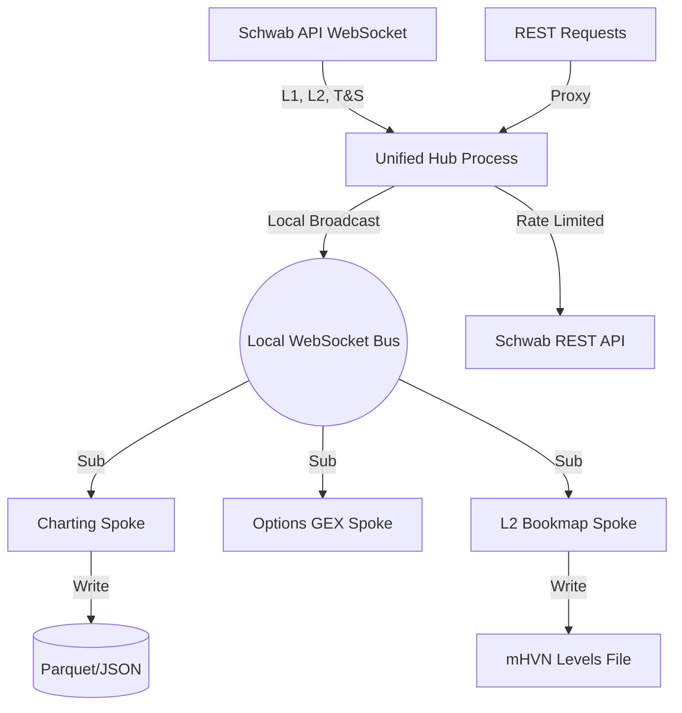

# DESIGN: Schwab Unified Hub & L2 Bookmap (V4.2)

## 1. Executive Summary
The system is transitioning from a "siloed" model (where every script connects individually to Schwab) to a **Hub-and-Spoke** model. This ensures:
- **Single WebSocket Connection**: No more session conflicts.
- **Unified Rate Limiting**: All REST calls are queued and throttled.
- **Distributed Processing**: Specialized engines (GEX, Charting, L2) consume data from the Hub's local broadcast.

## 2. System Diagram

## 3. Component Architecture

### A. The Producer: `schwab_hub.py`
- **Responsibility**: Authentication, WebSocket Maintenance, Local Broadcasting.
- **Technology**: FastAPI + WebSockets + schwab-py.
- **Local Endpoint**: `ws://127.0.0.1:8000/ws` (Broadcasts L1, L2, T&S).
- **REST Proxy**: `POST /request` (Throttles API calls).

### B. The L2 Engine: `l2_processor_engine.py` (PHASE 3)
- **Responsibility**: Real-time Book Depth tracking and mHVN detection.
- **Algorithm**:
  - Aggregates liquidity at 0.25 ticks.
  - Detects persistent resting weight.
  - Confirms with T&S volume.

### C. The Spokes (Consumers)
- **Charting**: `stream_chart.py` (Listen for price/bars).
- **Options**: `run_options_levels.py` (Request chains via Proxy).

## 3. Data Flow
1. **Schwab WS** -> **Hub** -> **Local WS Broadcast**.
2. **Spokes** listen to **Local WS** and update independent caches.
3. **Hub Proxy** receives **REST requests**, waits for rate-limit window, and returns data to Spokes.

## 4. Verification Plan
- **Stability**: Hub must auto-reconnect on Schwab disconnects.
- **Sync**: Verify Hub's L1 price matches L2 Top-of-Book values exactly.

## 5. Troubleshooting & Debugging

### Common Issues
- **Hub Unreachable**: Check if `schwab_hub.py` is running and bound to `127.0.0.1:8000`.
- **Latency**: If the Heatmap lags, check the broadcast frequency in the Hub (currently sub-second).
- **Rate Limits**: If the Proxy returns `429`, increase the `rate_limit_delay` in `schwab_hub.py`.

### Debugging Tools
- Use `curl http://127.0.0.1:8000/docs` to see the REST Proxy Swagger UI.
- Monitor log files at `logs/schwab_hub.log` for reconnection events.
