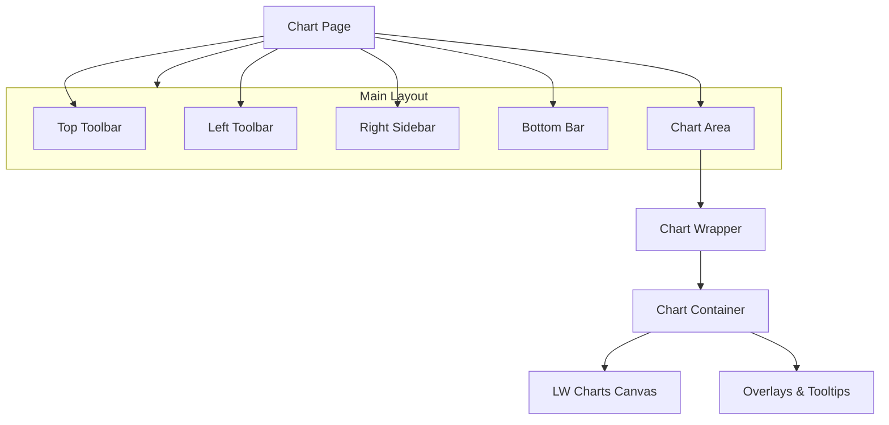

# UI Component Library

This document outlines the hierarchy and purpose of the React components powering the `web/` application.

## 1. High-Level Composition

The application layout is composed of a central chart area surrounded by functional toolbars.



## 2. Core Chart Components

These components form the heart of the trading interface.

| Component | Path | Description |
|-----------|------|-------------|
| **ChartPageClient** | `web/components/chart-page-client.tsx` | Client-side entry point. Manages URL state (symbol, interval) and layout composition. |
| **ChartWrapper** | `web/components/chart-wrapper.tsx` | Data orchestrator. Connects `useChartData`, `useLiveQuote` to the visual chart. Handles "Loading..." states and error boundaries. |
| **ChartContainer** | `web/components/chart-container.tsx` | The visual heavyweight. Wraps `lightweight-charts`. Handles resizing, cursors, plugin registration, and imperative updates. |
| **ChartPane** | `web/components/chart-pane.tsx` | A sub-wrapper for managing multiple visualization panes (price, volume, oscillators). |

## 3. Toolbars & Navigation

| Component | Path | Description |
|-----------|------|-------------|
| **TopToolbar** | `web/components/top-toolbar.tsx` | Global controls: Ticker search, Timeframe selector, Theme toggle, Settings menu. |
| **LeftToolbar** | `web/components/left-toolbar.tsx` | Drawing tools palette (Trendlines, FIBs, text). |
| **RightSidebar** | `web/components/right-sidebar.tsx` | Contextual tools: Watchlist, Alerts, Object Tree, Data Inspector. |
| **BottomBar** | `web/components/bottom-bar.tsx` | Status bar: Connection status, timezone info, and simple metrics. |
| **AppSidebar** | `web/components/app-sidebar.tsx` | Collapsible primary navigation (Charts, Journal, Backtest). |

## 4. Feature Components

Specialized UI elements for specific trading features.

### Playback & Time
- **`playback-controls.tsx`**: Bar replay interface (Play, Pause, Step, Speed).
- **`timeframe-selector.tsx`**: Quick switch buttons for 1m, 5m, 1h, 1D.

### Settings & Dialogs
- **`properties-modal.tsx`**: Creating massive centralized chart configuration (Colors, scales, margins).
- **`indicators-dialog.tsx`**: Searchable list of available indicators.
- **`em-settings-dialog.tsx`**: Settings for Expected Move visualization.

## 5. UI Primitives (`web/components/ui/`)

We use **Shadcn/UI** (Radix UI + Tailwind) for base components. Key primitives include:

- **Buttons**: `button.tsx` (Variants: default, destructive, outline, ghost).
- **Dialogs**: `dialog.tsx` (Modals).
- **Inputs**: `input.tsx`, `select.tsx`.
- **Popovers**: `popover.tsx`, `dropdown-menu.tsx`.
- **Toast**: `sonner` (Toast notifications).

## 6. Directory Structure

```text
web/components/
├── chart/              # Chart specific sub-elements
├── drawing/            # Drawing tool logic hooks? (Check separation)
├── journal/            # Trade journaling UI
├── profiler/           # Daily/Hourly Profile specific settings/UI
├── settings/           # General app settings forms
├── trading/            # Order entry ticket (if applicable)
└── ui/                 # Reusable Shadcn primitives
```
