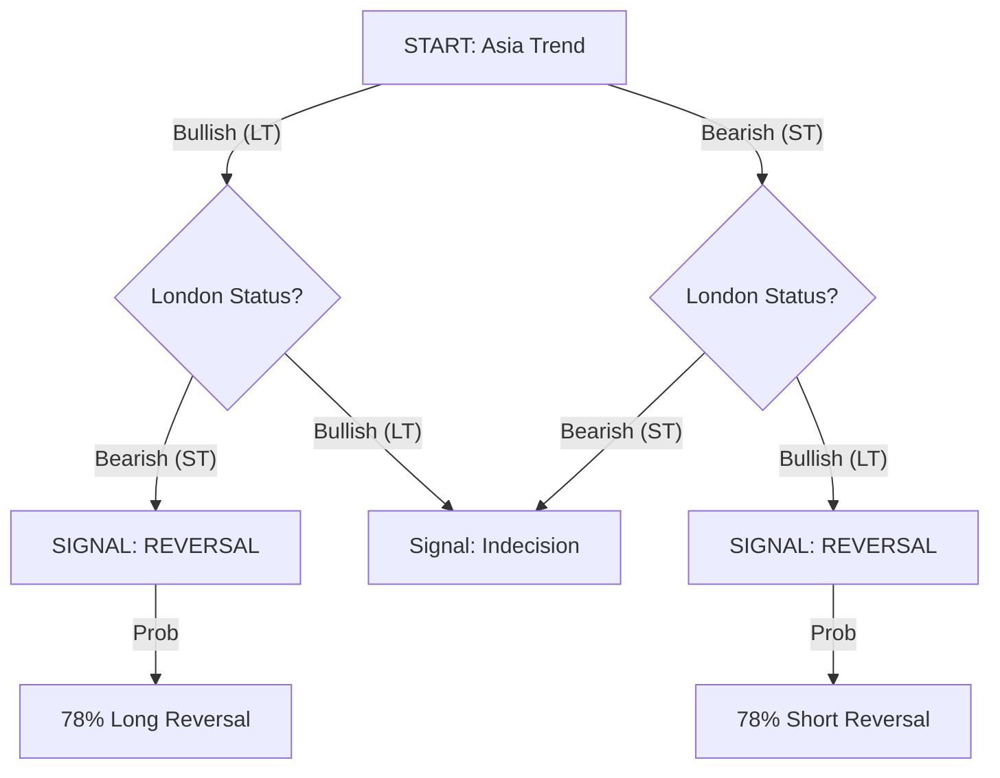
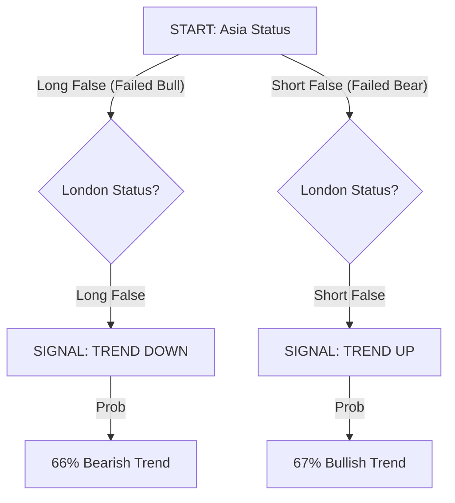
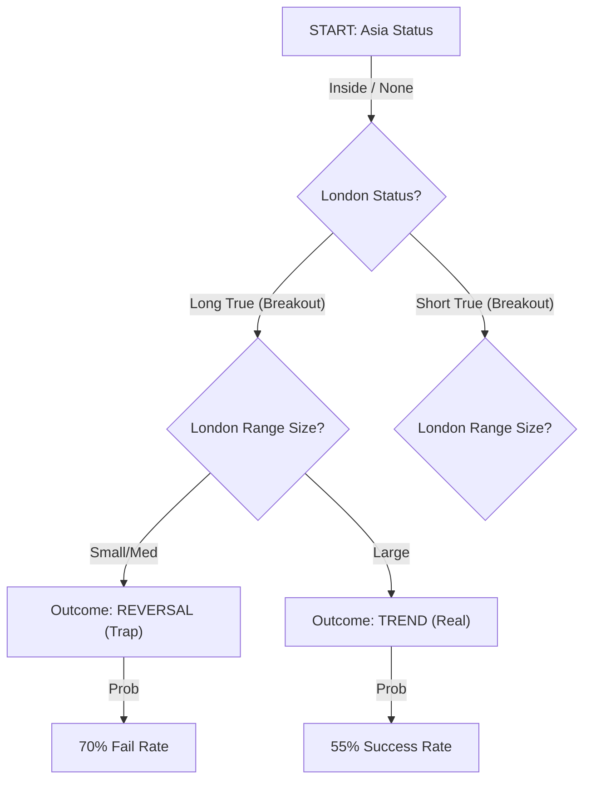

# Scientific Report: Session Profiler Decision Models
### Quantitative Analysis of Inter-Session Correlations for NQ

**Date:** February 8, 2026
**Data Source:** 5,165 Trading Days (2006-2026)
**Instrument:** Nasdaq 100 Futures (NQ)

---

## 1. Executive Summary

This report establishes a statistically significant decision framework for predicting the structural intent of the New York (NY) morning session based on the completed profiles of the Asia and London sessions.

**The Core Finding:**
Contrary to the popular belief that "Trend is your friend," predicting the NY session purely based on London's direction is a **50/50 coin flip** globally. However, when conditioned on the **Asia -> London interaction**, probabilities shift radically, creating edges as high as **78%**.

We have identified three distinct market regimes:
1.  **The Expansion Reversal (78% Probability)**: When London aggressively reverses Asia, NY reverses London.
2.  **The Double Failure Trend (67% Probability)**: When both Asia and London fail in the *same* direction, NY trends forcefully in the *opposite* direction.
3.  **The Inside Trap (70% Probability)**: A London breakout from a quiet Asia is a **fakeout** 70% of the time unless the range is exceptionally large.

---

## 2. Methodology & Definitions

### 2.1 Directional Classification
*   **UP (Bullish)**: Session Status is `Long True` or `Short False` (Failed breakdown).
*   **DOWN (Bearish)**: Session Status is `Short True` or `Long False` (Failed breakout).
*   **NEUTRAL**: Session Status is `Inside` (None).

### 2.2 Outcome Definitions
*   **TREND (Continuation)**: The NY session closes with the **same directional bias** as the London session.
    *   *Example:* London = UP, NY = UP.
*   **REVERSAL**: The NY session closes with the **opposite directional bias** to the London session.
    *   *Example:* London = UP, NY = DOWN.

---

## 3. Decision Tree Models

### TREE A: The "London Swing" (Expansion Reversal)
**Trigger:** Asia and London have **Opposing** Trends (e.g., Asia Up, London Down).
**Logic:** London served as the "Judas Swing" or manipulation phase against the Asia trend. NY restores the original direction.

**Trade Plan:**
*   **Context:** Asia was Trend A. London was Trend B.
*   **Bias:** Fade London. Target the Asia High/Low.
*   **Win Rate:** **78.2%**

---

### TREE B: The "Double Failure" (Volatility Trend)
**Trigger:** Both Asia and London have **Failed** in the same direction (e.g., Long False).
**Logic:** The market attempted to go one way twice and failed. This builds immense pressure. NY usually releases this energy in a unidirectional trend opposite to the failures.

**Trade Plan:**
*   **Context:** Asia broke High then reversed (LF). London broke High then reversed (LF).
*   **Bias:** Short. Expect a Trend Day Down.
*   **Win Rate:** **66-67%**

---

### TREE C: The "Inside Trap" (Fakeout)
**Trigger:** Asia was `Inside` (None) and London broke out (`Long True` / `Short True`).
**Logic:** A breakout from a contracted range is often assumed to be a valid trend. However, without a prior liquidity sweep (False status), these breakouts are highly fragile.

**Trade Plan:**
*   **Context:** Asia was dead. London trended up.
*   **Bias:** **FADE**. Do not chase the breakout.
*   **Condition:** If London Range is >60 points (NQ), probability neutralizes (50/50). If <40 points, **70% Reversal**.

---

## 4. Probability Matrices

### 4.1 Master Combination Matrix
*Row: Asia Status | Col: London Status | Value: % Outcome*

| Asia \ London | Short False | Long False | Short True | Long True |
| :--- | :---: | :---: | :---: | :---: |
| **Short False** | **67% TREND** | 50% Neutral | 50% Neutral | 50% Neutral |
| **Long False** | 50% Neutral | **66% TREND** | 50% Neutral | 50% Neutral |
| **Inside** | 59% Trend | 59% Trend | **51% REV** | **58% REV** |
| **Short True** | 65% Trend | **70% REV** | 65% Trend | **78% REV** |
| **Long True** | **70% REV** | 65% Trend | **78% REV** | 67% Trend |

### 4.2 Key Insights
1.  **Best Continuation:** **Asia Long True -> London Long True** (67% Trend). If both sessions trend up, NY continues up.
2.  **Best Reversal:** **Asia Long True -> London Short True** (78% Reversal). The "V" bottom or top.
3.  **Worst Setup:** **Asia Inside -> London Breakout**. This is the "sucker's bet." It looks like a trend but fails 58-70% of the time depending on range size.

---

## 5. Execution Protocols

### Usage in Live Trading
1.  **09:25 AM EST Checklist**:
    *   Identify **Asia Status** (Box color on chart).
    *   Identify **London Status** (Box color on chart).
    *   Find the intersection in the Matrix above.

2.  **Scenario Selection**:
    *   **If Probability > 65% TREND**:
        *   Look for Retracement entries (OTE).
        *   Do NOT fade new highs/lows.
        *   Target: Standard deviations (+2σ/-2σ).
    *   **If Probability > 65% REVERSAL**:
        *   Look for **Liquidity Sweeps** (Turtle Soups) of London High/Low.
        *   Enter on the *failure* of the London direction.
        *   Target: Opposing Session Mids.

3.  **Invalidation**:
    *   If the "Broken Mid" condition (explained in previous research) contradicts the setup, reduce risk.
    *   *Note:* **Double Broken Mids** (Asia & London Mids broken) is a strong volatility signature favoring TREND.
